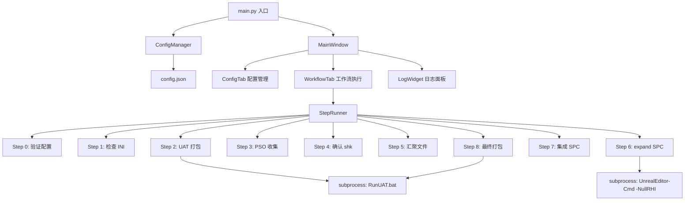

## 产品概述

UE5PSOPackager 是一款 Windows 桌面 GUI 工具，将 UE5 PSO（Pipeline State Object）缓存打包的 9 步流程自动化。用户配置好 UE 引擎路径和项目信息后，可通过可视化界面逐步或一键完成：PSO 配置验证、首次打包生成 Shader 稳定键、收集运行时 PSO 记录、转换缓存文件、集成并最终打包为内建 PSO 缓存的游戏包体。

## 核心功能

- **多项目管理**：支持添加/切换/删除多个 UE 项目配置，支持多 UE 版本并存
- **配置验证（Step 0-1）**：自动检查 config.json 完整性、引擎/项目路径存在性、DefaultEngine.ini 和 DefaultGame.ini 中的 8 项 PSO 配置
- **自动化打包（Step 2/8）**：调用 RunUAT BuildCookRun，实时显示打包日志，Step 2 生成 .shk 文件，Step 8 打入 .stable.upipelinecache
- **PSO 收集引导（Step 3）**：弹窗提示用户手动运行打包程序遍历场景，自动检测 .rec.upipelinecache 是否生成
- **缓存转换（Step 5-7）**：自动汇聚 .rec + .shk 到工作目录，调用 ShaderPipelineCacheTools expand（带 -NullRHI）生成 .spc，复制到 Build 目录
- **实时日志**：每步执行过程输出彩色日志，标记成功/失败/警告，支持日志导出
- **全局配置持久化**：config.json 保存到 %LOCALAPPDATA%\UE5PSOPackager\，程序启动自动加载

## 技术栈

- **语言**：Python 3.10+
- **GUI 框架**：PySide6（Qt for Python 官方版本，LGPL 协议，exe 分发无授权问题）
- **打包工具**：PyInstaller（单文件 exe）
- **CI/CD**：GitHub Actions（推送版本标签 `v*` 自动构建 exe 并发布 Release）
- **子进程管理**：subprocess（调用 UAT/UnrealEditor-Cmd）
- **配置存储**：JSON（%LOCALAPPDATA%\UE5PSOPackager\config.json）
- **INI 解析**：Python 标准库 configparser

## 实现方案

### 整体策略

采用 MVC 分层架构：配置管理层（ConfigManager）负责 config.json 的读写验证，步骤执行层（StepRunner）封装 9 步操作逻辑，UI 层（PySide6 窗口/标签页/组件）负责展示和交互。每步耗时操作（Step 2/6/8）在 QThread 中执行并通过信号槽与 UI 通信，保证界面不卡死。

### 关键设计决策

1. **QThread + 信号槽**：Step 2（UAT 打包 10-60 分钟）、Step 6（ShaderPipelineCacheTools 数分钟）、Step 8（UAT 二次打包）必须异步执行，通过 `subprocess.Popen` 逐行读取 stdout，用 `Signal` 发射日志行到主线程 UI
2. **-NullRHI 参数**：Step 6 的 UnrealEditor-Cmd 调用强制添加 `-NullRHI -unattended`，避免引擎初始化阶段卡在 shader 编译
3. **配置多项目架构**：config.json 顶层使用 `ue5_versions`（字典，key 为版本号）和 `projects`（数组），每个项目引用 `ue5_version` 字段关联引擎版本，支持灵活扩展
4. **INi 解析使用正则**：UE 的 .ini 文件格式与标准 INI 有差异（支持 `+`/`-`/`.` 前缀），Step 1 使用正则匹配替代 configparser 确保兼容性

### 架构设计



### 数据流

```
用户操作（点击执行） → QThread 启动 → StepRunner 执行步骤 → subprocess 调用外部程序
→ 逐行捕获 stdout → Signal 发射日志 → 主线程 LogWidget 追加显示
→ 步骤完成 → Signal 发射结果 → UI 更新状态（成功/失败）
```

## 实现注意事项

### 性能

- UAT 打包（Step 2/8）输出量大（数千行），QThread 中逐行读取避免内存堆积，UI 端日志控件设置最大行数限制（5000 行），超出自动截断
- Step 6 expand 命令耗时数分钟但输出可控，同样走 QThread + 信号槽

### 日志

- 日志行格式：`[时间戳] [步骤] [级别] 消息内容`
- 级别：INFO（白色）、SUCCESS（绿色）、WARNING（黄色）、ERROR（红色）
- 所有外部进程的 stdout/stderr 合并后逐行发射

### 兼容性

- PySide6 兼容 Python 3.10-3.12，Windows 10/11
- PyInstaller 打包时排除不需要的 Qt 模块（QtWebEngine、QtPdf 等）减小体积
- 生成的 exe 约 60-80 MB

### CI/CD 自动发布

- **触发条件**：仅推送 `v*` 格式标签（如 `v1.0.0`、`v1.0.1`）时触发，日常 push 不触发
- **手动兜底**：支持 `workflow_dispatch` 在 GitHub Actions 页面手动触发
- **构建环境**：`windows-latest` + Python 3.11
- **版本提取**：从 git tag 自动提取版本号（去掉 `v` 前缀），写入 `version.py`
- **产物发布**：使用 `softprops/action-gh-release@v2` 创建 Release 并上传 exe 附件
- **发布流程**：`git tag v1.0.0` → `git push origin v1.0.0` → GitHub Actions 自动构建 → Release 页可下载 exe

## 目录结构

```
e:\UE_Project\UE5GameFramework\
├── .github/
│   └── workflows/
│       └── build-release.yml        # [NEW] GitHub Actions 自动构建发布工作流
└── UE5PSOPackager/
    ├── main.py                          # [NEW] 入口文件，创建 QApplication，加载 ConfigManager，启动 MainWindow
    ├── config_manager.py                # [NEW] 配置管理器：load/save/validate config.json，管理 UE 版本和项目列表
    ├── step_runner.py                   # [NEW] 步骤执行器：封装 Step 0-8 全部逻辑，支持 QThread 异步执行
    ├── step_definitions.py              # [NEW] 步骤定义：StepConfig 数据类（步骤序号、名称、描述、依赖、验证逻辑）
    ├── version.py                       # [NEW] 版本号文件（本地 __version__ = "dev"，CI 自动替换为 tag 版本号）
    ├── ui/
    │   ├── __init__.py                  # [NEW] UI 包初始化
    │   ├── main_window.py               # [NEW] 主窗口：顶部菜单栏 + 左侧项目选择器 + 右侧 QTabWidget
    │   ├── config_tab.py                # [NEW] 配置管理标签页：UE 版本管理表单 + 项目配置表单（QFormLayout）
    │   ├── workflow_tab.py              # [NEW] 工作流标签页：步骤清单（QListWidget + 状态图标）、执行按钮组、进度条
    │   └── log_widget.py                # [NEW] 日志显示组件：QTextEdit 只读、彩色日志、右键复制/清除菜单
    ├── resources/
    │   ├── __init__.py                  # [NEW] 资源包初始化
    │   └── default_config.json          # [NEW] 默认配置模板（首次运行时若 config.json 不存在则复制到 AppData）
    ├── build_exe.py                     # [NEW] PyInstaller 打包脚本：指定入口 main.py，单文件模式，排除无用 Qt 模块
    └── requirements.txt                 # [NEW] 依赖清单：PySide6>=6.5, PyInstaller>=5.0
```

### 关键文件详情

**main.py**：创建 QApplication 实例，加载 ConfigManager（从 `%LOCALAPPDATA%\UE5PSOPackager\config.json`），若文件不存在则从 `resources/default_config.json` 复制并提示用户配置。启动 MainWindow 并进入事件循环。

**config_manager.py**：核心类 `ConfigManager`，属性包括 `ue5_versions: dict`（版本号→引擎路径映射）和 `projects: list[ProjectConfig]`。方法：`load()` 从 JSON 反序列化，`save()` 序列化回写，`validate_ue5_path(version)` 检查 editor_cmd_path 和 uat_bat_path 存在，`validate_project(index)` 检查 uproject_file 存在。

**step_runner.py**：核心类 `StepRunner(QObject)`。包含每个步骤的实施方法（如 `_step_2_build()`），使用 `subprocess.Popen` 调用外部命令。关键信号：`log_signal(str)` 逐行输出日志，`step_finished(int, bool, str)` 通知步骤完成。Step 6 命令格式：`"{editor_cmd}" "{uproject}" -run=ShaderPipelineCacheTools expand "{rec}" "{shk}" "{output.spc}" -NullRHI -unattended`。

**ui/workflow_tab.py**：步骤清单使用 QListWidget，每项左侧显示状态图标（○待执行 / ▶执行中 / ✓成功 / ✗失败），右侧显示步骤名称。底部按钮组："全部执行"、"执行选中"、"停止"。Step 3 特殊处理：弹出自定义 QDialog 提示用户手动运行游戏，包含指令说明和"已运行完毕"确认按钮。

**ui/log_widget.py**：继承 QPlainTextEdit，添加 `append_log(level, message)` 方法，使用 QTextCharFormat 设置不同颜色。支持右键菜单：清除日志、导出日志到 .txt。

**build_exe.py**：PyInstaller 配置脚本，执行 `pyinstaller --onefile --windowed --name UE5PSOPackager --add-data "resources/default_config.json;resources/" main.py`，排除 `PySide6/Qt/qml`、`PySide6/Qt/translations` 等无用目录。

**version.py**：版本号文件，本地开发时 `__version__ = "dev"`，CI 构建时由 workflow 自动替换为 tag 版本号（如 `"1.0.0"`）。main.py 中引用此版本号显示在标题栏。

**build-release.yml**：GitHub Actions 工作流。`on.push.tags: ['v*']` 仅响应版本标签推送，`workflow_dispatch` 支持手动触发。构建步骤：检出代码 → 安装 Python 3.11 → pip 安装依赖 → 提取 git tag 写入 `version.py` → 执行 `build_exe.py` → 使用 `softprops/action-gh-release@v2` 创建 Release 上传 exe。

## 设计风格

采用深色主题的工业工具风格（Dark Industrial），适合开发者日常使用的专业工具定位。以暗色背景搭配高对比度亮色强调，功能分区清晰。

## 页面布局

工具为单窗口多标签页结构，分为三大区域：

### 顶部标题栏

左侧显示工具名称「UE5 PSOPackager」及版本号，右侧为当前激活项目名称和 UE 版本信息的下拉选择器，快速切换项目。

### 标签页一：配置管理

- **UE 引擎管理区**：左侧列表显示已配置的 UE 版本（5.5、5.6 等），右侧表单编辑选中版本的安装路径、Editor-Cmd 路径、UAT 路径。底部有新增/删除版本按钮。
- **项目管理区**：左侧项目列表（可多选切换），右侧表单编辑项目名称、关联 UE 版本、项目目录、uproject 文件、Shader 格式、目标平台、打包输出目录、PSO 工作目录。底部有新增/删除/复制项目按钮。
- **状态栏**：实时显示路径验证结果（绿色勾/红色叉）。

### 标签页二：工作流执行

- **步骤清单**：竖向列表展示 Step 0-8，每行包含步骤编号、名称、状态图标、耗时预估。已完成步骤标记绿色勾，失败步骤标记红色叉。
- **操作面板**：底部横向排列「全部执行」「从当前步执行」「只执行选中步」「停止」按钮，右侧显示当前进度条。
- **Step 3 特殊弹窗**：弹出自定义对话框，显示手动操作指引（运行打包程序、遍历场景、退出游戏），底部「已运行完毕，继续」按钮。

### 标签页三：日志输出

- **日志区域**：占满标签页，深色背景，彩色日志文本（白色普通、绿色成功、黄色警告、红色错误），自动滚动到底部。
- **工具栏**：顶部「清除日志」「导出日志」按钮。

## Agent Extensions

### Skill

- **frontend-design**
- 用途：为 PySide6 GUI 提供专业的深色主题样式表（QSS）设计参考
- 预期成果：生成一套 Dark Industrial 风格的 QSS 样式字符串，包括按钮、输入框、标签页、列表控件、日志区域的完整样式定义
