# GASDocumentation

这是我对虚幻引擎 5（Unreal Engine 5）的 GameplayAbilitySystem 插件（GAS）的理解，附带一个简单的多人示例项目。这不是官方文档，本项目及本人与 Epic Games 没有任何隶属关系。我不对这些信息的准确性做出任何保证。

本文档的目标是解释 GAS 中的主要概念和类，并基于我的使用经验提供一些额外的评注。社区中关于 GAS 存在大量"隐性知识"（tribal knowledge），我在此旨在分享我所有的经验。

示例项目和文档目前与 **Unreal Engine 5.3**（UE5）保持同步。本文档有针对旧版本虚幻引擎的分支，但它们不再受支持，可能存在 bug 或过时的信息。请使用与你的引擎版本相匹配的分支。

[GASShooter](https://github.com/tranek/GASShooter) 是一个姊妹示例项目，展示了使用 GAS 实现多人 FPS/TPS 的高级技术。

最好的文档永远是插件源代码。

<a name="table-of-contents"></a>
## 目录

- [GameplayAbilitySystem 插件简介](#intro)
- [示例项目](#sp)
- [使用 GAS 搭建项目](#setup)
- [概念](#concepts)
  - [Ability System Component（技能系统组件）](#concepts-asc)
    - [复制模式（Replication Mode）](#concepts-asc-rm)
    - [设置与初始化](#concepts-asc-setup)
  - [Gameplay Tags（游戏标签）](#concepts-gt)
    - [响应 Gameplay Tags 的变化](#concepts-gt-change)
    - [从插件 .ini 文件加载 Gameplay Tags](#concepts-gt-loadfromplugin)
  - [Attributes（属性）](#concepts-a)
    - [Attribute 定义](#concepts-a-definition)
    - [BaseValue 与 CurrentValue](#concepts-a-value)
    - [Meta Attributes（元属性）](#concepts-a-meta)
    - [响应 Attribute 变化](#concepts-a-changes)
    - [派生 Attributes](#concepts-a-derived)
  - [Attribute Set（属性集）](#concepts-as)
    - [Attribute Set 定义](#concepts-as-definition)
    - [Attribute Set 设计](#concepts-as-design)
      - [具有独立 Attributes 的子组件](#concepts-as-design-subcomponents)
      - [运行时添加和移除 AttributeSets](#concepts-as-design-addremoveruntime)
      - [物品 Attributes（武器弹药）](#concepts-as-design-itemattributes)
        - [物品上的普通浮点数](#concepts-as-design-itemattributes-plainfloats)
        - [物品上的 `AttributeSet`](#concepts-as-design-itemattributes-attributeset)
        - [物品上的 `ASC`](#concepts-as-design-itemattributes-asc)
    - [定义 Attributes](#concepts-as-attributes)
    - [初始化 Attributes](#concepts-as-init)
    - [PreAttributeChange()](#concepts-as-preattributechange)
    - [PostGameplayEffectExecute()](#concepts-as-postgameplayeffectexecute)
    - [OnAttributeAggregatorCreated()](#concepts-as-onattributeaggregatorcreated)
  - [Gameplay Effects（游戏效果）](#concepts-ge)
    - [Gameplay Effect 定义](#concepts-ge-definition)
    - [应用 Gameplay Effects](#concepts-ge-applying)
    - [移除 Gameplay Effects](#concepts-ga-removing)
    - [Gameplay Effect Modifiers（修饰符）](#concepts-ge-mods)
      - [乘法和除法 Modifiers](#concepts-ge-mods-multiplydivide)
      - [Modifiers 上的 Gameplay Tags](#concepts-ge-mods-gameplaytags)
    - [Gameplay Effects 叠加](#concepts-ge-stacking)
    - [授予的 Abilities](#concepts-ge-ga)
    - [Gameplay Effect Tags](#concepts-ge-tags)
    - [免疫](#concepts-ge-immunity)
    - [Gameplay Effect Spec](#concepts-ge-spec)
      - [SetByCallers](#concepts-ge-spec-setbycaller)
    - [Gameplay Effect Context](#concepts-ge-context)
    - [Modifier Magnitude Calculation（修饰符幅度计算）](#concepts-ge-mmc)
    - [Gameplay Effect Execution Calculation（执行计算）](#concepts-ge-ec)
      - [向 Execution Calculations 发送数据](#concepts-ge-ec-senddata)
        - [SetByCaller](#concepts-ge-ec-senddata-setbycaller)
        - [Backing Data Attribute Calculation Modifier](#concepts-ge-ec-senddata-backingdataattribute)
        - [Backing Data Temporary Variable Calculation Modifier](#concepts-ge-ec-senddata-backingdatatempvariable)
        - [Gameplay Effect Context](#concepts-ge-ec-senddata-effectcontext)
    - [Custom Application Requirement（自定义应用条件）](#concepts-ge-car)
    - [Cost Gameplay Effect（消耗效果）](#concepts-ge-cost)
    - [Cooldown Gameplay Effect（冷却效果）](#concepts-ge-cooldown)
      - [获取 Cooldown Gameplay Effect 的剩余时间](#concepts-ge-cooldown-tr)
      - [监听冷却开始和结束](#concepts-ge-cooldown-listen)
      - [预测冷却](#concepts-ge-cooldown-prediction)
    - [修改已激活 Gameplay Effect 的持续时间](#concepts-ge-duration)
    - [运行时创建动态 Gameplay Effects](#concepts-ge-dynamic)
    - [Gameplay Effect Containers](#concepts-ge-containers)
  - [Gameplay Abilities（游戏技能）](#concepts-ga)
    - [Gameplay Ability 定义](#concepts-ga-definition)
      - [Replication Policy（复制策略）](#concepts-ga-definition-reppolicy)
      - [Server Respects Remote Ability Cancellation](#concepts-ga-definition-remotecancel)
      - [Replicate Input Directly](#concepts-ga-definition-repinputdirectly)
    - [将输入绑定到 ASC](#concepts-ga-input)
      - [绑定输入但不激活 Abilities](#concepts-ga-input-noactivate)
    - [授予 Abilities](#concepts-ga-granting)
    - [激活 Abilities](#concepts-ga-activating)
      - [被动 Abilities](#concepts-ga-activating-passive)
      - [激活失败 Tags](#concepts-ga-activating-failedtags)
    - [取消 Abilities](#concepts-ga-cancelabilities)
    - [获取已激活的 Abilities](#concepts-ga-definition-activeability)
    - [实例化策略（Instancing Policy）](#concepts-ga-instancing)
    - [网络执行策略（Net Execution Policy）](#concepts-ga-net)
    - [Ability Tags](#concepts-ga-tags)
    - [Gameplay Ability Spec](#concepts-ga-spec)
    - [向 Abilities 传递数据](#concepts-ga-data)
    - [Ability 消耗和冷却](#concepts-ga-commit)
    - [Ability 升级](#concepts-ga-leveling)
    - [Ability Sets](#concepts-ga-sets)
    - [Ability 批处理](#concepts-ga-batching)
    - [网络安全策略（Net Security Policy）](#concepts-ga-netsecuritypolicy)
  - [Ability Tasks（技能任务）](#concepts-at)
    - [Ability Task 定义](#concepts-at-definition)
    - [自定义 Ability Tasks](#concepts-at-definition)
    - [使用 Ability Tasks](#concepts-at-using)
    - [Root Motion Source Ability Tasks](#concepts-at-rms)
  - [Gameplay Cues（游戏提示）](#concepts-gc)
    - [Gameplay Cue 定义](#concepts-gc-definition)
    - [触发 Gameplay Cues](#concepts-gc-trigger)
    - [本地 Gameplay Cues](#concepts-gc-local)
    - [Gameplay Cue 参数](#concepts-gc-parameters)
    - [Gameplay Cue 管理器](#concepts-gc-manager)
    - [阻止 Gameplay Cues 触发](#concepts-gc-prevention)
    - [Gameplay Cue 批处理](#concepts-gc-batching)
      - [手动 RPC](#concepts-gc-batching-manualrpc)
      - [一个 GE 上的多个 GC](#concepts-gc-batching-gcsonge)
    - [Gameplay Cue 事件](#concepts-gc-events)
    - [Gameplay Cue 可靠性](#concepts-gc-reliability)
  - [Ability System Globals（技能系统全局）](#concepts-asg)
    - [InitGlobalData()](#concepts-asg-initglobaldata)
  - [预测（Prediction）](#concepts-p)
    - [预测键（Prediction Key）](#concepts-p-key)
    - [在 Abilities 中创建新的预测窗口](#concepts-p-windows)
    - [预测性生成 Actors](#concepts-p-spawn)
    - [GAS 预测的未来](#concepts-p-future)
    - [网络预测插件](#concepts-p-npp)
  - [目标选取（Targeting）](#concepts-targeting)
    - [Target Data（目标数据）](#concepts-targeting-data)
    - [Target Actors](#concepts-targeting-actors)
    - [Target Data 过滤器](#concepts-target-data-filters)
    - [Gameplay Ability World Reticles](#concepts-targeting-reticles)
    - [Gameplay Effect Containers 目标选取](#concepts-targeting-containers)  
- [常见实现的 Abilities 和 Effects](#cae)
  - [眩晕](#cae-stun)
  - [冲刺](#cae-sprint)
  - [瞄准镜](#cae-ads)
  - [生命偷取](#cae-ls)
  - [在客户端和服务器上生成随机数](#cae-random)
  - [暴击](#cae-crit)
  - [不叠加的 Gameplay Effects 但只有最大幅度实际影响目标](#cae-nonstackingge)
  - [在游戏暂停时生成 Target Data](#cae-paused)
  - [单按钮交互系统](#cae-onebuttoninteractionsystem)
- [调试 GAS](#debugging)
  - [showdebug abilitysystem](#debugging-sd)
  - [Gameplay Debugger](#debugging-gd)
  - [GAS 日志](#debugging-log)
- [优化](#optimizations)
  - [Ability 批处理](#optimizations-abilitybatching)
  - [Gameplay Cue 批处理](#optimizations-gameplaycuebatching)
  - [AbilitySystemComponent 复制模式](#optimizations-ascreplicationmode)
  - [Attribute 代理复制](#optimizations-attributeproxyreplication)
  - [ASC 懒加载](#optimizations-asclazyloading)
- [提升开发体验的建议](#qol)
  - [Gameplay Effect Containers](#qol-gameplayeffectcontainers)
  - [绑定 ASC 委托的 Blueprint AsyncTasks](#qol-asynctasksascdelegates)
- [故障排除](#troubleshooting)
  - [`LogAbilitySystem: Warning: Can't activate LocalOnly or LocalPredicted ability %s when not local!`](#troubleshooting-notlocal)
  - [`ScriptStructCache` 错误](#troubleshooting-scriptstructcache)
  - [动画 Montage 不复制到客户端](#troubleshooting-replicatinganimmontages)
  - [复制蓝图 Actor 时 AttributeSets 被设为 nullptr](#troubleshooting-duplicatingblueprintactors)
  - [unresolved external symbol UEPushModelPrivate::MarkPropertyDirty(int,int)](#troubleshooting-unresolvedexternalsymbolmarkpropertydirty)
  - [枚举名称现在由路径名表示](#troubleshooting-enumnamesarenowpathnames)
- [常见 GAS 缩写](#acronyms)
- [其他资源](#resources)
  - [与 Epic Games 的 Dave Ratti 的问答](#resources-daveratti)
    - [社区问题 1](#resources-daveratti-community1)
    - [社区问题 2](#resources-daveratti-community2)
- [GAS 更新日志](#changelog)
  - [5.3](#changelog-5.3)
  - [5.2](#changelog-5.2)
  - [5.1](#changelog-5.1)
  - [5.0](#changelog-5.0)
  - [4.27](#changelog-4.27)
  - [4.26](#changelog-4.26)
  - [4.25.1](#changelog-4.25.1)
  - [4.25](#changelog-4.25)
  - [4.24](#changelog-4.24)

<a name="intro"></a>
## 1. GameplayAbilitySystem 插件简介

来自[官方文档](https://docs.unrealengine.com/en-US/Gameplay/GameplayAbilitySystem/index.html)：
>Gameplay Ability System 是一个高度灵活的框架，用于构建你在 RPG 或 MOBA 游戏中可能见到的那类技能和属性。你可以为游戏中的角色构建动作或被动技能，实现可以累积或消耗各种属性的状态效果，实现"冷却"计时器或资源消耗来调控这些动作的使用，在每个等级改变技能及其效果的等级，激活粒子或音效等等。简单来说，这个系统可以帮助你设计、实现并高效地网络化游戏内技能，从简单的跳跃到你最喜欢的角色在现代 RPG 或 MOBA 游戏中的整套技能。

GameplayAbilitySystem 插件由 Epic Games 开发，随虚幻引擎一起提供。它已在 Paragon 和 Fortnite 等 AAA 商业游戏中经过实战检验。

该插件为单人和多人游戏提供开箱即用的解决方案，用于：
* 实现基于等级的角色技能或能力，带有可选的消耗和冷却（[GameplayAbilities](#concepts-ga)）
* 操控属于 Actors 的数值 `Attributes`（[Attributes](#concepts-a)）
* 向 Actors 应用状态效果（[GameplayEffects](#concepts-ge)）
* 向 Actors 应用 `GameplayTags`（[GameplayTags](#concepts-gt)）
* 生成视觉或音效（[GameplayCues](#concepts-gc)）
* 以上所有内容的网络复制

在多人游戏中，GAS 支持以下内容的[客户端预测](#concepts-p)：
* 技能激活
* 播放动画 Montage
* `Attributes` 的变化
* 应用 `GameplayTags`
* 生成 `GameplayCues`
* 通过连接到 `CharacterMovementComponent` 的 `RootMotionSource` 函数进行移动

**GAS 必须在 C++ 中设置**，但 `GameplayAbilities` 和 `GameplayEffects` 可以由设计师在蓝图中创建。

GAS 当前存在的问题：
* `GameplayEffect` 延迟调节（无法预测技能冷却，导致高延迟玩家在低冷却技能上的射速低于低延迟玩家）。
* 无法预测 `GameplayEffects` 的移除。但我们可以预测添加具有相反效果的 `GameplayEffects`，从而有效地移除它们。这并不总是合适或可行的，仍然是一个问题。
* 缺少模板代码、多人示例和文档。希望本文档能有所帮助！

**[⬆ 返回顶部](#table-of-contents)**

<a name="sp"></a>
## 2. 示例项目

本文档附带一个多人第三人称射击示例项目，面向不熟悉 GameplayAbilitySystem 插件但不熟悉虚幻引擎的用户。用户需要了解 C++、蓝图、UMG、网络复制和其他 UE 中级主题。该项目提供了一个示例，展示如何搭建一个基本的第三人称射击多人项目，在 `PlayerState` 类上为玩家/AI 控制的英雄放置 `AbilitySystemComponent`（`ASC`），在 `Character` 类上为 AI 控制的小兵放置 `ASC`。

目标是在展示 GAS 基础知识的同时保持项目简单，并通过注释良好的代码演示一些常被请求的技能。由于其面向初学者的定位，该项目不展示高级主题如[预测投射物](#concepts-p-spawn)。

演示的概念：
* `ASC` 在 `PlayerState` 上 vs 在 `Character` 上
* 复制的 `Attributes`
* 复制的动画 Montage
* `GameplayTags`
* 在 `GameplayAbilities` 内部和外部应用和移除 `GameplayEffects`
* 应用被护甲减伤后的伤害来改变角色生命值
* `GameplayEffectExecutionCalculations`
* 眩晕效果
* 死亡和重生
* 从技能在服务器上生成 Actors（投射物）
* 预测性地改变本地玩家的速度（瞄准镜和冲刺）
* 持续消耗耐力来冲刺
* 使用法力值施放技能
* 被动技能
* 叠加 `GameplayEffects`
* 目标 Actors
* 在蓝图中创建的 `GameplayAbilities`
* 在 C++ 中创建的 `GameplayAbilities`
* 每个 `Actor` 实例化的 `GameplayAbilities`
* 非实例化的 `GameplayAbilities`（跳跃）
* 静态 `GameplayCues`（开枪投射物撞击粒子效果）
* Actor `GameplayCues`（冲刺和眩晕粒子效果）

英雄类拥有以下技能：

| 技能                        | 输入绑定              | 是否预测     | C++ / 蓝图      | 描述                                                                                                                                                                        |
| -------------------------- | ------------------- | ---------- | --------------- | ---------------------------------------------------------------------------------------------------------------------------------------------------------------------------- |
| Jump（跳跃）               | 空格键              | 是         | C++             | 使英雄跳跃。                                                                                                                                                                |
| Gun（枪）                  | 鼠标左键            | 否         | C++             | 从英雄的枪发射投射物。动画是预测的，但投射物不是。                                                                                                                            |
| Aim Down Sights（瞄准镜）  | 鼠标右键            | 是         | Blueprint       | 按住按钮时，英雄会减慢行走速度，相机缩放以允许更精确的射击。                                                                                                                  |
| Sprint（冲刺）             | 左 Shift            | 是         | Blueprint       | 按住按钮时，英雄会跑得更快，消耗耐力。                                                                                                                                        |
| Forward Dash（前冲）       | Q                   | 是         | Blueprint       | 英雄以消耗耐力为代价向前冲刺。                                                                                                                                                |
| Passive Armor Stacks（被动护甲层数） | 被动             | 否         | Blueprint       | 每 4 秒英雄获得一层护甲，最多 4 层。受到伤害时移除一层护甲。                                                                                                                  |
| Meteor（陨石）             | R                   | 否         | Blueprint       | 玩家选择一个位置向敌人投下陨石，造成伤害并眩晕。目标选取是预测的，但生成陨石不是。                                                                                              |

`GameplayAbilities` 是用 C++ 还是蓝图创建并不重要。这里混合使用了两者，作为每种语言如何实现的示例。

小兵没有任何预定义的 `GameplayAbilities`。红色小兵有更高的生命回复，蓝色小兵有更高的初始生命值。

对于 `GameplayAbility` 命名，我使用后缀 `_BP` 表示 `GameplayAbility` 的逻辑是在蓝图中创建的。没有后缀表示逻辑是在 C++ 中创建的。

**蓝图资产命名前缀：**

| 前缀        | 资产类型            |
| ----------- | ------------------- |
| GA_         | GameplayAbility     |
| GC_         | GameplayCue         |
| GE_         | GameplayEffect      |

**[⬆ 返回顶部](#table-of-contents)**

<a name="setup"></a>
## 3. 使用 GAS 搭建项目

使用 GAS 搭建项目的基本步骤：
1. 在编辑器中启用 GameplayAbilitySystem 插件
1. 编辑 `YourProjectName.Build.cs`，将 `"GameplayAbilities", "GameplayTags", "GameplayTasks"` 添加到你的 `PrivateDependencyModuleNames` 中
1. 刷新/重新生成你的 Visual Studio 项目文件
1. 从 4.24 到 5.2，必须调用 `UAbilitySystemGlobals::Get().InitGlobalData()` 才能使用 [`TargetData`](#concepts-targeting-data)。示例项目在 `UAssetManager::StartInitialLoading()` 中执行此操作。从 5.3 开始这是自动调用的。更多信息请参见 [`InitGlobalData()`](#concepts-asg-initglobaldata)。

启用 GAS 需要做的就是这些。从这里开始，向你的 `Character` 或 `PlayerState` 添加 [`ASC`](#concepts-asc) 和 [`AttributeSet`](#concepts-as)，然后开始制作 [`GameplayAbilities`](#concepts-ga) 和 [`GameplayEffects`](#concepts-ge)！

**[⬆ 返回顶部](#table-of-contents)**

<a name="concepts"></a>
## 4. GAS 概念

#### 章节：

> 4.1 [Ability System Component](#concepts-asc)  
> 4.2 [Gameplay Tags](#concepts-gt)  
> 4.3 [Attributes](#concepts-a)  
> 4.4 [Attribute Set](#concepts-as)  
> 4.5 [Gameplay Effects](#concepts-ge)  
> 4.6 [Gameplay Abilities](#concepts-ga)  
> 4.7 [Ability Tasks](#concepts-at)  
> 4.8 [Gameplay Cues](#concepts-gc)  
> 4.9 [Ability System Globals](#concepts-asg)  
> 4.10 [Prediction](#concepts-p)

<a name="concepts-asc"></a>
### 4.1 Ability System Component

`AbilitySystemComponent`（`ASC`）是 GAS 的核心。它是一个 `UActorComponent`（[`UAbilitySystemComponent`](https://docs.unrealengine.com/en-US/API/Plugins/GameplayAbilities/UAbilitySystemComponent/index.html)），处理与系统的所有交互。任何希望使用 [`GameplayAbilities`](#concepts-ga)、拥有 [`Attributes`](#concepts-a) 或接收 [`GameplayEffects`](#concepts-ge) 的 `Actor` 都必须附加一个 `ASC`。这些对象都存在于 `ASC` 内部，由其管理并复制（`Attributes` 例外，由它们的 [`AttributeSet`](#concepts-as) 复制）。建议开发者继承此类，但不是必须的。

附加了 `ASC` 的 `Actor` 被称为该 `ASC` 的 `OwnerActor`。`ASC` 的物理表现 `Actor` 被称为 `AvatarActor`。`OwnerActor` 和 `AvatarActor` 可以是同一个 `Actor`，如 MOBA 游戏中简单的 AI 小兵。它们也可以是不同的 `Actors`，如 MOBA 游戏中玩家控制的英雄，其中 `OwnerActor` 是 `PlayerState`，`AvatarActor` 是英雄的 `Character` 类。大多数 `Actors` 会将 `ASC` 放在自己身上。如果你的 `Actor` 会重生并且需要在重生之间持久化 `Attributes` 或 `GameplayEffects`（如 MOBA 中的英雄），那么 `ASC` 的理想位置是在 `PlayerState` 上。

**注意：** 如果你的 `ASC` 在 `PlayerState` 上，那么你需要增加 `PlayerState` 的 `NetUpdateFrequency`。它在 `PlayerState` 上默认值非常低，可能导致 `Attributes` 和 `GameplayTags` 等变化在客户端上出现延迟或感知卡顿。务必启用[自适应网络更新频率](https://docs.unrealengine.com/en-US/Gameplay/Networking/Actors/Properties/index.html#adaptivenetworkupdatefrequency)，Fortnite 就使用了它。

`OwnerActor` 和 `AvatarActor`（如果是不同的 `Actors`）都应该实现 `IAbilitySystemInterface`。此接口有一个必须重写的函数 `UAbilitySystemComponent* GetAbilitySystemComponent() const`，返回指向其 `ASC` 的指针。`ASC` 之间通过查找此接口函数在系统内部进行交互。

`ASC` 将其当前激活的 `GameplayEffects` 保存在 `FActiveGameplayEffectsContainer ActiveGameplayEffects` 中。

`ASC` 将其已授予的 `Gameplay Abilities` 保存在 `FGameplayAbilitySpecContainer ActivatableAbilities` 中。任何时候你计划遍历 `ActivatableAbilities.Items`，务必在循环上方添加 `ABILITYLIST_SCOPE_LOCK();` 来锁定列表防止更改（由于移除技能）。作用域中的每个 `ABILITYLIST_SCOPE_LOCK();` 都会递增 `AbilityScopeLockCount`，在离开作用域时递减。不要尝试在 `ABILITYLIST_SCOPE_LOCK();` 的作用域内移除技能（清除技能的函数内部会检查 `AbilityScopeLockCount` 以防止在列表锁定时移除技能）。

<a name="concepts-asc-rm"></a>
### 4.1.1 复制模式

`ASC` 定义了三种不同的复制模式来复制 `GameplayEffects`、`GameplayTags` 和 `GameplayCues`——`Full`、`Mixed` 和 `Minimal`。`Attributes` 由其 `AttributeSet` 复制。

| 复制模式           | 使用场景                              | 描述                                                                                                                    |
| ------------------ | --------------------------------------- | ------------------------------------------------------------------------------------------------------------------------------ |
| `Full`             | 单人游戏                           | 每个 `GameplayEffect` 都复制到每个客户端。                                                                          |
| `Mixed`            | 多人游戏，玩家控制的 `Actors` | `GameplayEffects` 只复制到拥有者客户端。只有 `GameplayTags` 和 `GameplayCues` 复制给所有人。 |
| `Minimal`          | 多人游戏，AI 控制的 `Actors`     | `GameplayEffects` 永远不复制给任何人。只有 `GameplayTags` 和 `GameplayCues` 复制给所有人。           |

**注意：** `Mixed` 复制模式要求 `OwnerActor` 的 `Owner` 是 `Controller`。`PlayerState` 的 `Owner` 默认是 `Controller`，但 `Character` 的不是。如果在 `OwnerActor` 不是 `PlayerState` 的情况下使用 `Mixed` 复制模式，则需要在 `OwnerActor` 上使用有效的 `Controller` 调用 `SetOwner()`。

从 4.24 开始，`PossessedBy()` 现在将 `Pawn` 的所有者设置为新的 `Controller`。

**[⬆ 返回顶部](#table-of-contents)**

<a name="concepts-asc-setup"></a>
### 4.1.2 设置与初始化

`ASC` 通常在 `OwnerActor` 的构造函数中创建并显式标记为复制。**这必须在 C++ 中完成**。

```c++
AGDPlayerState::AGDPlayerState()
{
	// 创建技能系统组件，并设置为显式复制
	AbilitySystemComponent = CreateDefaultSubobject<UGDAbilitySystemComponent>(TEXT("AbilitySystemComponent"));
	AbilitySystemComponent->SetIsReplicated(true);
	//...
}
```

`ASC` 需要在服务器和客户端上用其 `OwnerActor` 和 `AvatarActor` 进行初始化。你需要在 `Pawn` 的 `Controller` 设置（占有之后）之后进行初始化。单人游戏只需要关心服务器端的路径。

对于 `ASC` 位于 `Pawn` 上的玩家控制角色，我通常在 `Pawn` 的 `PossessedBy()` 函数中在服务器上初始化，在 `PlayerController` 的 `AcknowledgePossession()` 函数中在客户端上初始化。

```c++
void APACharacterBase::PossessedBy(AController * NewController)
{
	Super::PossessedBy(NewController);

	if (AbilitySystemComponent)
	{
		AbilitySystemComponent->InitAbilityActorInfo(this, this);
	}

	// ASC MixedMode 复制要求 ASC Owner 的 Owner 是 Controller。
	SetOwner(NewController);
}
```

```c++
void APAPlayerControllerBase::AcknowledgePossession(APawn* P)
{
	Super::AcknowledgePossession(P);

	APACharacterBase* CharacterBase = Cast<APACharacterBase>(P);
	if (CharacterBase)
	{
		CharacterBase->GetAbilitySystemComponent()->InitAbilityActorInfo(CharacterBase, CharacterBase);
	}

	//...
}
```

对于 `ASC` 位于 `PlayerState` 上的玩家控制角色，我通常在 `Pawn` 的 `PossessedBy()` 函数中在服务器上初始化，在 `Pawn` 的 `OnRep_PlayerState()` 函数中在客户端上初始化。这确保 `PlayerState` 在客户端上已存在。

```c++
// 仅服务器
void AGDHeroCharacter::PossessedBy(AController * NewController)
{
	Super::PossessedBy(NewController);

	AGDPlayerState* PS = GetPlayerState<AGDPlayerState>();
	if (PS)
	{
		// 在服务器上设置 ASC。客户端在 OnRep_PlayerState() 中执行此操作
		AbilitySystemComponent = Cast<UGDAbilitySystemComponent>(PS->GetAbilitySystemComponent());

		// AI 不会有 PlayerController，所以我们可以在这里再次初始化以确保无误。对有 PlayerController 的英雄来说初始化两次没有坏处。
		PS->GetAbilitySystemComponent()->InitAbilityActorInfo(PS, this);
	}
	
	//...
}
```

```c++
// 仅客户端
void AGDHeroCharacter::OnRep_PlayerState()
{
	Super::OnRep_PlayerState();

	AGDPlayerState* PS = GetPlayerState<AGDPlayerState>();
	if (PS)
	{
		// 为客户端设置 ASC。服务器在 PossessedBy 中执行此操作。
		AbilitySystemComponent = Cast<UGDAbilitySystemComponent>(PS->GetAbilitySystemComponent());

		// 为客户端初始化 ASC Actor Info。服务器在占有新 Actor 时初始化其 ASC。
		AbilitySystemComponent->InitAbilityActorInfo(PS, this);
	}

	// ...
}
```

如果你收到错误消息 `LogAbilitySystem: Warning: Can't activate LocalOnly or LocalPredicted ability %s when not local!`，说明你没有在客户端上初始化 `ASC`。

**[⬆ 返回顶部](#table-of-contents)**

<a name="concepts-gt"></a>
### 4.2 Gameplay Tags

[`FGameplayTags`](https://docs.unrealengine.com/en-US/API/Runtime/GameplayTags/FGameplayTag/index.html) 是以 `Parent.Child.Grandchild...` 形式表示的分层名称，在 `GameplayTagManager` 中注册。这些标签对于分类和描述对象状态非常有用。例如，如果角色被眩晕，我们可以在眩晕期间给它一个 `State.Debuff.Stun` `GameplayTag`。

你会发现自己在用 `GameplayTags` 替换以前用布尔值或枚举处理的事情，并根据对象是否具有某些 `GameplayTags` 进行布尔逻辑运算。

当给对象添加标签时，如果它有 `ASC`，我们通常将标签添加到其 `ASC` 上，以便 GAS 可以与它们交互。`UAbilitySystemComponent` 实现了 `IGameplayTagAssetInterface`，提供了访问其拥有的 `GameplayTags` 的函数。

多个 `GameplayTags` 可以存储在 `FGameplayTagContainer` 中。优先使用 `GameplayTagContainer` 而不是 `TArray<FGameplayTag>`，因为 `GameplayTagContainers` 添加了一些效率优化。虽然标签是标准的 `FNames`，但如果在项目设置中启用了 `Fast Replication`，它们可以在 `FGameplayTagContainers` 中高效打包以进行复制。`Fast Replication` 要求服务器和客户端具有相同的 `GameplayTags` 列表。这通常不会有问题，所以你应该启用此选项。`GameplayTagContainers` 也可以返回 `TArray<FGameplayTag>` 用于遍历。

存储在 `FGameplayTagCountContainer` 中的 `GameplayTags` 有一个 `TagMap`，存储该 `GameplayTag` 的实例数量。`FGameplayTagCountContainer` 可能仍然包含某个 `GameplayTag`，但其 `TagMapCount` 为零。如果在调试时发现 `ASC` 仍然有某个 `GameplayTag`，你可能会遇到这种情况。任何 `HasTag()` 或 `HasMatchingTag()` 或类似函数都会检查 `TagMapCount`，如果 `GameplayTag` 不存在或其 `TagMapCount` 为零则返回 false。

`GameplayTags` 必须在 `DefaultGameplayTags.ini` 中提前定义。虚幻引擎编辑器在项目设置中提供了一个界面，让开发者无需手动编辑 `DefaultGameplayTags.ini` 即可管理 `GameplayTags`。`GameplayTag` 编辑器可以创建、重命名、搜索引用和删除 `GameplayTags`。

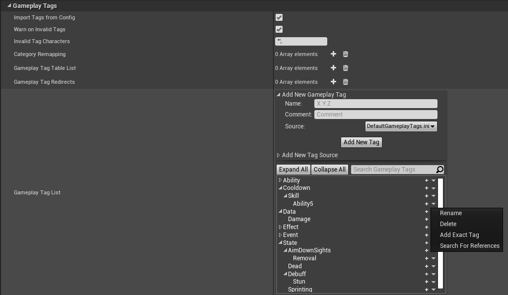

搜索 `GameplayTag` 引用会弹出编辑器中熟悉的 `Reference Viewer` 图表，显示引用该 `GameplayTag` 的所有资产。但这不会显示引用该 `GameplayTag` 的 C++ 类。

重命名 `GameplayTags` 会创建一个重定向，这样仍然引用原始 `GameplayTag` 的资产可以重定向到新的 `GameplayTag`。如果可能，我更倾向于创建一个新的 `GameplayTag`，手动将所有引用更新到新的 `GameplayTag`，然后删除旧的 `GameplayTag`，以避免创建重定向。

除了 `Fast Replication`，`GameplayTag` 编辑器还有一个选项可以填充经常复制的 `GameplayTags` 以进一步优化它们。

如果 `GameplayTags` 是从 `GameplayEffect` 添加的，它们会被复制。`ASC` 允许你添加不被复制且必须手动管理的 `LooseGameplayTags`。示例项目为 `State.Dead` 使用 `LooseGameplayTag`，这样拥有者客户端可以在生命值降为零时立即响应。重生时手动将 `TagMapCount` 重置为零。只有在处理 `LooseGameplayTags` 时才手动调整 `TagMapCount`。优先使用 `UAbilitySystemComponent::AddLooseGameplayTag()` 和 `UAbilitySystemComponent::RemoveLooseGameplayTag()` 函数，而不是手动调整 `TagMapCount`。

在 C++ 中获取 `GameplayTag` 的引用：
```c++
FGameplayTag::RequestGameplayTag(FName("Your.GameplayTag.Name"))
```

对于高级 `GameplayTag` 操作，如获取父级或子级 `GameplayTags`，请查看 `GameplayTagManager` 提供的函数。要访问 `GameplayTagManager`，包含 `GameplayTagManager.h` 并使用 `UGameplayTagManager::Get().FunctionName` 调用。`GameplayTagManager` 实际上将 `GameplayTags` 存储为关系节点（父、子等），比不断进行字符串操作和比较处理得更快。

`GameplayTags` 和 `GameplayTagContainers` 可以有可选的 `UPROPERTY` 说明符 `Meta = (Categories = "GameplayCue")`，它过滤蓝图中的标签，只显示父标签为 `GameplayCue` 的 `GameplayTags`。当你知道 `GameplayTag` 或 `GameplayTagContainer` 变量只应用于 `GameplayCues` 时，这很有用。

另外，还有一个单独的结构体叫做 `FGameplayCueTag`，它封装了一个 `FGameplayTag`，并且还自动在蓝图中过滤 `GameplayTags`，只显示父标签为 `GameplayCue` 的标签。

如果你想过滤函数中的 `GameplayTag` 参数，使用 `UFUNCTION` 说明符 `Meta = (GameplayTagFilter = "GameplayCue")`。函数中的 `GameplayTagContainer` 参数不能被过滤。如果你想修改引擎以允许这样做，请查看 `Engine\Plugins\Editor\GameplayTagsEditor\Source\GameplayTagsEditor\Private\SGameplayTagGraphPin.cpp` 中的 `SGameplayTagGraphPin::ParseDefaultValueData()` 如何调用 `FilterString = UGameplayTagsManager::Get().GetCategoriesMetaFromField(PinStructType);` 并将 `FilterString` 传递给 `SGameplayTagGraphPin::GetListContent()` 中的 `SGameplayTagWidget`。`Engine\Plugins\Editor\GameplayTagsEditor\Source\GameplayTagsEditor\Private\SGameplayTagContainerGraphPin.cpp` 中这些函数的 `GameplayTagContainer` 版本不检查元字段属性并传递过滤器。

示例项目大量使用了 `GameplayTags`。

**[⬆ 返回顶部](#table-of-contents)**

<a name="concepts-gt-change"></a>
### 4.2.1 响应 Gameplay Tags 的变化

`ASC` 提供了一个委托，用于 `GameplayTags` 被添加或移除时触发。它接受一个 `EGameplayTagEventType`，可以指定只在 `GameplayTag` 被添加/移除时触发，或在 `GameplayTag` 的 `TagMapCount` 发生任何变化时触发。

```c++
AbilitySystemComponent->RegisterGameplayTagEvent(FGameplayTag::RequestGameplayTag(FName("State.Debuff.Stun")), EGameplayTagEventType::NewOrRemoved).AddUObject(this, &AGDPlayerState::StunTagChanged);
```

回调函数有一个 `GameplayTag` 参数和新的 `TagCount`。
```c++
virtual void StunTagChanged(const FGameplayTag CallbackTag, int32 NewCount);
```

**[⬆ 返回顶部](#table-of-contents)**

<a name="concepts-gt-loadfromplugin"></a>
### 4.2.2 从插件 .ini 文件加载 Gameplay Tags

如果你创建了一个带有自己 .ini 文件（包含 `GameplayTags`）的插件，你可以在插件的 `StartupModule()` 函数中加载该插件的 `GameplayTag` .ini 目录。

例如，虚幻引擎附带的 CommonConversation 插件就是这样做的：

```c++
void FCommonConversationRuntimeModule::StartupModule()
{
	TSharedPtr<IPlugin> ThisPlugin = IPluginManager::Get().FindPlugin(TEXT("CommonConversation"));
	check(ThisPlugin.IsValid());
	
	UGameplayTagsManager::Get().AddTagIniSearchPath(ThisPlugin->GetBaseDir() / TEXT("Config") / TEXT("Tags"));

	//...
}
```

如果插件已启用，这会查找目录 `Plugins\CommonConversation\Config\Tags`，并在引擎启动时将其中包含 `GameplayTags` 的任何 .ini 文件加载到你的项目中。

**[⬆ 返回顶部](#table-of-contents)**

<a name="concepts-a"></a>
### 4.3 Attributes

<a name="concepts-a-definition"></a>
#### 4.3.1 Attribute 定义

`Attributes` 是由结构体 [`FGameplayAttributeData`](https://docs.unrealengine.com/en-US/API/Plugins/GameplayAbilities/FGameplayAttributeData/index.html) 定义的浮点值。它们可以表示从角色的生命值到角色等级再到药水充能次数的任何内容。如果它是属于 `Actor` 的与游戏玩法相关的数值，你应该考虑为其使用 `Attribute`。`Attributes` 通常应该只由 [`GameplayEffects`](#concepts-ge) 修改，以便 ASC 可以[预测](#concepts-p)这些变化。

`Attributes` 由 [`AttributeSet`](#concepts-as) 定义并存在于其中。`AttributeSet` 负责复制标记为复制的 `Attributes`。关于如何定义 `Attributes`，请参见 [`AttributeSets`](#concepts-as) 章节。

**提示：** 如果你不希望某个 `Attribute` 出现在编辑器的 `Attributes` 列表中，可以使用 `Meta = (HideInDetailsView)` `property specifier`。

**[⬆ 返回顶部](#table-of-contents)**

<a name="concepts-a-value"></a>
#### 4.3.2 BaseValue 与 CurrentValue

一个 `Attribute` 由两个值组成——`BaseValue` 和 `CurrentValue`。`BaseValue` 是 `Attribute` 的永久值，而 `CurrentValue` 是 `BaseValue` 加上 `GameplayEffects` 的临时修改。例如，你的 `Character` 可能有一个移动速度 `Attribute`，其 `BaseValue` 为 600 单位/秒。由于还没有 `GameplayEffects` 修改移动速度，`CurrentValue` 也是 600 u/s。如果她获得一个临时 50 u/s 的移动速度增益，`BaseValue` 保持不变仍为 600 u/s，而 `CurrentValue` 现在是 600 + 50 = 650 u/s。当移动速度增益过期时，`CurrentValue` 恢复到 `BaseValue` 的 600 u/s。

GAS 初学者经常将 `BaseValue` 与 `Attribute` 的最大值混淆并尝试将其作为最大值使用。这是不正确的方法。可以变化或在技能或 UI 中引用的 `Attributes` 的最大值应该作为单独的 `Attributes` 处理。对于硬编码的最大值和最小值，有一种方法可以定义一个带有 `FAttributeMetaData` 的 `DataTable` 来设置最大值和最小值，但 Epic 在结构体上方的注释称其为"正在进行的工作"。更多信息请参见 `AttributeSet.h`。为避免混淆，我建议将在技能或 UI 中引用的最大值作为单独的 `Attributes`，仅用于钳制 `Attributes` 的硬编码最大值和最小值定义为 `AttributeSet` 中的硬编码浮点数。`Attributes` 的钳制在 [PreAttributeChange()](#concepts-as-preattributechange) 中讨论 `CurrentValue` 的变化，在 [PostGameplayEffectExecute()](#concepts-as-postgameplayeffectexecute) 中讨论 `GameplayEffects` 对 `BaseValue` 的变化。

对 `BaseValue` 的永久变化来自 `Instant` `GameplayEffects`，而 `Duration` 和 `Infinite` `GameplayEffects` 改变 `CurrentValue`。周期性 `GameplayEffects` 被视为即时 `GameplayEffects` 并改变 `BaseValue`。

**[⬆ 返回顶部](#table-of-contents)**

<a name="concepts-a-meta"></a>
#### 4.3.3 Meta Attributes

一些 `Attributes` 被视为临时值的占位符，旨在与 `Attributes` 交互。这些被称为 `Meta Attributes`。例如，我们通常将伤害定义为 `Meta Attribute`。不是 `GameplayEffect` 直接改变我们的生命值 `Attribute`，而是使用一个称为伤害的 `Meta Attribute` 作为占位符。这样，伤害值可以在 [`GameplayEffectExecutionCalculation`](#concepts-ge-ec) 中通过增益和减益修改，并可以在 `AttributeSet` 中进一步操作，例如先从当前护盾 `Attribute` 中减去伤害，最后从生命值 `Attribute` 中减去剩余部分。伤害 `Meta Attribute` 在 `GameplayEffects` 之间没有持久性，每个都会覆盖它。`Meta Attributes` 通常不被复制。

`Meta Attributes` 为伤害和治疗等提供了良好的逻辑分离，将"我们造成了多少伤害？"和"我们如何处理这些伤害？"分开。这种逻辑分离意味着我们的 `Gameplay Effects` 和 `Execution Calculations` 不需要知道目标如何处理伤害。继续我们的伤害示例，`Gameplay Effect` 决定造成多少伤害，然后 `AttributeSet` 决定如何处理这些伤害。并非所有角色都有相同的 `Attributes`，特别是如果你使用了子类化的 `AttributeSets`。基础 `AttributeSet` 类可能只有生命值 `Attribute`，但子类化的 `AttributeSet` 可能添加护盾 `Attribute`。带有护盾 `Attribute` 的子类化 `AttributeSet` 处理伤害的方式与基础 `AttributeSet` 类不同。

虽然 `Meta Attributes` 是一个好的设计模式，但它们不是强制性的。如果你只对所有伤害实例使用一个 `Execution Calculation`，且所有角色共享一个 `Attribute Set` 类，那么你可以在 `Execution Calculation` 内部直接将伤害分配到生命值、护盾等并直接修改这些 `Attributes`。你只是牺牲了灵活性，但这对你来说可能没问题。

**[⬆ 返回顶部](#table-of-contents)**

<a name="concepts-a-changes"></a>
#### 4.3.4 响应 Attribute 变化

要监听 `Attribute` 何时变化以更新 UI 或其他游戏逻辑，使用 `UAbilitySystemComponent::GetGameplayAttributeValueChangeDelegate(FGameplayAttribute Attribute)`。此函数返回一个委托，你可以绑定它，它会在 `Attribute` 变化时自动调用。委托提供一个带有 `NewValue`、`OldValue` 和 `FGameplayEffectModCallbackData` 的 `FOnAttributeChangeData` 参数。**注意：** `FGameplayEffectModCallbackData` 只在服务器上设置。

```c++
AbilitySystemComponent->GetGameplayAttributeValueChangeDelegate(AttributeSetBase->GetHealthAttribute()).AddUObject(this, &AGDPlayerState::HealthChanged);
```

```c++
virtual void HealthChanged(const FOnAttributeChangeData& Data);
```

示例项目在 `GDPlayerState` 上绑定 `Attribute` 值变化委托，以更新 HUD 并在生命值降为零时响应玩家死亡。

示例项目中包含一个将此封装为 `ASyncTask` 的自定义蓝图节点。它在 `UI_HUD` UMG Widget 中用于更新生命值、法力值和耐力值。此 `AsyncTask` 将一直存在直到手动调用 `EndTask()`，我们在 UMG Widget 的 `Destruct` 事件中执行此操作。参见 `AsyncTaskAttributeChanged.h/cpp`。

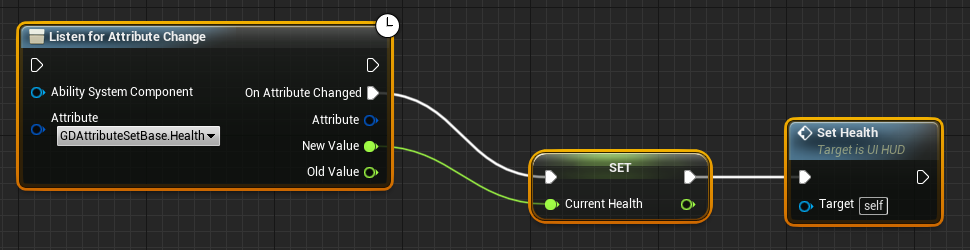

**[⬆ 返回顶部](#table-of-contents)**

<a name="concepts-a-derived"></a>
#### 4.3.5 派生 Attributes

要创建一个值部分或全部从一个或多个其他 `Attributes` 派生的 `Attribute`，使用一个带有 `Attribute Based` 或 [`MMC`](#concepts-ge-mmc) [`Modifiers`](#concepts-ge-mods) 的 `Infinite` `GameplayEffect`。当它依赖的 `Attribute` 更新时，`Derived Attribute` 会自动更新。

`Derived Attribute` 上所有 `Modifiers` 的最终公式与 `Modifier Aggregators` 的公式相同。如果你需要按特定顺序进行计算，请在 `MMC` 内部完成。

```
((CurrentValue + Additive) * Multiplicitive) / Division
```

**注意：** 如果在 PIE 中与多个客户端一起测试，你需要在编辑器首选项中禁用 `Run Under One Process`，否则当其独立的 `Attributes` 在第一个以外的客户端上更新时，`Derived Attributes` 不会更新。

在这个示例中，我们有一个 `Infinite` `GameplayEffect`，它根据 `Attributes` `TestAttrB` 和 `TestAttrC` 按公式 `TestAttrA = (TestAttrA + TestAttrB) * ( 2 * TestAttrC)` 派生 `TestAttrA` 的值。每当任何 `Attribute` 更新其值时，`TestAttrA` 都会自动重新计算其值。

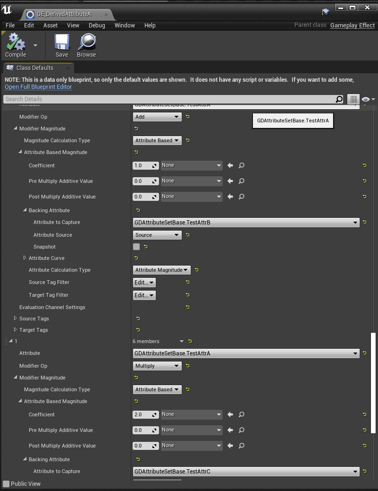

**[⬆ 返回顶部](#table-of-contents)**

<a name="concepts-as"></a>
### 4.4 Attribute Set

<a name="concepts-as-definition"></a>
#### 4.4.1 Attribute Set 定义

`AttributeSet` 定义、保存和管理 `Attributes` 的变化。开发者应该从 [`UAttributeSet`](https://docs.unrealengine.com/en-US/API/Plugins/GameplayAbilities/UAttributeSet/index.html) 继承。在 `OwnerActor` 的构造函数中创建 `AttributeSet` 会自动将其注册到其 `ASC`。**这必须在 C++ 中完成**。

**[⬆ 返回顶部](#table-of-contents)**

<a name="concepts-as-design"></a>
#### 4.4.2 Attribute Set 设计

一个 `ASC` 可以有一个或多个 `AttributeSets`。AttributeSets 的内存开销可以忽略不计，因此使用多少 `AttributeSets` 是由开发者决定的组织选择。

可以有一个大型单体 `AttributeSet` 被游戏中每个 `Actor` 共享，只在需要时使用属性而忽略未使用的属性，这是可以接受的。

或者，你可以选择有多个 `AttributeSet`，代表按需选择性地添加到你的 `Actors` 的 `Attributes` 分组。例如，你可以有一个用于生命值相关 `Attributes` 的 `AttributeSet`，一个用于法力值相关 `Attributes` 的 `AttributeSet` 等等。在 MOBA 游戏中，英雄可能需要法力值但小兵可能不需要。因此英雄会获得法力值 `AttributeSet` 而小兵不会。

此外，`AttributeSets` 可以被子类化，作为选择性地选择 `Actor` 拥有哪些 `Attributes` 的另一种方式。`Attributes` 在内部被称为 `AttributeSetClassName.AttributeName`。当你子类化 `AttributeSet` 时，父类的所有 `Attributes` 仍然会以父类名作为前缀。

虽然你可以有多个 `AttributeSet`，但不应在一个 `ASC` 上有同一个类的多个 `AttributeSet`。如果你有同一个类的多个 `AttributeSet`，它不知道使用哪个 `AttributeSet`，只会随机选一个。

<a name="concepts-as-design-subcomponents"></a>
##### 4.4.2.1 具有独立 Attributes 的子组件

在 `Pawn` 上有多个可受伤害的组件（如单独可受伤害的盔甲件）的场景中，我建议如果你知道 `Pawn` 可能拥有的可受伤害组件的最大数量，就在一个 `AttributeSet` 上创建相应数量的生命值 `Attributes`——DamageableCompHealth0、DamageableCompHealth1 等，代表这些可受伤害组件的逻辑"槽位"。在你的可受伤害组件类实例中，分配槽位编号 `Attribute`，`GameplayAbilities` 或 [`Executions`](#concepts-ge-ec) 可以读取它以知道将伤害应用到哪个 `Attribute`。拥有少于最大数量或零个可受伤害组件的 `Pawns` 没问题。`AttributeSet` 有某个 `Attribute` 并不意味着你必须使用它。未使用的 `Attributes` 占用的内存微不足道。

如果你的子组件每个都需要许多 `Attributes`，子组件数量可能无上限，子组件可以脱离并被其他玩家使用（例如武器），或者出于任何原因这种方法不适合你，我建议不再使用 `Attributes`，而是在组件上存储普通浮点数。参见[物品 Attributes](#concepts-as-design-itemattributes)。

<a name="concepts-as-design-addremoveruntime"></a>
##### 4.4.2.2 运行时添加和移除 AttributeSets

`AttributeSets` 可以在运行时从 `ASC` 中添加和移除；但是，移除 `AttributeSets` 可能是危险的。例如，如果在服务器之前在客户端移除了 `AttributeSet`，并且一个 `Attribute` 值变化被复制到客户端，该 `Attribute` 找不到其 `AttributeSet` 并导致游戏崩溃。

武器添加到背包时：
```c++
AbilitySystemComponent->GetSpawnedAttributes_Mutable().AddUnique(WeaponAttributeSetPointer);
AbilitySystemComponent->ForceReplication();
```

武器从背包移除时：
```c++
AbilitySystemComponent->GetSpawnedAttributes_Mutable().Remove(WeaponAttributeSetPointer);
AbilitySystemComponent->ForceReplication();
```
<a name="concepts-as-design-itemattributes"></a>
##### 4.4.2.3 物品 Attributes（武器弹药）

有几种方法可以用 `Attributes` 实现可装备物品（武器弹药、盔甲耐久度等）。所有这些方法都将值直接存储在物品上。这对于在其生命周期内可以被多个玩家装备的物品是必需的。

> 1. 在物品上使用普通浮点数（**推荐**）
> 1. 物品上单独的 `AttributeSet`
> 1. 物品上单独的 `ASC`

<a name="concepts-as-design-itemattributes-plainfloats"></a>
###### 4.4.2.3.1 物品上的普通浮点数

不是使用 `Attributes`，而是在物品类实例上存储普通浮点值。Fortnite 和 [GASShooter](https://github.com/tranek/GASShooter) 就是这样处理枪械弹药的。对于枪械，将最大弹夹容量、当前弹夹弹药、备用弹药等直接作为复制浮点数（`COND_OwnerOnly`）存储在枪械实例上。如果武器共享备用弹药，你会将备用弹药移到角色上作为共享弹药 `AttributeSet` 中的 `Attribute`（装弹技能可以使用 `Cost GE` 从备用弹药中提取到枪械的浮点数弹夹弹药中）。由于你没有为当前弹夹弹药使用 `Attributes`，你需要重写 `UGameplayAbility` 中的一些函数来检查并应用针对枪械浮点数的消耗。在授予技能时将枪械作为 [`GameplayAbilitySpec`](https://github.com/tranek/GASDocumentation#concepts-ga-spec) 中的 `SourceObject`，意味着你可以在技能内部访问授予该技能的枪械。

为了防止枪械在自动射击时复制回弹药数量并覆盖本地弹药数量，在 `PreReplication()` 中当玩家有 `IsFiring` `GameplayTag` 时禁用复制。你本质上是在做自己的本地预测。

```c++
void AGSWeapon::PreReplication(IRepChangedPropertyTracker& ChangedPropertyTracker)
{
	Super::PreReplication(ChangedPropertyTracker);

	DOREPLIFETIME_ACTIVE_OVERRIDE(AGSWeapon, PrimaryClipAmmo, (IsValid(AbilitySystemComponent) && !AbilitySystemComponent->HasMatchingGameplayTag(WeaponIsFiringTag)));
	DOREPLIFETIME_ACTIVE_OVERRIDE(AGSWeapon, SecondaryClipAmmo, (IsValid(AbilitySystemComponent) && !AbilitySystemComponent->HasMatchingGameplayTag(WeaponIsFiringTag)));
}
```

优点：
1. 避免使用 `AttributeSets` 的限制（见下文）

限制：
1. 不能使用现有的 `GameplayEffect` 工作流（弹药消耗的 `Cost GEs` 等）
1. 需要重写 `UGameplayAbility` 上的关键函数来检查并应用针对枪械浮点数的弹药消耗

<a name="concepts-as-design-itemattributes-attributeset"></a>
###### 4.4.2.3.2 物品上的 `AttributeSet`

在物品上使用单独的 `AttributeSet`，在[将其添加到玩家背包时添加到玩家的 `ASC`](#concepts-as-design-addremoveruntime) 是可行的，但它有一些主要限制。我在 [GASShooter](https://github.com/tranek/GASShooter) 的早期版本中就是这样处理武器弹药的。武器将其 `Attributes`（如最大弹夹容量、当前弹夹弹药、备用弹药等）存储在位于武器类上的 `AttributeSet` 中。如果武器共享备用弹药，你会将备用弹药移到角色上的共享弹药 `AttributeSet` 中。当武器在服务器上添加到玩家背包时，武器会将其 `AttributeSet` 添加到玩家的 `ASC::SpawnedAttributes`。然后服务器将其复制到客户端。如果武器从背包中移除，它会从 `ASC::SpawnedAttributes` 中移除其 `AttributeSet`。

当 `AttributeSet` 位于 `OwnerActor` 以外的东西上（比如武器）时，你最初会在 `AttributeSet` 中遇到一些编译错误。解决方法是在 `BeginPlay()` 而不是构造函数中构造 `AttributeSet`，并在武器上实现 `IAbilitySystemInterface`（当你将武器添加到玩家背包时设置指向 `ASC` 的指针）。

```c++
void AGSWeapon::BeginPlay()
{
	if (!AttributeSet)
	{
		AttributeSet = NewObject<UGSWeaponAttributeSet>(this);
	}
	//...
}
```

你可以查看[GASShooter 的旧版本](https://github.com/tranek/GASShooter/tree/df5949d0dd992bd3d76d4a728f370f2e2c827735)来了解实际应用。

优点：
1. 可以使用现有的 `GameplayAbility` 和 `GameplayEffect` 工作流（弹药消耗的 `Cost GEs` 等）
1. 对于非常少量的物品，设置简单

限制：
1. 你必须为每种武器类型创建一个新的 `AttributeSet` 类。`ASC` 实际上每个类只能有一个 `AttributeSet` 实例，因为对 `Attribute` 的更改会在 `ASC` 的 `SpawnedAttributes` 数组中查找其 `AttributeSet` 类的第一个实例。同一 `AttributeSet` 类的其他实例会被忽略。
1. 由于上述每个 `AttributeSet` 类一个 `AttributeSet` 实例的原因，玩家背包中每种武器只能有一把。
1. 移除 `AttributeSet` 是危险的。在 GASShooter 中，如果玩家被自己的火箭弹杀死，玩家会立即从背包中移除火箭发射器（包括从 `ASC` 中移除其 `AttributeSet`）。当服务器复制火箭发射器的弹药 `Attribute` 变化时，`AttributeSet` 在客户端的 `ASC` 上已不存在，游戏崩溃。

<a name="concepts-as-design-itemattributes-asc"></a>
###### 4.4.2.3.3 物品上的 `ASC`

在每个物品上放置一个完整的 `AbilitySystemComponent` 是一种极端方法。我个人没有这样做过，也没有在实际项目中见过。需要大量的工程工作才能使其运行。

> 拥有多个具有相同所有者但不同化身的 AbilitySystemComponents 是否可行（例如在 pawn 和武器/物品/投射物上，Owner 设置为 PlayerState）？
> 
> 我看到的第一个问题是在拥有者 actor 上实现 IGameplayTagAssetInterface 和 IAbilitySystemInterface。前者可能是可行的：只需聚合所有 ASC 的标签（但要注意——HasAllMatchingGameplayTags 可能只能通过跨 ASC 聚合来满足。仅将调用转发到每个 ASC 并将结果 OR 在一起是不够的）。但后者更棘手：哪个 ASC 是权威的？如果有人想应用一个 GE——应该接收它的是哪个？也许你可以解决这些问题，但问题的这一面将是最难的：拥有者下面会有多个 ASC。
> 
> 在 pawn 和武器上分开的 ASC 本身可能是合理的。例如，区分描述武器的标签和描述拥有者 pawn 的标签。也许授予武器的标签也"适用"于拥有者且仅此而已（例如，属性和 GE 是独立的，但拥有者会像我所描述的那样聚合拥有的标签）是合理的。这可能是行得通的，我确信。但拥有多个具有相同所有者的 ASC 可能会有风险。

*Dave Ratti 来自 Epic 对[社区问题 #6](https://epicgames.ent.box.com/s/m1egifkxv3he3u3xezb9hzbgroxyhx89)的回答*

优点：
1. 可以使用现有的 `GameplayAbility` 和 `GameplayEffect` 工作流（弹药消耗的 `Cost GEs` 等）
1. 可以重用 `AttributeSet` 类（每个武器的 ASC 上一个）

限制：
1. 未知的工程成本
1. 是否可行？

**[⬆ 返回顶部](#table-of-contents)**

<a name="concepts-as-attributes"></a>
#### 4.4.3 定义 Attributes

**`Attributes` 只能在 C++ 中定义**，在 `AttributeSet` 的头文件中。建议在每个 `AttributeSet` 头文件顶部添加这个宏块。它会自动为你的 `Attributes` 生成 getter 和 setter 函数。

```c++
// 使用 AttributeSet.h 中的宏
#define ATTRIBUTE_ACCESSORS(ClassName, PropertyName) \
	GAMEPLAYATTRIBUTE_PROPERTY_GETTER(ClassName, PropertyName) \
	GAMEPLAYATTRIBUTE_VALUE_GETTER(PropertyName) \
	GAMEPLAYATTRIBUTE_VALUE_SETTER(PropertyName) \
	GAMEPLAYATTRIBUTE_VALUE_INITTER(PropertyName)
```

一个复制的生命值属性定义如下：

```c++
UPROPERTY(BlueprintReadOnly, Category = "Health", ReplicatedUsing = OnRep_Health)
FGameplayAttributeData Health;
ATTRIBUTE_ACCESSORS(UGDAttributeSetBase, Health)
```

还需要在头文件中定义 `OnRep` 函数：
```c++
UFUNCTION()
virtual void OnRep_Health(const FGameplayAttributeData& OldHealth);
```

`AttributeSet` 的 .cpp 文件应使用预测系统使用的 `GAMEPLAYATTRIBUTE_REPNOTIFY` 宏填充 `OnRep` 函数：
```c++
void UGDAttributeSetBase::OnRep_Health(const FGameplayAttributeData& OldHealth)
{
	GAMEPLAYATTRIBUTE_REPNOTIFY(UGDAttributeSetBase, Health, OldHealth);
}
```

最后，`Attribute` 需要添加到 `GetLifetimeReplicatedProps`：
```c++
void UGDAttributeSetBase::GetLifetimeReplicatedProps(TArray<FLifetimeProperty>& OutLifetimeProps) const
{
	Super::GetLifetimeReplicatedProps(OutLifetimeProps);

	DOREPLIFETIME_CONDITION_NOTIFY(UGDAttributeSetBase, Health, COND_None, REPNOTIFY_Always);
}
```

`REPNOTIFY_Always` 告诉 `OnRep` 函数在本地值已经等于从服务器复制下来的值时（由于预测）也触发。默认情况下，如果本地值与从服务器复制下来的值相同，则不会触发 `OnRep` 函数。

如果 `Attribute` 不像 `Meta Attribute` 那样复制，则可以跳过 `OnRep` 和 `GetLifetimeReplicatedProps` 步骤。

**[⬆ 返回顶部](#table-of-contents)**

<a name="concepts-as-init"></a>
#### 4.4.4 初始化 Attributes

有多种方法可以初始化 `Attributes`（将其 `BaseValue` 以及因此其 `CurrentValue` 设置为某个初始值）。Epic 建议使用即时 `GameplayEffect`。这也是示例项目使用的方法。

关于如何制作即时 `GameplayEffect` 来初始化 `Attributes`，请参见示例项目中的 `GE_HeroAttributes` 蓝图。此 `GameplayEffect` 的应用在 C++ 中完成。

如果在定义 `Attributes` 时使用了 `ATTRIBUTE_ACCESSORS` 宏，`AttributeSet` 上会自动为每个 `Attribute` 生成一个初始化函数，你可以在 C++ 中随时调用。

```c++
// InitHealth(float InitialValue) 是为使用 `ATTRIBUTE_ACCESSORS` 宏定义的 Attribute 'Health' 自动生成的函数
AttributeSet->InitHealth(100.0f);
```

更多初始化 `Attributes` 的方法请参见 `AttributeSet.h`。

**注意：** 在 4.24 之前，`FAttributeSetInitterDiscreteLevels` 不适用于 `FGameplayAttributeData`。它是在 `Attributes` 为原始浮点数时创建的，会抱怨 `FGameplayAttributeData` 不是 `Plain Old Data`（`POD`）。这在 4.24 中已修复 https://issues.unrealengine.com/issue/UE-76557。

**[⬆ 返回顶部](#table-of-contents)**

<a name="concepts-as-preattributechange"></a>
#### 4.4.5 PreAttributeChange()

`PreAttributeChange(const FGameplayAttribute& Attribute, float& NewValue)` 是 `AttributeSet` 中响应 `Attribute` 的 `CurrentValue` 变化前的主要函数之一。它是在变化发生前通过引用参数 `NewValue` 钳制传入的 `CurrentValue` 变化的理想位置。

例如要钳制移动速度修饰符，示例项目这样做：
```c++
if (Attribute == GetMoveSpeedAttribute())
{
	// 不能减速到 150 单位/秒以下，不能加速到 1000 单位/秒以上
	NewValue = FMath::Clamp<float>(NewValue, 150, 1000);
}
```
`GetMoveSpeedAttribute()` 函数由我们添加到 `AttributeSet.h` 的宏块创建（[定义 Attributes](#concepts-as-attributes)）。

这在 `Attributes` 的任何变化时触发，无论是使用 `Attribute` setter（由 `AttributeSet.h` 中的宏块定义（[定义 Attributes](#concepts-as-attributes)））还是使用 [`GameplayEffects`](#concepts-ge)。

**注意：** 这里发生的任何钳制都不会永久更改 `ASC` 上的修饰符。它只更改查询修饰符返回的值。这意味着任何从所有修饰符重新计算 `CurrentValue` 的东西，如 [`GameplayEffectExecutionCalculations`](#concepts-ge-ec) 和 [`ModifierMagnitudeCalculations`](#concepts-ge-mmc)，都需要再次实现钳制。

**注意：** Epic 对 `PreAttributeChange()` 的注释说不要将其用于游戏事件，而是主要用于钳制。`Attribute` 变化时游戏事件的推荐位置是 `UAbilitySystemComponent::GetGameplayAttributeValueChangeDelegate(FGameplayAttribute Attribute)`（[响应 Attribute 变化](#concepts-a-changes)）。

**[⬆ 返回顶部](#table-of-contents)**

<a name="concepts-as-postgameplayeffectexecute"></a>
#### 4.4.6 PostGameplayEffectExecute()

`PostGameplayEffectExecute(const FGameplayEffectModCallbackData & Data)` 只在即时 [`GameplayEffect`](#concepts-ge) 对 `Attribute` 的 `BaseValue` 进行更改后触发。这是当 `Attributes` 因 `GameplayEffect` 变化时进行更多 `Attribute` 操作的有效位置。

例如，在示例项目中，我们在这里从生命值 `Attribute` 中减去最终伤害 `Meta Attribute`。如果有护盾 `Attribute`，我们会先从护盾中减去伤害，再从生命值中减去剩余部分。示例项目还使用此位置应用受击反应动画、显示浮动伤害数字，以及将经验和金币赏金分配给击杀者。按照设计，伤害 `Meta Attribute` 总是通过即时 `GameplayEffect` 传入，而不是 `Attribute` setter。

其他只会从即时 `GameplayEffects` 更改 `BaseValue` 的 `Attributes`（如法力值和耐力值）也可以在这里钳制到其对应的最大值 `Attributes`。

**注意：** 当 `PostGameplayEffectExecute()` 被调用时，`Attribute` 的变化已经发生，但还没有复制回客户端，所以在这里钳制值不会导致两次网络更新到客户端。客户端只会在钳制后收到更新。

**[⬆ 返回顶部](#table-of-contents)**

<a name="concepts-as-onattributeaggregatorcreated"></a>
#### 4.4.7 OnAttributeAggregatorCreated()

`OnAttributeAggregatorCreated(const FGameplayAttribute& Attribute, FAggregator* NewAggregator)` 在为此集合中的 `Attribute` 创建 `Aggregator` 时触发。它允许自定义设置 [`FAggregatorEvaluateMetaData`](https://docs.unrealengine.com/en-US/API/Plugins/GameplayAbilities/FAggregatorEvaluateMetaData/index.html)。`AggregatorEvaluateMetaData` 被 `Aggregator` 用于根据应用于 `Attribute` 的所有 [`Modifiers`](#concepts-ge-mods) 评估 `CurrentValue`。默认情况下，`AggregatorEvaluateMetaData` 只被 `Aggregator` 用于确定哪些 `Modifiers` 符合条件，例如 `MostNegativeMod_AllPositiveMods` 允许所有正向 `Modifiers` 但限制负向 `Modifiers` 只取最负的一个。Paragon 使用此功能，无论玩家身上同时有多少减速效果，只允许最负的移动速度减速效果应用于玩家，同时应用所有正向移动速度增益。不符合条件的 `Modifiers` 仍然存在于 `ASC` 上，只是不会被聚合到最终 `CurrentValue` 中。一旦条件改变，它们可能符合条件，例如当最负的 `Modifier` 过期时，下一个最负的 `Modifier`（如果存在）就会符合条件。

在只允许最负 `Modifier` 和所有正向 `Modifiers` 的示例中使用 AggregatorEvaluateMetaData：

```c++
virtual void OnAttributeAggregatorCreated(const FGameplayAttribute& Attribute, FAggregator* NewAggregator) const override;
```

```c++
void UGSAttributeSetBase::OnAttributeAggregatorCreated(const FGameplayAttribute& Attribute, FAggregator* NewAggregator) const
{
	Super::OnAttributeAggregatorCreated(Attribute, NewAggregator);

	if (!NewAggregator)
	{
		return;
	}

	if (Attribute == GetMoveSpeedAttribute())
	{
		NewAggregator->EvaluationMetaData = &FAggregatorEvaluateMetaDataLibrary::MostNegativeMod_AllPositiveMods;
	}
}
```

你的自定义 `AggregatorEvaluateMetaData` 限定符应作为静态变量添加到 `FAggregatorEvaluateMetaDataLibrary`。

**[⬆ 返回顶部](#table-of-contents)**

<a name="concepts-ge"></a>
### 4.5 Gameplay Effects

<a name="concepts-ge-definition"></a>
#### 4.5.1 Gameplay Effect 定义

[`GameplayEffects`](https://docs.unrealengine.com/en-US/API/Plugins/GameplayAbilities/UGameplayEffect/index.html)（`GE`）是技能改变自身和他人 [`Attributes`](#concepts-a) 和 [`GameplayTags`](#concepts-gt) 的载体。它们可以造成即时的 `Attribute` 变化，如伤害或治疗，或应用长期的状态增益/减益，如移动速度提升或眩晕。`UGameplayEffect` 类是一个**纯数据**类，定义单个游戏效果。不应向 `GameplayEffects` 添加额外逻辑。通常设计师会创建许多 `UGameplayEffect` 的蓝图子类。

`GameplayEffects` 通过 [`Modifiers`](#concepts-ge-mods) 和 [`Executions`（`GameplayEffectExecutionCalculation`）](#concepts-ge-ec) 改变 `Attributes`。

`GameplayEffects` 有三种持续时间类型：`Instant`、`Duration` 和 `Infinite`。

此外，`GameplayEffects` 可以添加/执行 [`GameplayCues`](#concepts-gc)。`Instant` `GameplayEffect` 会在 `GameplayCue` `GameplayTags` 上调用 `Execute`，而 `Duration` 或 `Infinite` `GameplayEffect` 会在 `GameplayCue` `GameplayTags` 上调用 `Add` 和 `Remove`。

| 持续时间类型   | GameplayCue 事件  | 使用场景                                                                                                                                                                                                                                |
| ------------- | ----------------- | ------------------------------------------------------------------------------------------------------------------------------------------------------------------------------------------------------------------------------------------ |
| `Instant`     | Execute           | 用于对 `Attribute` 的 `BaseValue` 进行即时永久更改。`GameplayTags` 不会被应用，甚至一帧都不会。                                                                                                                    |
| `Duration`    | Add & Remove      | 用于对 `Attribute` 的 `CurrentValue` 进行临时更改，以及应用在 `GameplayEffect` 过期或手动移除时会被移除的 `GameplayTags`。持续时间在 `UGameplayEffect` 类/蓝图中指定。       |
| `Infinite`    | Add & Remove      | 用于对 `Attribute` 的 `CurrentValue` 进行临时更改，以及应用在 `GameplayEffect` 被移除时会移除的 `GameplayTags`。这些永不会自己过期，必须由技能或 `ASC` 手动移除。 |

`Duration` 和 `Infinite` `GameplayEffects` 可以选择应用 `Periodic Effects`，按其 `Period` 定义每 `X` 秒应用其 `Modifiers` 和 `Executions`。`Periodic Effects` 在改变 `Attribute` 的 `BaseValue` 和 `Executing` `GameplayCues` 方面被视为 `Instant` `GameplayEffects`。这些对于持续伤害（DOT）类型的效果很有用。**注意：** `Periodic Effects` 不能被[预测](#concepts-p)。

`Duration` 和 `Infinite` `GameplayEffects` 如果其 `Ongoing Tag Requirements` 不满足/满足（[Gameplay Effect Tags](#concepts-ge-tags)），可以在应用后临时关闭和打开。关闭 `GameplayEffect` 会移除其 `Modifiers` 的效果和已应用的 `GameplayTags`，但不会移除 `GameplayEffect`。重新打开 `GameplayEffect` 会重新应用其 `Modifiers` 和 `GameplayTags`。

如果你需要手动重新计算 `Duration` 或 `Infinite` `GameplayEffect` 的 `Modifiers`（比如你有一个使用非 `Attributes` 数据的 `MMC`），可以调用 `UAbilitySystemComponent::ActiveGameplayEffects.SetActiveGameplayEffectLevel(FActiveGameplayEffectHandle ActiveHandle, int32 NewLevel)`，使用 `UAbilitySystemComponent::ActiveGameplayEffects.GetActiveGameplayEffect(ActiveHandle).Spec.GetLevel()` 获取的相同等级。基于后端 `Attributes` 的 `Modifiers` 在这些后端 `Attributes` 更新时自动更新。`SetActiveGameplayEffectLevel()` 更新 `Modifiers` 的关键函数是：

```C++
MarkItemDirty(Effect);
Effect.Spec.CalculateModifierMagnitudes();
// 私有函数，否则我们会调用这四个函数而不需要将级别设置为已有的级别
UpdateAllAggregatorModMagnitudes(Effect);
```

`GameplayEffects` 通常不会被实例化。当技能或 `ASC` 想要应用 `GameplayEffect` 时，它从 `GameplayEffect` 的 `ClassDefaultObject` 创建一个 [`GameplayEffectSpec`](#concepts-ge-spec)。成功应用的 `GameplayEffectSpecs` 然后被添加到一个名为 `FActiveGameplayEffect` 的新结构体中，这是 `ASC` 在一个名为 `ActiveGameplayEffects` 的特殊容器结构体中跟踪的内容。

**[⬆ 返回顶部](#table-of-contents)**

<a name="concepts-ge-applying"></a>
#### 4.5.2 应用 Gameplay Effects

`GameplayEffects` 可以通过多种方式应用，来自 [`GameplayAbilities`](#concepts-ga) 上的函数和 `ASC` 上的函数，通常采用 `ApplyGameplayEffectTo` 的形式。不同的函数本质上是便捷函数，最终会在 `Target` 上调用 `UAbilitySystemComponent::ApplyGameplayEffectSpecToSelf()`。

要在 `GameplayAbility` 之外应用 `GameplayEffects`（例如从投射物），你需要获取 `Target` 的 `ASC` 并使用其函数之一 `ApplyGameplayEffectToSelf`。

你可以通过绑定其委托来监听任何 `Duration` 或 `Infinite` `GameplayEffects` 被应用到 `ASC`：
```c++
AbilitySystemComponent->OnActiveGameplayEffectAddedDelegateToSelf.AddUObject(this, &APACharacterBase::OnActiveGameplayEffectAddedCallback);
```
回调函数：
```c++
virtual void OnActiveGameplayEffectAddedCallback(UAbilitySystemComponent* Target, const FGameplayEffectSpec& SpecApplied, FActiveGameplayEffectHandle ActiveHandle);
```

无论复制模式如何，服务器总是会调用此函数。自主代理只会在 `Full` 和 `Mixed` 复制模式下为复制的 `GameplayEffects` 调用此函数。模拟代理只会在 `Full` [复制模式](#concepts-asc-rm)下调用此函数。

**[⬆ 返回顶部](#table-of-contents)**

<a name="concepts-ga-removing"></a>
#### 4.5.3 移除 Gameplay Effects

`GameplayEffects` 可以通过多种方式移除，来自 [`GameplayAbilities`](#concepts-ga) 上的函数和 `ASC` 上的函数，通常采用 `RemoveActiveGameplayEffect` 的形式。不同的函数本质上是便捷函数，最终会在 `Target` 上调用 `FActiveGameplayEffectsContainer::RemoveActiveEffects()`。

要在 `GameplayAbility` 之外移除 `GameplayEffects`，你需要获取 `Target` 的 `ASC` 并使用其函数之一 `RemoveActiveGameplayEffect`。

你可以通过绑定其委托来监听任何 `Duration` 或 `Infinite` `GameplayEffects` 从 `ASC` 移除：
```c++
AbilitySystemComponent->OnAnyGameplayEffectRemovedDelegate().AddUObject(this, &APACharacterBase::OnRemoveGameplayEffectCallback);
```
回调函数：
```c++
virtual void OnRemoveGameplayEffectCallback(const FActiveGameplayEffect& EffectRemoved);
```

无论复制模式如何，服务器总是会调用此函数。自主代理只会在 `Full` 和 `Mixed` 复制模式下为复制的 `GameplayEffects` 调用此函数。模拟代理只会在 `Full` [复制模式](#concepts-asc-rm)下调用此函数。

**[⬆ 返回顶部](#table-of-contents)**

<a name="concepts-ge-mods"></a>
#### 4.5.4 Gameplay Effect Modifiers

`Modifiers` 改变一个 `Attribute`，是[预测性地](#concepts-p)改变 `Attribute` 的唯一方式。一个 `GameplayEffect` 可以有零个或多个 `Modifiers`。每个 `Modifier` 负责通过指定的操作只改变一个 `Attribute`。

| 操作        | 描述                                                                                                         |
| ---------- | ------------------------------------------------------------------------------------------------------------------- |
| `Add`      | 将结果添加到 `Modifier` 指定的 `Attribute`。使用负值进行减法。                    |
| `Multiply` | 将结果乘到 `Modifier` 指定的 `Attribute`。                                                    |
| `Divide`   | 将结果除 `Modifier` 指定的 `Attribute`。                                                  |
| `Override` | 用结果覆盖 `Modifier` 指定的 `Attribute`。                                                   |

`Attribute` 的 `CurrentValue` 是其所有 `Modifiers` 聚合结果加上其 `BaseValue`。`Modifiers` 如何聚合的公式在 `GameplayEffectAggregator.cpp` 的 `FAggregatorModChannel::EvaluateWithBase` 中定义如下：
```c++
((InlineBaseValue + Additive) * Multiplicitive) / Division
```

任何 `Override` `Modifiers` 都会用最后应用的 `Modifier` 覆盖最终值。

**注意：** 对于基于百分比的变化，确保使用 `Multiply` 操作，使其在加法之后发生。

**注意：** [预测](#concepts-p)在百分比变化方面有困难。

有四种类型的 `Modifiers`：Scalable Float、Attribute Based、Custom Calculation Class 和 Set By Caller。它们都生成某个浮点值，然后根据其操作用于改变 `Modifier` 指定的 `Attribute`。

| `Modifier` 类型            | 描述                                                                                                                                                                                                                                                                                                                                                                                                                                                                                                                                                                                                                                                                                                                                                                                                                                                                                                                                                                                                                                                                           |
| -------------------------- | --------------------------------------------------------------------------------------------------------------------------------------------------------------------------------------------------------------------------------------------------------------------------------------------------------------------------------------------------------------------------------------------------------------------------------------------------------------------------------------------------------------------------------------------------------------------------------------------------------------------------------------------------------------------------------------------------------------------------------------------------------------------------------------------------------------------------------------------------------------------------------------------------------------------------------------------------------------------------------------------------------------------- |
| `Scalable Float`           | `FScalableFloats` 是一个可以指向以变量为行、等级为列的数据表的结构体。Scalable Floats 会自动在技能当前等级（或在 [`GameplayEffectSpec`](#concepts-ge-spec) 上覆盖的不同等级）读取指定表行的值。此值还可以通过系数进一步操作。如果没有指定数据表/行，它将值视为 1，因此系数可以用于在所有等级硬编码单个值。 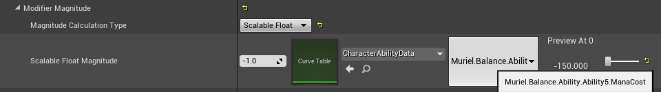                                                                                                                                                                                                                                                                                                                                                                                                                                                       |
| `Attribute Based`          | `Attribute Based` `Modifiers` 取 `Source`（创建 `GameplayEffectSpec` 的人）或 `Target`（接收 `GameplayEffectSpec` 的人）上后端 `Attribute` 的 `CurrentValue` 或 `BaseValue`，并通过系数和系数前后加法进一步修改。`Snapshotting` 意味着在创建 `GameplayEffectSpec` 时捕获后端 `Attribute`，而非快照意味着在应用 `GameplayEffectSpec` 时捕获 `Attribute`。                                                                                                                                                                                                                                                                                                                                                                                                                                                                                                                                                                                     |
| `Custom Calculation Class` | `Custom Calculation Class` 为复杂的 `Modifiers` 提供最大的灵活性。此 `Modifier` 接受一个 [`ModifierMagnitudeCalculation`](#concepts-ge-mmc) 类，并可以通过系数和系数前后加法进一步操作结果浮点值。                                                                                                                                                                                                                                                                                                                                                                                                                                                                                                                                                                                                                                                                                                                                                                                                    |
| `Set By Caller`            | `SetByCaller` `Modifiers` 是在运行时由技能或创建 `GameplayEffectSpec` 的人在 `GameplayEffectSpec` 上在 `GameplayEffect` 之外设置的值。例如，如果你想根据玩家按住按钮充能技能的时间来设置伤害，你会使用 `SetByCaller`。`SetByCallers` 本质上是存在于 `GameplayEffectSpec` 上的 `TMap<FGameplayTag, float>`。`Modifier` 只是告诉 `Aggregator` 查找与提供的 `GameplayTag` 关联的 `SetByCaller` 值。`Modifiers` 使用的 `SetByCallers` 只能使用 `GameplayTag` 版本的概念。`FName` 版本在此被禁用。如果 `Modifier` 设置为 `SetByCaller` 但 `GameplayEffectSpec` 上不存在具有正确 `GameplayTag` 的 `SetByCaller`，游戏会抛出运行时错误并返回值 0。这在 `Divide` 操作的情况下可能导致问题。关于如何使用 `SetByCallers` 的更多信息，请参见 [`SetByCallers`](#concepts-ge-spec-setbycaller)。 |

**[⬆ 返回顶部](#table-of-contents)**

<a name="concepts-ge-mods-multiplydivide"></a>
##### 4.5.4.1 乘法和除法 Modifiers

默认情况下，所有 `Multiply` 和 `Divide` `Modifiers` 在乘入或除入 `Attribute` 的 `BaseValue` 之前会被加在一起。

```c++
float FAggregatorModChannel::EvaluateWithBase(float InlineBaseValue, const FAggregatorEvaluateParameters& Parameters) const
{
	...
	float Additive = SumMods(Mods[EGameplayModOp::Additive], GameplayEffectUtilities::GetModifierBiasByModifierOp(EGameplayModOp::Additive), Parameters);
	float Multiplicitive = SumMods(Mods[EGameplayModOp::Multiplicitive], GameplayEffectUtilities::GetModifierBiasByModifierOp(EGameplayModOp::Multiplicitive), Parameters);
	float Division = SumMods(Mods[EGameplayModOp::Division], GameplayEffectUtilities::GetModifierBiasByModifierOp(EGameplayModOp::Division), Parameters);
	...
	return ((InlineBaseValue + Additive) * Multiplicitive) / Division;
	...
}
```

```c++
float FAggregatorModChannel::SumMods(const TArray<FAggregatorMod>& InMods, float Bias, const FAggregatorEvaluateParameters& Parameters)
{
	float Sum = Bias;

	for (const FAggregatorMod& Mod : InMods)
	{
		if (Mod.Qualifies())
		{
			Sum += (Mod.EvaluatedMagnitude - Bias);
		}
	}

	return Sum;
}
```
*来自 `GameplayEffectAggregator.cpp`*

`Multiply` 和 `Divide` `Modifiers` 在此公式中都有 `Bias` 值 `1`（`Addition` 的 `Bias` 为 `0`）。所以它看起来像：

```
1 + (Mod1.Magnitude - 1) + (Mod2.Magnitude - 1) + ...
```

这个公式导致了一些意想不到的结果。首先，此公式在乘入或除入 `BaseValue` 之前将所有修饰符加在一起。大多数人会期望它将它们相乘或相除。例如，如果你有两个 `1.5` 的 `Multiply` 修饰符，大多数人会期望 `BaseValue` 乘以 `1.5 x 1.5 = 2.25`。相反，这会将 `1.5` 加在一起以将 `BaseValue` 乘以 `2`（`50% 增加 + 另一个 50% 增加 = 100% 增加`）。这是来自 `GameplayPrediction.h` 的示例，`500` 基础速度上的 `10%` 速度增益会变成 `550`。再加一个 `10%` 速度增益会变成 `600`。

其次，此公式有一些未记录的关于哪些值可以使用的规则，因为它是考虑到 Paragon 而设计的。

`Multiply` 和 `Divide` 乘法加法公式的规则：
* `(不超过一个值 < 1) AND (任意数量的值 [1, 2))`
* `OR (一个值 >= 2)`

公式中的 `Bias` 基本上减去了 `[1, 2)` 范围内数字的整数位。第一个 `Modifier` 的 `Bias` 从起始 `Sum` 值（在循环前设置为 `Bias`）中减去，这就是为什么任何值单独使用有效，以及为什么一个值 `< 1` 可以与 `[1, 2)` 范围内的数字一起使用。

一些 `Multiply` 示例：  
乘数：`0.5`  
`1 + (0.5 - 1) = 0.5`，正确

乘数：`0.5, 0.5`  
`1 + (0.5 - 1) + (0.5 - 1) = 0`，不正确，期望 `1`？多个小于 `1` 的值对于添加乘数没有意义。Paragon 设计为只使用[最大的负值用于 `Multiply` `Modifiers`](#cae-nonstackingge)，所以最多只有一个小于 `1` 的值乘入 `BaseValue`。

乘数：`1.1, 0.5`  
`1 + (0.5 - 1) + (1.1 - 1) = 0.6`，正确

乘数：`5, 5`  
`1 + (5 - 1) + (5 - 1) = 9`，不正确，期望 `10`。永远是 `Modifiers 之和 - Modifiers 数量 + 1`。

许多游戏希望其 `Multiply` 和 `Divide` `Modifiers` 在应用到 `BaseValue` 之前相乘和相除。要实现这一点，你需要**修改引擎代码**中的 `FAggregatorModChannel::EvaluateWithBase()`。

```c++
float FAggregatorModChannel::EvaluateWithBase(float InlineBaseValue, const FAggregatorEvaluateParameters& Parameters) const
{
	...
	float Multiplicitive = MultiplyMods(Mods[EGameplayModOp::Multiplicitive], Parameters);
	float Division = MultiplyMods(Mods[EGameplayModOp::Division], Parameters);
	...

	return ((InlineBaseValue + Additive) * Multiplicitive) / Division;
}
```

```c++
float FAggregatorModChannel::MultiplyMods(const TArray<FAggregatorMod>& InMods, const FAggregatorEvaluateParameters& Parameters)
{
	float Multiplier = 1.0f;

	for (const FAggregatorMod& Mod : InMods)
	{
		if (Mod.Qualifies())
		{
			Multiplier *= Mod.EvaluatedMagnitude;
		}
	}

	return Multiplier;
}
```

**[⬆ 返回顶部](#table-of-contents)**

<a name="concepts-ge-mods-gameplaytags"></a>
##### 4.5.4.2 Modifiers 上的 Gameplay Tags

可以为每个 [Modifier](#concepts-ge-mods) 设置 `SourceTags` 和 `TargetTags`。它们的工作方式与 `GameplayEffect` 的 [`Application Tag requirements`](#concepts-ge-tags) 相同。因此，标签只在效果应用时被考虑。即对于周期性、无限效果，它们只在效果的第一次应用时被考虑，而*不会*在每次周期执行时考虑。

`Attribute Based` Modifiers 还可以设置 `SourceTagFilter` 和 `TargetTagFilter`。在确定作为 `Attribute Based` Modifier 来源的属性的大小时，这些过滤器用于排除该属性的某些 Modifiers。源或目标没有过滤器所有标签的 Modifiers 会被排除。

这意味着具体来说：源 ASC 和目标 ASC 的标签由 `GameplayEffects` 捕获。源 ASC 标签在创建 `GameplayEffectSpec` 时捕获，目标 ASC 标签在执行效果时捕获。在确定无限或持续时间效果的 Modifier 是否"符合条件"应用（即其 Aggregator 是否符合条件）并设置了这些过滤器时，捕获的标签会与过滤器进行比较。

**[⬆ 返回顶部](#table-of-contents)**

<a name="concepts-ge-stacking"></a>
#### 4.5.5 Gameplay Effects 叠加

默认情况下，`GameplayEffects` 会应用新的 `GameplayEffectSpec` 实例，这些实例不知道也不关心应用时先前存在的 `GameplayEffectSpec` 实例。`GameplayEffects` 可以设置为叠加，其中不是添加新的 `GameplayEffectSpec` 实例，而是更改当前存在的 `GameplayEffectSpec` 的叠加计数。叠加只适用于 `Duration` 和 `Infinite` `GameplayEffects`。

有两种叠加类型：按源聚合和按目标聚合。

| 叠加类型           | 描述                                                                                                                          |
| ------------------- | ------------------------------------------------------------------------------------------------------------------------------------ |
| 按源聚合 | 在目标上每个源 `ASC` 有单独的叠加实例。每个源可以应用 X 数量的叠加。                     |
| 按目标聚合 | 无论源如何，目标上只有一个叠加实例。每个源可以叠加直到共享叠加限制。 |

叠加还有过期、持续时间刷新和周期重置的策略。它们在 `GameplayEffect` 蓝图中有有用的悬停工具提示。

示例项目包含一个监听 `GameplayEffect` 叠加变化的自定义蓝图节点。HUD UMG Widget 使用它来更新玩家拥有的被动护甲叠加数量。此 `AsyncTask` 将一直存在直到手动调用 `EndTask()`，我们在 UMG Widget 的 `Destruct` 事件中执行此操作。参见 `AsyncTaskEffectStackChanged.h/cpp`。

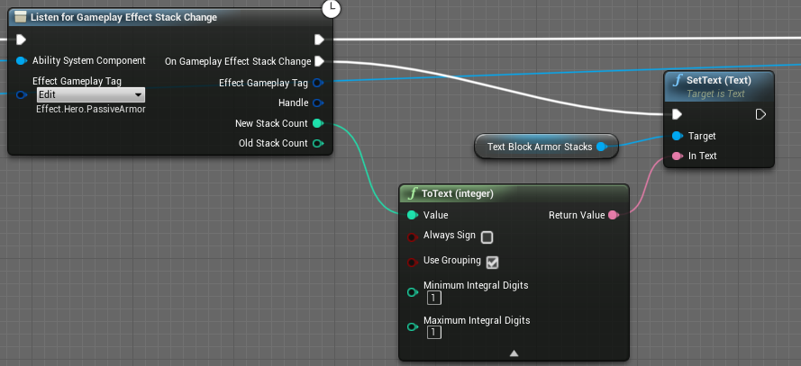

**[⬆ 返回顶部](#table-of-contents)**

<a name="concepts-ge-ga"></a>
#### 4.5.6 授予的 Abilities

`GameplayEffects` 可以向 `ASC` 授予新的 [`GameplayAbilities`](#concepts-ga)。只有 `Duration` 和 `Infinite` `GameplayEffects` 可以授予技能。

常见的用例是当你想强制另一个玩家做某事，如从击退或拉扯中移动他们。你会对他们应用一个 `GameplayEffect`，授予一个自动激活的技能（关于授予时如何自动激活技能，请参见[被动 Abilities](#concepts-ga-activating-passive)），对他们执行所需操作。

设计师可以选择 `GameplayEffect` 授予哪些技能、以什么等级授予、绑定到什么[输入](#concepts-ga-input)以及授予技能的移除策略。

| 移除策略                   | 描述                                                                                                                                                                     |
| -------------------------- | ------------------------------------------------------------------------------------------------------------------------------------------------------------------------------- |
| 立即取消技能 | 当授予技能的 `GameplayEffect` 从目标移除时，授予的技能立即被取消和移除。                                                   |
| 结束时移除技能      | 授予的技能允许完成然后从目标移除。                                                                                                   |
| 不做任何操作                 | 授予的技能不受从目标移除授予 `GameplayEffect` 的影响。目标永久拥有该技能直到稍后手动移除。 |

**[⬆ 返回顶部](#table-of-contents)**

<a name="concepts-ge-tags"></a>
#### 4.5.7 Gameplay Effect Tags

`GameplayEffects` 携带多个 [`GameplayTagContainers`](#concepts-gt)。设计师会为每个类别编辑 `Added` 和 `Removed` `GameplayTagContainers`，结果会在编译时显示在 `Combined` `GameplayTagContainer` 中。`Added` 标签是此 `GameplayEffect` 添加的新标签，其父类之前没有。`Removed` 标签是父类有但此子类没有的标签。

| 类别                          | 描述                                                                                                                                                                                                                                                                                                                                                                        |
| --------------------------------- | ---------------------------------------------------------------------------------------------------------------------------------------------------------------------------------------------------------------------------------------------------------------------------------------------------------------------------------------------------------------------------------- |
| Gameplay Effect Asset Tags        | `GameplayEffect` 拥有的标签。它们本身不做任何功能，仅用于描述 `GameplayEffect`。                                                                                                                                                                                                                                        |
| Granted Tags                      | 存在于 `GameplayEffect` 上但也会给予应用 `GameplayEffect` 的 `ASC` 的标签。当 `GameplayEffect` 被移除时，它们会从 `ASC` 移除。这只适用于 `Duration` 和 `Infinite` `GameplayEffects`。                                                                                                                             |
| Ongoing Tag Requirements          | 应用后，这些标签决定 `GameplayEffect` 是开还是关。`GameplayEffect` 可以处于关闭状态但仍然被应用。如果 `GameplayEffect` 因不满足 Ongoing Tag Requirements 而关闭，但随后满足了要求，`GameplayEffect` 会再次打开并重新应用其修饰符。这只适用于 `Duration` 和 `Infinite` `GameplayEffects`。 |
| Application Tag Requirements      | 目标上的标签，决定 `GameplayEffect` 是否可以应用到目标。如果不满足这些要求，`GameplayEffect` 不会被应用。                                                                                                                                                                                                                      |
| Remove Gameplay Effects with Tags | 当此 `GameplayEffect` 成功应用时，目标上在其 `Asset Tags` 或 `Granted Tags` 中有这些标签的 `GameplayEffects` 会从目标移除。                                                                                                                                                                                            |

**[⬆ 返回顶部](#table-of-contents)**

<a name="concepts-ge-immunity"></a>
#### 4.5.8 免疫

`GameplayEffects` 可以基于 [`GameplayTags`](#concepts-gt) 授予免疫，有效地阻止其他 `GameplayEffects` 的应用。虽然免疫可以通过其他方式（如 `Application Tag Requirements`）有效实现，但使用此系统提供了一个当 `GameplayEffects` 因免疫被阻止时的委托 `UAbilitySystemComponent::OnImmunityBlockGameplayEffectDelegate`。

`GrantedApplicationImmunityTags` 检查源 `ASC`（如果有源技能，包括源技能 `AbilityTags` 中的标签）是否有任何指定标签。这是一种根据标签提供对来自某些角色或源的所有 `GameplayEffects` 免疫的方法。

`Granted Application Immunity Query` 检查传入的 `GameplayEffectSpec` 是否匹配任何查询以阻止或允许其应用。

查询在 `GameplayEffect` 蓝图中有有用的悬停工具提示。

**[⬆ 返回顶部](#table-of-contents)**

<a name="concepts-ge-spec"></a>
#### 4.5.9 Gameplay Effect Spec

[`GameplayEffectSpec`](https://docs.unrealengine.com/en-US/API/Plugins/GameplayAbilities/FGameplayEffectSpec/index.html)（`GESpec`）可以被认为是 `GameplayEffects` 的实例化。它们持有它们代表的 `GameplayEffect` 类的引用、创建时的等级以及创建者。这些可以在运行时应用前自由创建和修改，不同于 `GameplayEffects` 应该由设计师在运行时前创建。当应用 `GameplayEffect` 时，会从 `GameplayEffect` 创建一个 `GameplayEffectSpec`，这实际上就是应用到目标的内容。

`GameplayEffectSpecs` 使用 `UAbilitySystemComponent::MakeOutgoingSpec()` 从 `GameplayEffects` 创建，该函数是 `BlueprintCallable`。`GameplayEffectSpecs` 不必立即应用。通常将 `GameplayEffectSpec` 传递给从技能创建的投射物，投射物可以稍后应用到它命中的目标。当 `GameplayEffectSpecs` 成功应用时，它们返回一个名为 `FActiveGameplayEffect` 的新结构体。

`GameplayEffectSpec` 的主要内容：
* 此 `GameplayEffectSpec` 创建自的 `GameplayEffect` 类。
* 此 `GameplayEffectSpec` 的等级。通常与创建 `GameplayEffectSpec` 的技能等级相同，但可以不同。
* `GameplayEffectSpec` 的持续时间。默认为 `GameplayEffect` 的持续时间，但可以不同。
* 周期效果的 `GameplayEffectSpec` 的周期。默认为 `GameplayEffect` 的周期，但可以不同。
* 此 `GameplayEffectSpec` 的当前叠加计数。叠加限制在 `GameplayEffect` 上。
* [`GameplayEffectContextHandle`](#concepts-ge-context) 告诉我们谁创建了这个 `GameplayEffectSpec`。
* 由于快照在 `GameplayEffectSpec` 创建时捕获的 `Attributes`。
* `GameplayEffectSpec` 除了 `GameplayEffect` 授予的 `GameplayTags` 外，还授予目标的 `DynamicGrantedTags`。
* `GameplayEffectSpec` 除了 `GameplayEffect` 拥有的 `AssetTags` 外，还拥有的 `DynamicAssetTags`。
* `SetByCaller` `TMaps`。

**[⬆ 返回顶部](#table-of-contents)**

<a name="concepts-ge-spec-setbycaller"></a>
##### 4.5.9.1 SetByCallers

`SetByCallers` 允许 `GameplayEffectSpec` 携带与 `GameplayTag` 或 `FName` 关联的浮点值。它们存储在各自的 `TMaps` 中：`GameplayEffectSpec` 上的 `TMap<FGameplayTag, float>` 和 `TMap<FName, float>`。这些可以用作 `GameplayEffect` 上的 `Modifiers` 或作为传递浮点数的通用方式。通常通过 `SetByCallers` 将技能内部生成的数值数据传递给 [`GameplayEffectExecutionCalculations`](#concepts-ge-ec) 或 [`ModifierMagnitudeCalculations`](#concepts-ge-mmc)。

| `SetByCaller` 用途 | 说明                                                                                                                                                                                                                                                                                                                                                                                                                               |
| ----------------- | ----------------------------------------------------------------------------------------------------------------------------------------------------------------------------------------------------------------------------------------------------------------------------------------------------------------------------------------------------------------------------------------------------------------------------------- |
| `Modifiers`       | 必须在 `GameplayEffect` 类中提前定义。只能使用 `GameplayTag` 版本。如果在 `GameplayEffect` 类上定义了一个但 `GameplayEffectSpec` 没有相应的标签和浮点值对，游戏在应用 `GameplayEffectSpec` 时会有运行时错误并返回 0。这对 `Divide` 操作是潜在问题。参见 [`Modifiers`](#concepts-ge-mods)。 |
| 其他地方         | 不需要在任何地方提前定义。读取 `GameplayEffectSpec` 上不存在的 `SetByCaller` 可以返回开发者定义的默认值，带有可选警告。                                                                                                                                                                                                                                      |

要在蓝图中分配 `SetByCaller` 值，使用你需要的版本（`GameplayTag` 或 `FName`）的蓝图节点：

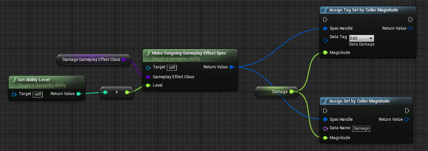

要在蓝图中读取 `SetByCaller` 值，你需要在蓝图库中制作自定义节点。

要在 C++ 中分配 `SetByCaller` 值，使用你需要的版本的函数（`GameplayTag` 或 `FName`）：

```c++
void FGameplayEffectSpec::SetSetByCallerMagnitude(FName DataName, float Magnitude);
```
```c++
void FGameplayEffectSpec::SetSetByCallerMagnitude(FGameplayTag DataTag, float Magnitude);
```

要在 C++ 中读取 `SetByCaller` 值，使用你需要的版本的函数（`GameplayTag` 或 `FName`）：

```c++
float GetSetByCallerMagnitude(FName DataName, bool WarnIfNotFound = true, float DefaultIfNotFound = 0.f) const;
```
```c++
float GetSetByCallerMagnitude(FGameplayTag DataTag, bool WarnIfNotFound = true, float DefaultIfNotFound = 0.f) const;
```

我推荐使用 `GameplayTag` 版本而不是 `FName` 版本。这可以防止蓝图中的拼写错误。

**[⬆ 返回顶部](#table-of-contents)**

<a name="concepts-ge-context"></a>
#### 4.5.10 Gameplay Effect Context

[`GameplayEffectContext`](https://docs.unrealengine.com/en-US/API/Plugins/GameplayAbilities/FGameplayEffectContext/index.html) 结构体持有关于 `GameplayEffectSpec` 发起者和 [`TargetData`](#concepts-targeting-data) 的信息。这也是一个适合子类化以在 [`ModifierMagnitudeCalculations`](#concepts-ge-mmc) / [`GameplayEffectExecutionCalculations`](#concepts-ge-ec)、[`AttributeSets`](#concepts-as) 和 [`GameplayCues`](#concepts-gc) 等位置之间传递任意数据的结构体。

要子类化 `GameplayEffectContext`：

1. 子类化 `FGameplayEffectContext`
1. 重写 `FGameplayEffectContext::GetScriptStruct()`
1. 重写 `FGameplayEffectContext::Duplicate()`
1. 如果你的新数据需要复制，重写 `FGameplayEffectContext::NetSerialize()`
1. 为你的子类实现 `TStructOpsTypeTraits`，就像父结构体 `FGameplayEffectContext` 那样
1. 在你的 [`AbilitySystemGlobals`](#concepts-asg) 类中重写 `AllocGameplayEffectContext()` 以返回你的子类的新对象

[GASShooter](https://github.com/tranek/GASShooter) 使用子类化的 `GameplayEffectContext` 来添加可在 `GameplayCues` 中访问的 `TargetData`，特别是霰弹枪，因为它可以命中多个敌人。

**[⬆ 返回顶部](#table-of-contents)**

<a name="concepts-ge-mmc"></a>
#### 4.5.11 Modifier Magnitude Calculation

[`ModifierMagnitudeCalculations`](https://docs.unrealengine.com/en-US/API/Plugins/GameplayAbilities/UGameplayModMagnitudeCalculation/index.html)（`ModMagCalc` 或 `MMC`）是作为 `GameplayEffects` 中 [`Modifiers`](#concepts-ge-mods) 使用的强大类。它们的功能类似于 [`GameplayEffectExecutionCalculations`](#concepts-ge-ec)，但功能较少，最重要的是它们可以被[预测](#concepts-p)。它们的唯一目的是从 `CalculateBaseMagnitude_Implementation()` 返回一个浮点值。你可以在蓝图和 C++ 中子类化并重写此函数。

`MMCs` 可以用于任何持续时间的 `GameplayEffects`——`Instant`、`Duration`、`Infinite` 或 `Periodic`。

`MMCs` 的强大之处在于它们能够捕获 `GameplayEffect` 的 `Source` 或 `Target` 上任意数量 `Attributes` 的值，并完全访问 `GameplayEffectSpec` 以读取 `GameplayTags` 和 `SetByCallers`。`Attributes` 可以快照或不快照。快照的 `Attributes` 在创建 `GameplayEffectSpec` 时捕获，而非快照的 `Attributes` 在应用 `GameplayEffectSpec` 时捕获，并对于 `Infinite` 和 `Duration` `GameplayEffects` 在 `Attribute` 变化时自动更新。捕获 `Attributes` 会从 `ASC` 上现有的修饰符重新计算其 `CurrentValue`。此重新计算**不会**运行 `AbilitySet` 中的 [`PreAttributeChange()`](#concepts-as-preattributechange)，因此任何钳制必须在这里再次完成。

| 快照 | 源或目标 | 在 `GameplayEffectSpec` 上捕获 | `Infinite` 或 `Duration` `GE` 的 `Attribute` 变化时自动更新 |
| -------- | ---------------- | -------------------------------- | -------------------------------------------------------------------------------- |
| 是      | 源           | 创建                         | 否                                                                               |
| 是      | 目标           | 应用                      | 否                                                                               |
| 否       | 源           | 应用                      | 是                                                                              |
| 否       | 目标           | 应用                      | 是                                                                              |

`MMC` 的结果浮点值可以在 `GameplayEffect` 的 `Modifier` 中通过系数和系数前后加法进一步修改。

一个示例 `MMC`，捕获 `Target` 的法力值 `Attribute`，从毒药效果中减少它，其中减少的量取决于 `Target` 有多少法力值以及 `Target` 可能拥有的标签：
```c++
UPAMMC_PoisonMana::UPAMMC_PoisonMana()
{

	//ManaDef 在头文件中定义 FGameplayEffectAttributeCaptureDefinition ManaDef;
	ManaDef.AttributeToCapture = UPAAttributeSetBase::GetManaAttribute();
	ManaDef.AttributeSource = EGameplayEffectAttributeCaptureSource::Target;
	ManaDef.bSnapshot = false;

	//MaxManaDef 在头文件中定义 FGameplayEffectAttributeCaptureDefinition MaxManaDef;
	MaxManaDef.AttributeToCapture = UPAAttributeSetBase::GetMaxManaAttribute();
	MaxManaDef.AttributeSource = EGameplayEffectAttributeCaptureSource::Target;
	MaxManaDef.bSnapshot = false;

	RelevantAttributesToCapture.Add(ManaDef);
	RelevantAttributesToCapture.Add(MaxManaDef);
}

float UPAMMC_PoisonMana::CalculateBaseMagnitude_Implementation(const FGameplayEffectSpec & Spec) const
{
	// 收集源和目标的标签，因为这可以影响应该使用哪些增益
	const FGameplayTagContainer* SourceTags = Spec.CapturedSourceTags.GetAggregatedTags();
	const FGameplayTagContainer* TargetTags = Spec.CapturedTargetTags.GetAggregatedTags();

	FAggregatorEvaluateParameters EvaluationParameters;
	EvaluationParameters.SourceTags = SourceTags;
	EvaluationParameters.TargetTags = TargetTags;

	float Mana = 0.f;
	GetCapturedAttributeMagnitude(ManaDef, Spec, EvaluationParameters, Mana);
	Mana = FMath::Max<float>(Mana, 0.0f);

	float MaxMana = 0.f;
	GetCapturedAttributeMagnitude(MaxManaDef, Spec, EvaluationParameters, MaxMana);
	MaxMana = FMath::Max<float>(MaxMana, 1.0f); // 避免除以零

	float Reduction = -20.0f;
	if (Mana / MaxMana > 0.5f)
	{
		// 如果目标法力值超过一半，效果加倍
		Reduction *= 2;
	}
	
	if (TargetTags->HasTagExact(FGameplayTag::RequestGameplayTag(FName("Status.WeakToPoisonMana"))))
	{
		// 如果目标对 PoisonMana 虚弱，效果加倍
		Reduction *= 2;
	}
	
	return Reduction;
}
```

如果你没有在 `MMC` 的构造函数中将 `FGameplayEffectAttributeCaptureDefinition` 添加到 `RelevantAttributesToCapture` 并尝试捕获 `Attributes`，你会在捕获时得到关于缺少 Spec 的错误。如果你不需要捕获 `Attributes`，则不需要向 `RelevantAttributesToCapture` 添加任何内容。

**[⬆ 返回顶部](#table-of-contents)**

<a name="concepts-ge-ec"></a>
#### 4.5.12 Gameplay Effect Execution Calculation

[`GameplayEffectExecutionCalculations`](https://docs.unrealengine.com/en-US/API/Plugins/GameplayAbilities/UGameplayEffectExecutionCalculat-/index.html)（`ExecutionCalculation`、`Execution`（你会在插件源代码中经常看到这个术语）或 `ExecCalc`）是 `GameplayEffects` 对 `ASC` 进行更改的最强大方式。与 [`ModifierMagnitudeCalculations`](#concepts-ge-mmc) 一样，这些可以捕获 `Attributes` 并可选地快照。与 `MMCs` 不同，这些可以更改多个 `Attribute` 并基本上做程序员想要的任何其他事情。这种强大和灵活性的缺点是它们不能被[预测](#concepts-p)，并且必须在 C++ 中实现。

`ExecutionCalculations` 只能与 `Instant` 和 `Periodic` `GameplayEffects` 一起使用。任何带有"Execute"一词的东西通常指的是这两种类型的 `GameplayEffects`。

快照在创建 `GameplayEffectSpec` 时捕获 `Attribute`，而非快照在应用 `GameplayEffectSpec` 时捕获 `Attribute`。捕获 `Attributes` 会从 `ASC` 上现有的修饰符重新计算其 `CurrentValue`。此重新计算**不会**运行 `AbilitySet` 中的 [`PreAttributeChange()`](#concepts-as-preattributechange)，因此任何钳制必须在这里再次完成。

| 快照 | 源或目标 | 在 `GameplayEffectSpec` 上捕获 |
| -------- | ---------------- | -------------------------------- |
| 是      | 源           | 创建                         |
| 是      | 目标           | 应用                      |
| 否       | 源           | 应用                      |
| 否       | 目标           | 应用                      |

要设置 `Attribute` 捕获，我们遵循 Epic 的 ActionRPG 示例项目设置的模式，定义一个结构体来持有和定义我们如何捕获 `Attributes`，并在结构体的构造函数中创建它的一个副本。每个 `ExecCalc` 都会有这样的结构体。**注意：** 每个结构体需要唯一的名称，因为它们共享相同的命名空间。为结构体使用相同的名称会导致捕获 `Attributes` 的不正确行为（主要是捕获错误的 `Attributes` 的值）。

对于 `Local Predicted`、`Server Only` 和 `Server Initiated` 的 [`GameplayAbilities`](#concepts-ga)，`ExecCalc` 只在服务器上调用。

基于从 `Source` 和 `Target` 上的多个属性读取的复杂公式计算接收到的伤害是 `ExecCalc` 最常见的示例。包含的示例项目有一个简单的 `ExecCalc` 用于计算伤害，它从 `GameplayEffectSpec` 的 [`SetByCaller`](#concepts-ge-spec-setbycaller) 读取伤害值，然后根据从 `Target` 捕获的护甲 `Attribute` 减免该值。参见 `GDDamageExecCalculation.cpp/.h`。

**[⬆ 返回顶部](#table-of-contents)**

<a name="concepts-ge-ec-senddata"></a>
##### 4.5.12.1 向 Execution Calculations 发送数据

除了捕获 `Attributes` 外，还有几种方法可以向 `ExecutionCalculation` 发送数据。

<a name="concepts-ge-ec-senddata-setbycaller"></a>
###### 4.5.12.1.1 SetByCaller

[`GameplayEffectSpec` 上设置的任何 `SetByCallers`](#concepts-ge-spec-setbycaller) 都可以在 `ExecutionCalculation` 中直接读取。

```c++
const FGameplayEffectSpec& Spec = ExecutionParams.GetOwningSpec();
float Damage = FMath::Max<float>(Spec.GetSetByCallerMagnitude(FGameplayTag::RequestGameplayTag(FName("Data.Damage")), false, -1.0f), 0.0f);
```

<a name="concepts-ge-ec-senddata-backingdataattribute"></a>
###### 4.5.12.1.2 Backing Data Attribute Calculation Modifier

如果你想将值硬编码到 `GameplayEffect`，可以使用一个使用捕获的 `Attributes` 之一作为后端数据的 `CalculationModifier` 来传递它们。

在此截图示例中，我们将 50 添加到捕获的 Damage `Attribute`。你也可以将其设置为 `Override` 以仅接收硬编码值。

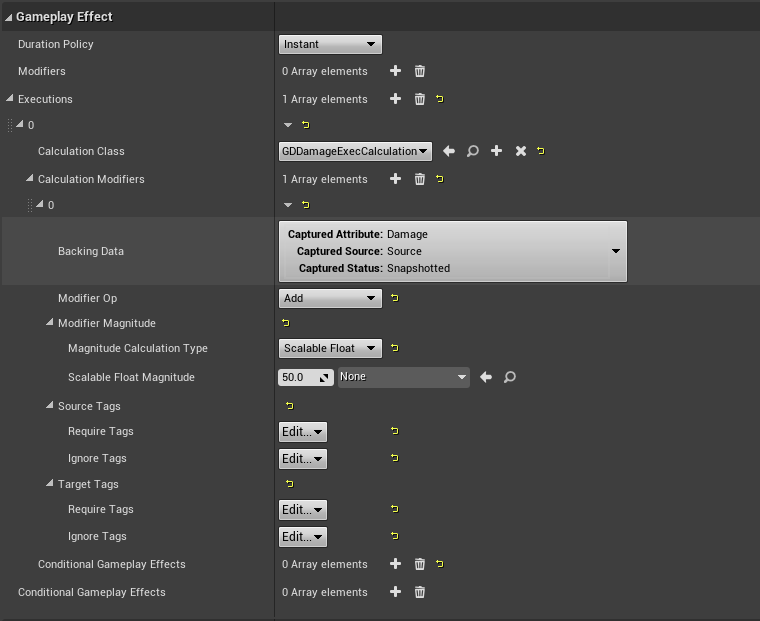

`ExecutionCalculation` 在捕获 `Attribute` 时读取此值。

```c++
float Damage = 0.0f;
// 捕获在伤害 GE 上作为 ExecutionCalculation 下的 CalculationModifier 设置的可选伤害值
ExecutionParams.AttemptCalculateCapturedAttributeMagnitude(DamageStatics().DamageDef, EvaluationParameters, Damage);
```

<a name="concepts-ge-ec-senddata-backingdatatempvariable"></a>
###### 4.5.12.1.3 Backing Data Temporary Variable Calculation Modifier

如果你想将值硬编码到 `GameplayEffect`，可以使用一个使用 `Temporary Variable` 或 C++ 中称为 `Transient Aggregator` 的 `CalculationModifier` 来传递它们。`Temporary Variable` 与 `GameplayTag` 关联。

在此截图示例中，我们使用 `Data.Damage` `GameplayTag` 将 50 添加到 `Temporary Variable`。

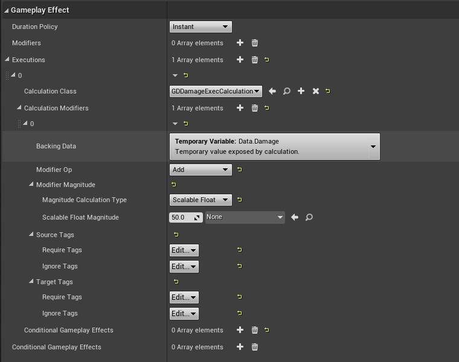

将后端 `Temporary Variables` 添加到你的 `ExecutionCalculation` 的构造函数中：

```c++
ValidTransientAggregatorIdentifiers.AddTag(FGameplayTag::RequestGameplayTag("Data.Damage"));
```

`ExecutionCalculation` 使用类似于 `Attribute` 捕获函数的特殊捕获函数读取此值。

```c++
float Damage = 0.0f;
ExecutionParams.AttemptCalculateTransientAggregatorMagnitude(FGameplayTag::RequestGameplayTag("Data.Damage"), EvaluationParameters, Damage);
```

<a name="concepts-ge-ec-senddata-effectcontext"></a>
###### 4.5.12.1.4 Gameplay Effect Context

你可以通过 [`GameplayEffectSpec` 上的自定义 `GameplayEffectContext`](#concepts-ge-context) 向 `ExecutionCalculation` 发送数据。

在 `ExecutionCalculation` 中，你可以从 `FGameplayEffectCustomExecutionParameters` 访问 `EffectContext`。

```c++
const FGameplayEffectSpec& Spec = ExecutionParams.GetOwningSpec();
FGSGameplayEffectContext* ContextHandle = static_cast<FGSGameplayEffectContext*>(Spec.GetContext().Get());
```

如果你需要更改 `GameplayEffectSpec` 或 `EffectContext` 上的某些内容：

```c++
FGameplayEffectSpec* MutableSpec = ExecutionParams.GetOwningSpecForPreExecuteMod();
FGSGameplayEffectContext* ContextHandle = static_cast<FGSGameplayEffectContext*>(MutableSpec->GetContext().Get());
```

在 `ExecutionCalculation` 中修改 `GameplayEffectSpec` 时要小心。参见 `GetOwningSpecForPreExecuteMod()` 的注释。

```c++
/** 非常量访问。小心使用，特别是在属性捕获后修改 spec 时。 */
FGameplayEffectSpec* GetOwningSpecForPreExecuteMod() const;
```

**[⬆ 返回顶部](#table-of-contents)**

<a name="concepts-ge-car"></a>
#### 4.5.13 Custom Application Requirement

[`CustomApplicationRequirement`](https://docs.unrealengine.com/en-US/API/Plugins/GameplayAbilities/UGameplayEffectCustomApplication-/index.html)（`CAR`）类让设计师对 `GameplayEffect` 是否可以应用进行高级控制，相对于 `GameplayEffect` 上简单的 `GameplayTag` 检查。这些可以在蓝图中通过重写 `CanApplyGameplayEffect()` 实现，在 C++ 中通过重写 `CanApplyGameplayEffect_Implementation()` 实现。

使用 `CARs` 的示例：
* `Target` 需要有一定数量的某个 `Attribute`
* `Target` 需要有一定叠加层数的某个 `GameplayEffect`

`CARs` 还可以做更高级的事情，如检查 `Target` 上是否已有此 `GameplayEffect` 的实例，并[更改现有实例的持续时间](#concepts-ge-duration)而不是应用新实例（对 `CanApplyGameplayEffect()` 返回 false）。

**[⬆ 返回顶部](#table-of-contents)**

<a name="concepts-ge-cost"></a>
#### 4.5.14 Cost Gameplay Effect

[`GameplayAbilities`](#concepts-ga) 有一个可选的 `GameplayEffect`，专门设计用作技能的消耗。消耗是 `ASC` 激活 `GameplayAbility` 所需拥有的 `Attribute` 数量。如果 `GA` 无法负担 `Cost GE`，则无法激活。此 `Cost GE` 应该是带有一个或多个从 `Attributes` 中减去的 `Modifiers` 的 `Instant` `GameplayEffect`。默认情况下，`Cost GEs` 旨在被预测，建议保持该能力，意味着不要使用 `ExecutionCalculations`。`MMCs` 完全可以接受，并鼓励用于复杂的消耗计算。

刚开始时，你很可能为每个有消耗的 `GA` 使用一个唯一的 `Cost GE`。更高级的技术是为多个 `GA` 重用一个 `Cost GE`，只需用 `GA` 特定的数据（消耗值在 `GA` 上定义）修改从 `Cost GE` 创建的 `GameplayEffectSpec`。**这只适用于 `Instanced` 技能。**

重用 `Cost GE` 的两种技术：

1. **使用 `MMC`。** 这是最简单的方法。创建一个 [`MMC`](#concepts-ge-mmc)，从 `GameplayAbility` 实例读取消耗值，你可以从 `GameplayEffectSpec` 获取该实例。

```c++
float UPGMMC_HeroAbilityCost::CalculateBaseMagnitude_Implementation(const FGameplayEffectSpec & Spec) const
{
	const UPGGameplayAbility* Ability = Cast<UPGGameplayAbility>(Spec.GetContext().GetAbilityInstance_NotReplicated());

	if (!Ability)
	{
		return 0.0f;
	}

	return Ability->Cost.GetValueAtLevel(Ability->GetAbilityLevel());
}
```

在此示例中，消耗值是我添加到 `GameplayAbility` 子类上的 `FScalableFloat`。
```c++
UPROPERTY(BlueprintReadOnly, EditAnywhere, Category = "Cost")
FScalableFloat Cost;
```

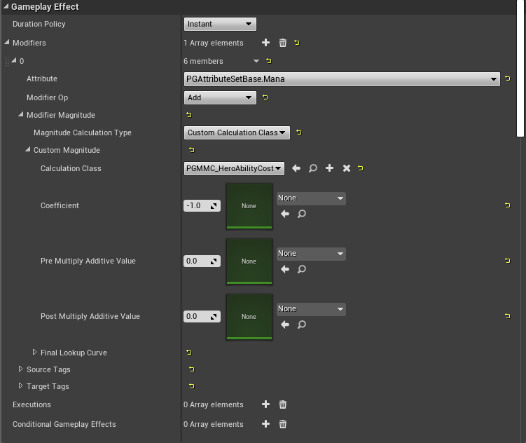

2. **重写 `UGameplayAbility::GetCostGameplayEffect()`。** 重写此函数并[在运行时创建一个 `GameplayEffect`](#concepts-ge-dynamic)，读取 `GameplayAbility` 上的消耗值。

**[⬆ 返回顶部](#table-of-contents)**

<a name="concepts-ge-cooldown"></a>
#### 4.5.15 Cooldown Gameplay Effect

[`GameplayAbilities`](#concepts-ga) 有一个可选的 `GameplayEffect`，专门设计用作技能的冷却。冷却决定技能激活后多久可以再次激活。如果 `GA` 仍在冷却中，则无法激活。此 `Cooldown GE` 应该是没有 `Modifiers` 的 `Duration` `GameplayEffect`，每个 `GameplayAbility` 或每个技能槽位（如果你的游戏有分配到共享冷却的槽位的可互换技能）在 `GameplayEffect` 的 `GrantedTags` 中有唯一的 `GameplayTag`（"`Cooldown Tag`"）。`GA` 实际上检查的是 `Cooldown Tag` 的存在而不是 `Cooldown GE` 的存在。默认情况下，`Cooldown GEs` 旨在被预测，建议保持该能力，意味着不要使用 `ExecutionCalculations`。`MMCs` 完全可以接受，并鼓励用于复杂的冷却计算。

刚开始时，你很可能为每个有冷却的 `GA` 使用一个唯一的 `Cooldown GE`。更高级的技术是为多个 `GA` 重用一个 `Cooldown GE`，只需用 `GA` 特定的数据（冷却持续时间和 `Cooldown Tag` 在 `GA` 上定义）修改从 `Cooldown GE` 创建的 `GameplayEffectSpec`。**这只适用于 `Instanced` 技能。**

重用 `Cooldown GE` 的两种技术：

1. **使用 [`SetByCaller`](#concepts-ge-spec-setbycaller)。** 这是最简单的方法。将共享 `Cooldown GE` 的持续时间设置为带有 `GameplayTag` 的 `SetByCaller`。在你的 `GameplayAbility` 子类上，为持续时间定义一个 float / `FScalableFloat`，为唯一的 `Cooldown Tag` 定义一个 `FGameplayTagContainer`，以及一个临时 `FGameplayTagContainer`，我们将用它作为 `Cooldown Tag` 和 `Cooldown GE` 标签并集的返回指针。
```c++
UPROPERTY(BlueprintReadOnly, EditAnywhere, Category = "Cooldown")
FScalableFloat CooldownDuration;

UPROPERTY(BlueprintReadOnly, EditAnywhere, Category = "Cooldown")
FGameplayTagContainer CooldownTags;

// 临时容器，我们将在 GetCooldownTags() 中返回其指针。
// 这将是我们的 CooldownTags 和 Cooldown GE 冷却标签的并集。
UPROPERTY(Transient)
FGameplayTagContainer TempCooldownTags;
```

然后重写 `UGameplayAbility::GetCooldownTags()` 以返回我们的 `Cooldown Tags` 和任何现有 `Cooldown GE` 标签的并集。
```c++
const FGameplayTagContainer * UPGGameplayAbility::GetCooldownTags() const
{
	FGameplayTagContainer* MutableTags = const_cast<FGameplayTagContainer*>(&TempCooldownTags);
	MutableTags->Reset(); // MutableTags 写入 CDO 上的 TempCooldownTags，因此清除它以防技能冷却标签变化（移到不同槽位）
	const FGameplayTagContainer* ParentTags = Super::GetCooldownTags();
	if (ParentTags)
	{
		MutableTags->AppendTags(*ParentTags);
	}
	MutableTags->AppendTags(CooldownTags);
	return MutableTags;
}
```

最后，重写 `UGameplayAbility::ApplyCooldown()` 来注入我们的 `Cooldown Tags` 并将 `SetByCaller` 添加到冷却 `GameplayEffectSpec`。
```c++
void UPGGameplayAbility::ApplyCooldown(const FGameplayAbilitySpecHandle Handle, const FGameplayAbilityActorInfo * ActorInfo, const FGameplayAbilityActivationInfo ActivationInfo) const
{
	UGameplayEffect* CooldownGE = GetCooldownGameplayEffect();
	if (CooldownGE)
	{
		FGameplayEffectSpecHandle SpecHandle = MakeOutgoingGameplayEffectSpec(CooldownGE->GetClass(), GetAbilityLevel());
		SpecHandle.Data.Get()->DynamicGrantedTags.AppendTags(CooldownTags);
		SpecHandle.Data.Get()->SetSetByCallerMagnitude(FGameplayTag::RequestGameplayTag(FName(  OurSetByCallerTag  )), CooldownDuration.GetValueAtLevel(GetAbilityLevel()));
		ApplyGameplayEffectSpecToOwner(Handle, ActorInfo, ActivationInfo, SpecHandle);
	}
}
```

在此图片中，冷却的持续时间 `Modifier` 设置为 `SetByCaller`，`Data Tag` 为 `Data.Cooldown`。`Data.Cooldown` 对应上面代码中的 `OurSetByCallerTag`。

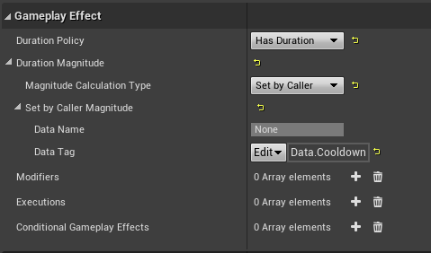

2. **使用 [`MMC`](#concepts-ge-mmc)。** 这与上面的设置相同，只是不将 `SetByCaller` 设置为 `Cooldown GE` 上的持续时间并在 `ApplyCooldown` 中。而是将持续时间设置为 `Custom Calculation Class` 并指向我们将创建的新 `MMC`。
```c++
UPROPERTY(BlueprintReadOnly, EditAnywhere, Category = "Cooldown")
FScalableFloat CooldownDuration;

UPROPERTY(BlueprintReadOnly, EditAnywhere, Category = "Cooldown")
FGameplayTagContainer CooldownTags;

// 临时容器，我们将在 GetCooldownTags() 中返回其指针。
// 这将是我们的 CooldownTags 和 Cooldown GE 冷却标签的并集。
UPROPERTY(Transient)
FGameplayTagContainer TempCooldownTags;
```

然后重写 `UGameplayAbility::GetCooldownTags()` 以返回我们的 `Cooldown Tags` 和任何现有 `Cooldown GE` 标签的并集。
```c++
const FGameplayTagContainer * UPGGameplayAbility::GetCooldownTags() const
{
	FGameplayTagContainer* MutableTags = const_cast<FGameplayTagContainer*>(&TempCooldownTags);
	MutableTags->Reset(); // MutableTags 写入 CDO 上的 TempCooldownTags，因此清除它以防技能冷却标签变化（移到不同槽位）
	const FGameplayTagContainer* ParentTags = Super::GetCooldownTags();
	if (ParentTags)
	{
		MutableTags->AppendTags(*ParentTags);
	}
	MutableTags->AppendTags(CooldownTags);
	return MutableTags;
}
```

最后，重写 `UGameplayAbility::ApplyCooldown()` 来将我们的 `Cooldown Tags` 注入冷却 `GameplayEffectSpec`。
```c++
void UPGGameplayAbility::ApplyCooldown(const FGameplayAbilitySpecHandle Handle, const FGameplayAbilityActorInfo * ActorInfo, const FGameplayAbilityActivationInfo ActivationInfo) const
{
	UGameplayEffect* CooldownGE = GetCooldownGameplayEffect();
	if (CooldownGE)
	{
		FGameplayEffectSpecHandle SpecHandle = MakeOutgoingGameplayEffectSpec(CooldownGE->GetClass(), GetAbilityLevel());
		SpecHandle.Data.Get()->DynamicGrantedTags.AppendTags(CooldownTags);
		ApplyGameplayEffectSpecToOwner(Handle, ActorInfo, ActivationInfo, SpecHandle);
	}
}
```

```c++
float UPGMMC_HeroAbilityCooldown::CalculateBaseMagnitude_Implementation(const FGameplayEffectSpec & Spec) const
{
	const UPGGameplayAbility* Ability = Cast<UPGGameplayAbility>(Spec.GetContext().GetAbilityInstance_NotReplicated());

	if (!Ability)
	{
		return 0.0f;
	}

	return Ability->CooldownDuration.GetValueAtLevel(Ability->GetAbilityLevel());
}
```

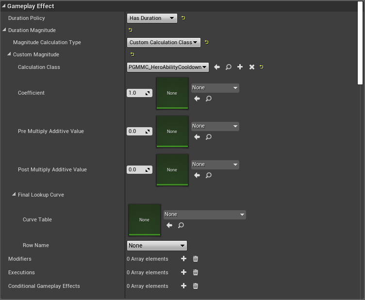

**[⬆ 返回顶部](#table-of-contents)**

<a name="concepts-ge-cooldown-tr"></a>
##### 4.5.15.1 获取 Cooldown Gameplay Effect 的剩余时间
```c++
bool APGPlayerState::GetCooldownRemainingForTag(FGameplayTagContainer CooldownTags, float & TimeRemaining, float & CooldownDuration)
{
	if (AbilitySystemComponent && CooldownTags.Num() > 0)
	{
		TimeRemaining = 0.f;
		CooldownDuration = 0.f;

		FGameplayEffectQuery const Query = FGameplayEffectQuery::MakeQuery_MatchAnyOwningTags(CooldownTags);
		TArray< TPair<float, float> > DurationAndTimeRemaining = AbilitySystemComponent->GetActiveEffectsTimeRemainingAndDuration(Query);
		if (DurationAndTimeRemaining.Num() > 0)
		{
			int32 BestIdx = 0;
			float LongestTime = DurationAndTimeRemaining[0].Key;
			for (int32 Idx = 1; Idx < DurationAndTimeRemaining.Num(); ++Idx)
			{
				if (DurationAndTimeRemaining[Idx].Key > LongestTime)
				{
					LongestTime = DurationAndTimeRemaining[Idx].Key;
					BestIdx = Idx;
				}
			}

			TimeRemaining = DurationAndTimeRemaining[BestIdx].Key;
			CooldownDuration = DurationAndTimeRemaining[BestIdx].Value;

			return true;
		}
	}

	return false;
}
```

**注意：** 在客户端上查询冷却的剩余时间要求它们能接收复制的 `GameplayEffects`。这取决于它们 `ASC` 的[复制模式](#concepts-asc-rm)。

<a name="concepts-ge-cooldown-listen"></a>
##### 4.5.15.2 监听冷却开始和结束

要监听冷却何时开始，你可以通过绑定 `AbilitySystemComponent->OnActiveGameplayEffectAddedDelegateToSelf` 响应 `Cooldown GE` 被应用，或通过绑定 `AbilitySystemComponent->RegisterGameplayTagEvent(CooldownTag, EGameplayTagEventType::NewOrRemoved)` 响应 `Cooldown Tag` 被添加。我建议监听 `Cooldown GE` 何时被添加，因为你还可以访问应用它的 `GameplayEffectSpec`。由此你可以确定 `Cooldown GE` 是本地预测的还是服务器纠正的。

要监听冷却何时结束，你可以通过绑定 `AbilitySystemComponent->OnAnyGameplayEffectRemovedDelegate()` 响应 `Cooldown GE` 被移除，或通过绑定 `AbilitySystemComponent->RegisterGameplayTagEvent(CooldownTag, EGameplayTagEventType::NewOrRemoved)` 响应 `Cooldown Tag` 被移除。我建议监听 `Cooldown Tag` 何时被移除，因为当服务器的纠正 `Cooldown GE` 到来时，它会移除我们本地预测的 `Cooldown GE`，导致 `OnAnyGameplayEffectRemovedDelegate()` 触发，即使我们仍在冷却中。在移除预测的 `Cooldown GE` 和应用服务器纠正的 `Cooldown GE` 期间，`Cooldown Tag` 不会变化。

**注意：** 在客户端上监听 `GameplayEffect` 被添加或移除要求它们能接收复制的 `GameplayEffects`。这取决于它们 `ASC` 的[复制模式](#concepts-asc-rm)。

示例项目包含一个监听冷却开始和结束的自定义蓝图节点。HUD UMG Widget 使用它来更新 Meteor 冷却的剩余时间。此 `AsyncTask` 将一直存在直到手动调用 `EndTask()`，我们在 UMG Widget 的 `Destruct` 事件中执行此操作。参见 [`AsyncTaskCooldownChanged.h/cpp`](Source/GASDocumentation/Private/Characters/Abilities/AsyncTaskCooldownChanged.cpp)。

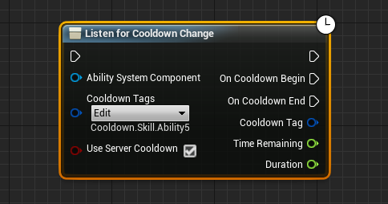

<a name="concepts-ge-cooldown-prediction"></a>
##### 4.5.15.3 预测冷却

冷却目前无法真正被预测。我们可以在本地预测的 `Cooldown GE` 被应用时启动 UI 冷却计时器，但 `GameplayAbility` 的实际冷却与服务器的冷却剩余时间绑定。根据玩家的延迟，本地预测的冷却可能已过期但 `GameplayAbility` 在服务器上仍在冷却中，这会阻止 `GameplayAbility` 的立即重新激活，直到服务器冷却过期。

示例项目通过在本地预测的冷却开始时将 Meteor 技能的 UI 图标变灰，然后在服务器的纠正 `Cooldown GE` 到来时启动冷却计时器来处理此问题。

这种情况的游戏后果是，高延迟玩家在短冷却技能上的射速低于低延迟玩家，使他们处于劣势。Fortnite 通过其武器使用不使用冷却 `GameplayEffects` 的自定义记账来避免此问题。

允许真正的预测冷却（玩家可以在本地冷却过期但服务器仍在冷却中时激活 `GameplayAbility`）是 Epic 希望在[GAS 的未来迭代](#concepts-p-future)中实现的东西。

**[⬆ 返回顶部](#table-of-contents)**

<a name="concepts-ge-duration"></a>
#### 4.5.16 修改已激活 Gameplay Effect 的持续时间

要更改 `Cooldown GE` 或任何 `Duration` `GameplayEffect` 的剩余时间，我们需要更改 `GameplayEffectSpec` 的 `Duration`，更新其 `StartServerWorldTime`，更新其 `CachedStartServerWorldTime`，更新其 `StartWorldTime`，并用 `CheckDuration()` 重新运行持续时间检查。在服务器上执行此操作并标记 `FActiveGameplayEffect` 为脏会将更改复制到客户端。
**注意：** 这确实涉及 `const_cast`，可能不是 Epic 更改持续时间的预期方式，但到目前为止似乎运行良好。

```c++
bool UPAAbilitySystemComponent::SetGameplayEffectDurationHandle(FActiveGameplayEffectHandle Handle, float NewDuration)
{
	if (!Handle.IsValid())
	{
		return false;
	}

	const FActiveGameplayEffect* ActiveGameplayEffect = GetActiveGameplayEffect(Handle);
	if (!ActiveGameplayEffect)
	{
		return false;
	}

	FActiveGameplayEffect* AGE = const_cast<FActiveGameplayEffect*>(ActiveGameplayEffect);
	if (NewDuration > 0)
	{
		AGE->Spec.Duration = NewDuration;
	}
	else
	{
		AGE->Spec.Duration = 0.01f;
	}

	AGE->StartServerWorldTime = ActiveGameplayEffects.GetServerWorldTime();
	AGE->CachedStartServerWorldTime = AGE->StartServerWorldTime;
	AGE->StartWorldTime = ActiveGameplayEffects.GetWorldTime();
	ActiveGameplayEffects.MarkItemDirty(*AGE);
	ActiveGameplayEffects.CheckDuration(Handle);

	AGE->EventSet.OnTimeChanged.Broadcast(AGE->Handle, AGE->StartWorldTime, AGE->GetDuration());
	OnGameplayEffectDurationChange(*AGE);

	return true;
}
```

**[⬆ 返回顶部](#table-of-contents)**

<a name="concepts-ge-dynamic"></a>
#### 4.5.17 运行时创建动态 Gameplay Effects

在运行时创建动态 `GameplayEffects` 是一个高级主题。你不应该经常需要这样做。

只有 `Instant` `GameplayEffects` 可以在 C++ 中从零开始运行时创建。`Duration` 和 `Infinite` `GameplayEffects` 不能在运行时动态创建，因为它们复制时会查找不存在的 `GameplayEffect` 类定义。要实现此功能，你应该像在编辑器中通常做的那样制作一个原型 `GameplayEffect` 类。然后在运行时用你需要的自定义 `GameplayEffectSpec` 实例。

运行时创建的 `Instant` `GameplayEffects` 也可以在[本地预测](#concepts-p)的 `GameplayAbility` 中调用。但是，动态创建是否会有副作用尚不清楚。

##### 示例

示例项目创建一个在 `AttributeSet` 中角色受到致命一击时将金币和经验值返回给击杀者。

```c++
// 创建一个动态即时 Gameplay Effect 来给予赏金
UGameplayEffect* GEBounty = NewObject<UGameplayEffect>(GetTransientPackage(), FName(TEXT("Bounty")));
GEBounty->DurationPolicy = EGameplayEffectDurationType::Instant;

int32 Idx = GEBounty->Modifiers.Num();
GEBounty->Modifiers.SetNum(Idx + 2);

FGameplayModifierInfo& InfoXP = GEBounty->Modifiers[Idx];
InfoXP.ModifierMagnitude = FScalableFloat(GetXPBounty());
InfoXP.ModifierOp = EGameplayModOp::Additive;
InfoXP.Attribute = UGDAttributeSetBase::GetXPAttribute();

FGameplayModifierInfo& InfoGold = GEBounty->Modifiers[Idx + 1];
InfoGold.ModifierMagnitude = FScalableFloat(GetGoldBounty());
InfoGold.ModifierOp = EGameplayModOp::Additive;
InfoGold.Attribute = UGDAttributeSetBase::GetGoldAttribute();

Source->ApplyGameplayEffectToSelf(GEBounty, 1.0f, Source->MakeEffectContext());
```

第二个示例展示在本地预测的 `GameplayAbility` 中创建运行时 `GameplayEffect`。风险自负使用（参见代码中的注释）！

```c++
UGameplayAbilityRuntimeGE::UGameplayAbilityRuntimeGE()
{
	NetExecutionPolicy = EGameplayAbilityNetExecutionPolicy::LocalPredicted;
}

void UGameplayAbilityRuntimeGE::ActivateAbility(const FGameplayAbilitySpecHandle Handle, const FGameplayAbilityActorInfo* ActorInfo, const FGameplayAbilityActivationInfo ActivationInfo, const FGameplayEventData* TriggerEventData)
{
	if (HasAuthorityOrPredictionKey(ActorInfo, &ActivationInfo))
	{
		if (!CommitAbility(Handle, ActorInfo, ActivationInfo))
		{
			EndAbility(Handle, ActorInfo, ActivationInfo, true, true);
		}

		// 在运行时创建 GE。
		UGameplayEffect* GameplayEffect = NewObject<UGameplayEffect>(GetTransientPackage(), TEXT("RuntimeInstantGE"));
		GameplayEffect->DurationPolicy = EGameplayEffectDurationType::Instant; // 只有即时适用于运行时 GE。

		// 添加一个简单的可缩放浮点数修饰符，用 42 覆盖 MyAttribute。
		// 在实际应用中，使用通过 TriggerEventData 传递的信息。
		const int32 Idx = GameplayEffect->Modifiers.Num();
		GameplayEffect->Modifiers.SetNum(Idx + 1);
		FGameplayModifierInfo& ModifierInfo = GameplayEffect->Modifiers[Idx];
		ModifierInfo.Attribute.SetUProperty(UMyAttributeSet::GetMyModifiedAttribute());
		ModifierInfo.ModifierMagnitude = FScalableFloat(42.f);
		ModifierInfo.ModifierOp = EGameplayModOp::Override;

		// 应用 GE。

		// 在这里创建 GESpec 以避免 ASC 从 GE 类默认对象创建 GESpec 的行为。
		// 由于我们这里有一个动态 GE，这会创建一个带有基础 GameplayEffect 类的 GESpec，所以
		// 我们会丢失修饰符。注意：不知道这里做的这个"hack"是否会有缺点！
		// spec 阻止 GE 对象被垃圾回收器收集，因为 GE 是 spec 上的 UPROPERTY。
		FGameplayEffectSpec* GESpec = new FGameplayEffectSpec(GameplayEffect, {}, 0.f); // "new"，因为生命周期由 handle 内的共享指针管理
		ApplyGameplayEffectSpecToOwner(Handle, ActorInfo, ActivationInfo, FGameplayEffectSpecHandle(GESpec));
	}
	EndAbility(Handle, ActorInfo, ActivationInfo, false, false);
}
```

**[⬆ 返回顶部](#table-of-contents)**

<a name="concepts-ge-containers"></a>
#### 4.5.18 Gameplay Effect Containers

Epic 的 [Action RPG 示例项目](https://www.unrealengine.com/marketplace/en-US/product/action-rpg) 实现了一个名为 `FGameplayEffectContainer` 的结构体。这些不在原生 GAS 中，但对于包含 `GameplayEffects` 和 [`TargetData`](#concepts-targeting-data) 非常方便。它自动化了一些工作，如从 `GameplayEffects` 创建 `GameplayEffectSpecs` 并在其 `GameplayEffectContext` 中设置默认值。在 `GameplayAbility` 中制作 `GameplayEffectContainer` 并将其传递给生成的投射物非常简单直接。我选择不在包含的示例项目中实现 `GameplayEffectContainers`，以展示在原生 GAS 中没有它们时如何工作，但我强烈建议研究它们并考虑将它们添加到你的项目中。

要访问 `GameplayEffectContainers` 内部的 `GESpecs` 来执行添加 `SetByCallers` 等操作，分解 `FGameplayEffectContainer` 并通过其在 `GESpecs` 数组中的索引访问 `GESpec` 引用。这要求你提前知道要访问的 `GESpec` 的索引。

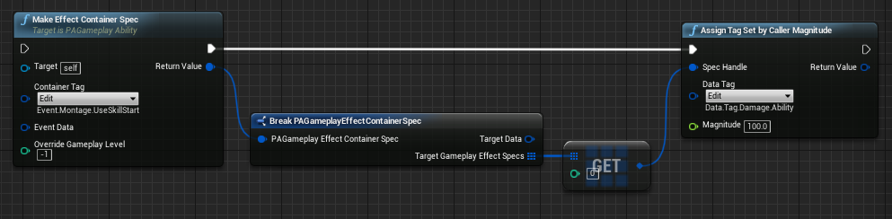

`GameplayEffectContainers` 还包含一个可选的高效[目标选取](#concepts-targeting-containers)方式。

**[⬆ 返回顶部](#table-of-contents)**

<a name="concepts-ga"></a>
### 4.6 Gameplay Abilities

<a name="concepts-ga-definition"></a>
#### 4.6.1 Gameplay Ability 定义

[`GameplayAbilities`](https://docs.unrealengine.com/en-US/API/Plugins/GameplayAbilities/Abilities/UGameplayAbility/index.html)（`GA`）是 `Actor` 在游戏中可以执行的任何动作或技能。一次可以有多个 `GameplayAbility` 同时激活，例如冲刺和射击。这些可以在蓝图或 C++ 中制作。

`GameplayAbilities` 的示例：
* 跳跃
* 冲刺
* 射击
* 每隔 X 秒被动格挡一次攻击
* 使用药水
* 开门
* 收集资源
* 建造建筑

不应该用 `GameplayAbilities` 实现的事情：
* 基本移动输入
* 某些与 UI 的交互——不要用 `GameplayAbility` 从商店购买物品。

这些不是规则，只是我的建议。你的设计和实现可能有所不同。

`GameplayAbilities` 自带默认功能，可以有一个等级来修改对属性的更改量或更改 `GameplayAbility` 的功能。

`GameplayAbilities` 根据其[网络执行策略（Net Execution Policy）](#concepts-ga-net)在拥有者客户端和/或服务器上运行，但不在模拟代理上运行。`Net Execution Policy` 决定 `GameplayAbility` 是否会被本地[预测](#concepts-p)。它们包含[可选的消耗和冷却 `GameplayEffects`](#concepts-ga-commit) 的默认行为。`GameplayAbilities` 使用 [`AbilityTasks`](#concepts-at) 来处理随时间发生的动作，如等待事件、等待属性变化、等待玩家选择目标，或使用 `Root Motion Source` 移动 `Character`。**模拟客户端不会运行 `GameplayAbilities`**。相反，当服务器运行技能时，任何需要在模拟代理上视觉播放的内容（如动画 Montage）会通过 `AbilityTasks` 复制或 RPC，而对于声音和粒子等装饰性内容则通过 [`GameplayCues`](#concepts-gc)。

所有 `GameplayAbilities` 都会重写其 `ActivateAbility()` 函数来实现你的游戏逻辑。可以在 `EndAbility()` 中添加额外逻辑，它在 `GameplayAbility` 完成或取消时运行。

简单 `GameplayAbility` 的流程图：
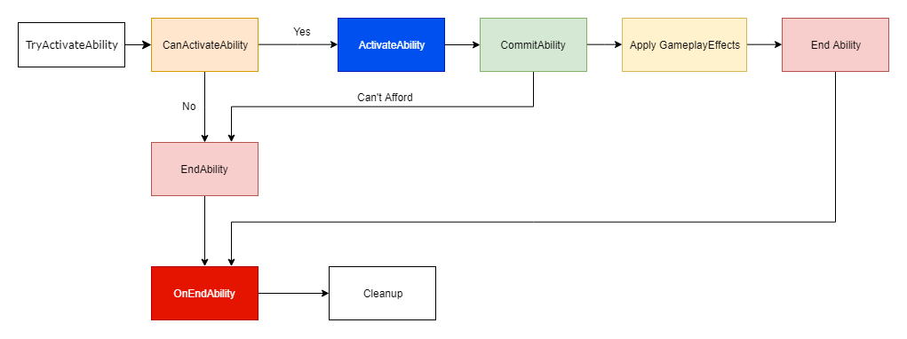


更复杂的 `GameplayAbility` 流程图：
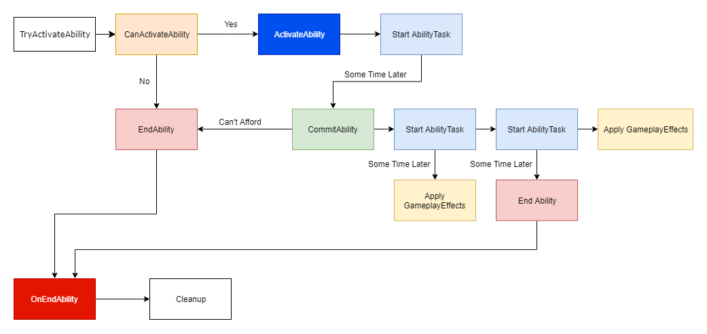

复杂技能可以使用多个相互交互（激活、取消等）的 `GameplayAbilities` 来实现。

<a name="concepts-ga-definition-reppolicy"></a>
##### 4.6.1.1 Replication Policy

不要使用此选项。名称有误导性，你不需要它。[`GameplayAbilitySpecs`](#concepts-ga-spec) 默认从服务器复制到拥有者客户端。如上所述，**`GameplayAbilities` 不在模拟代理上运行**。它们使用 `AbilityTasks` 和 `GameplayCues` 来复制或 RPC 视觉变化到模拟代理。Epic 的 Dave Ratti 表示他希望在未来[移除此选项](https://epicgames.ent.box.com/s/m1egifkxv3he3u3xezb9hzbgroxyhx89)。

<a name="concepts-ga-definition-remotecancel"></a>
##### 4.6.1.2 Server Respects Remote Ability Cancellation

此选项经常引起麻烦。它意味着如果客户端的 `GameplayAbility` 因取消或自然完成而结束，它会强制服务器的版本结束，无论是否完成。后一个问题很重要，特别是对于高延迟玩家使用的本地预测 `GameplayAbilities`。通常你会想要禁用此选项。

<a name="concepts-ga-definition-repinputdirectly"></a>
##### 4.6.1.3 Replicate Input Directly

设置此选项将始终将输入按下和释放事件复制到服务器。Epic 建议不要使用此选项，而是依赖现有输入相关 [`AbilityTasks`](#concepts-at) 中内置的 `Generic Replicated Events`（如果你已将[输入绑定到 `ASC`](#concepts-ga-input)）。

Epic 的注释：
```c++
/** 直接输入状态复制。如果 bReplicateInputDirectly 在技能上为 true，则将调用这些，通常不是好的使用方式。（相反，优先使用 Generic Replicated Events）。 */
UAbilitySystemComponent::ServerSetInputPressed()
```

**[⬆ 返回顶部](#table-of-contents)**

<a name="concepts-ga-input"></a>
#### 4.6.2 将输入绑定到 ASC

`ASC` 允许你直接将输入动作绑定到它，并在授予时将这些输入分配给 `GameplayAbilities`。如果满足 `GameplayTag` 要求，分配给 `GameplayAbilities` 的输入动作在按下时会自动激活这些 `GameplayAbilities`。分配的输入动作是使用响应输入的内置 `AbilityTasks` 所必需的。

除了分配给激活 `GameplayAbilities` 的输入动作外，`ASC` 还接受通用的 `Confirm` 和 `Cancel` 输入。这些特殊输入被 `AbilityTasks` 用于确认如 [`Target Actors`](#concepts-targeting-actors) 或取消它们。

要将输入绑定到 `ASC`，你必须首先创建一个将输入动作名称转换为字节的枚举。枚举名称必须与项目设置中用于输入动作的名称完全匹配。`DisplayName` 无关紧要。

来自示例项目：
```c++
UENUM(BlueprintType)
enum class EGDAbilityInputID : uint8
{
	// 0 None
	None			UMETA(DisplayName = "None"),
	// 1 Confirm
	Confirm			UMETA(DisplayName = "Confirm"),
	// 2 Cancel
	Cancel			UMETA(DisplayName = "Cancel"),
	// 3 LMB
	Ability1		UMETA(DisplayName = "Ability1"),
	// 4 RMB
	Ability2		UMETA(DisplayName = "Ability2"),
	// 5 Q
	Ability3		UMETA(DisplayName = "Ability3"),
	// 6 E
	Ability4		UMETA(DisplayName = "Ability4"),
	// 7 R
	Ability5		UMETA(DisplayName = "Ability5"),
	// 8 Sprint
	Sprint			UMETA(DisplayName = "Sprint"),
	// 9 Jump
	Jump			UMETA(DisplayName = "Jump")
};
```

如果你的 `ASC` 位于 `Character` 上，则在 `SetupPlayerInputComponent()` 中包含绑定到 `ASC` 的函数：
```c++
// 绑定到 AbilitySystemComponent
FTopLevelAssetPath AbilityEnumAssetPath = FTopLevelAssetPath(FName("/Script/GASDocumentation"), FName("EGDAbilityInputID"));
AbilitySystemComponent->BindAbilityActivationToInputComponent(PlayerInputComponent, FGameplayAbilityInputBinds(FString("ConfirmTarget"),
	FString("CancelTarget"), AbilityEnumAssetPath, static_cast<int32>(EGDAbilityInputID::Confirm), static_cast<int32>(EGDAbilityInputID::Cancel)));
```

如果你的 `ASC` 位于 `PlayerState` 上，在 `SetupPlayerInputComponent()` 内部存在潜在的竞态条件，即 `PlayerState` 可能尚未复制到客户端。因此，我建议在 `SetupPlayerInputComponent()` 和 `OnRep_PlayerState()` 中都尝试绑定输入。仅 `OnRep_PlayerState()` 本身不够，因为可能存在当 `PlayerState` 在 `PlayerController` 告诉客户端调用创建 `InputComponent` 的 `ClientRestart()` 之前复制时，`Actor` 的 `InputComponent` 可能为 null 的情况。示例项目演示了在两个位置都尝试绑定，使用布尔值控制过程，使其只实际绑定一次输入。

**注意：** 在示例项目中，枚举中的 `Confirm` 和 `Cancel` 不匹配项目设置中的输入动作名称（`ConfirmTarget` 和 `CancelTarget`），但我们在 `BindAbilityActivationToInputComponent()` 中提供了它们之间的映射。这些是特殊的，因为我们提供了映射，它们不必匹配，但可以匹配。枚举中的所有其他输入必须匹配项目设置中的输入动作名称。

对于只通过一个输入激活的 `GameplayAbilities`（它们将始终存在于同一个"槽位"如 MOBA），我更喜欢在我的 `UGameplayAbility` 子类中添加一个变量，我可以在其中定义它们的输入。然后我可以在授予技能时从 `ClassDefaultObject` 读取它。

<a name="concepts-ga-input-noactivate"></a>
##### 4.6.2.1 绑定输入但不激活 Abilities

如果你不希望 `GameplayAbilities` 在按下输入时自动激活，但仍将其绑定到输入以与 `AbilityTasks` 一起使用，你可以在 `UGameplayAbility` 子类中添加一个新的布尔变量 `bActivateOnInput`，默认为 `true`，并重写 `UAbilitySystemComponent::AbilityLocalInputPressed()`。

```c++
void UGSAbilitySystemComponent::AbilityLocalInputPressed(int32 InputID)
{
	// 如果此 InputID 被重载为 GenericConfirm/Cancel 且 GenericConfim/Cancel 回调已绑定，则消耗输入
	if (IsGenericConfirmInputBound(InputID))
	{
		LocalInputConfirm();
		return;
	}

	if (IsGenericCancelInputBound(InputID))
	{
		LocalInputCancel();
		return;
	}

	// ---------------------------------------------------------

	ABILITYLIST_SCOPE_LOCK();
	for (FGameplayAbilitySpec& Spec : ActivatableAbilities.Items)
	{
		if (Spec.InputID == InputID)
		{
			if (Spec.Ability)
			{
				Spec.InputPressed = true;
				if (Spec.IsActive())
				{
					if (Spec.Ability->bReplicateInputDirectly && IsOwnerActorAuthoritative() == false)
					{
						ServerSetInputPressed(Spec.Handle);
					}

					AbilitySpecInputPressed(Spec);

					// 调用 InputPressed 事件。这不会在这里复制。如果有人在监听，他们可能会将 InputPressed 事件复制到服务器。
					InvokeReplicatedEvent(EAbilityGenericReplicatedEvent::InputPressed, Spec.Handle, Spec.ActivationInfo.GetActivationPredictionKey());
				}
				else
				{
					UGSGameplayAbility* GA = Cast<UGSGameplayAbility>(Spec.Ability);
					if (GA && GA->bActivateOnInput)
					{
						// 技能未激活，所以尝试激活它
						TryActivateAbility(Spec.Handle);
					}
				}
			}
		}
	}
}
```

**[⬆ 返回顶部](#table-of-contents)**

<a name="concepts-ga-granting"></a>
#### 4.6.3 授予 Abilities

向 `ASC` 授予 `GameplayAbility` 会将其添加到 `ASC` 的 `ActivatableAbilities` 列表中，允许其在满足 [`GameplayTag` 要求](#concepts-ga-tags) 时随意激活 `GameplayAbility`。

我们在服务器上授予 `GameplayAbilities`，然后自动将 [`GameplayAbilitySpec`](#concepts-ga-spec) 复制到拥有者客户端。其他客户端/模拟代理不会收到 `GameplayAbilitySpec`。

示例项目在 `Character` 类上存储 `TArray<TSubclassOf<UGDGameplayAbility>>`，在游戏开始时读取并授予：
```c++
void AGDCharacterBase::AddCharacterAbilities()
{
	// 授予技能，但仅在服务器上	
	if (Role != ROLE_Authority || !AbilitySystemComponent.IsValid() || AbilitySystemComponent->bCharacterAbilitiesGiven)
	{
		return;
	}

	for (TSubclassOf<UGDGameplayAbility>& StartupAbility : CharacterAbilities)
	{
		AbilitySystemComponent->GiveAbility(
			FGameplayAbilitySpec(StartupAbility, GetAbilityLevel(StartupAbility.GetDefaultObject()->AbilityID), static_cast<int32>(StartupAbility.GetDefaultObject()->AbilityInputID), this));
	}

	AbilitySystemComponent->bCharacterAbilitiesGiven = true;
}
```

授予这些 `GameplayAbilities` 时，我们创建 `GameplayAbilitySpecs`，包含 `UGameplayAbility` 类、技能等级、绑定的输入以及 `SourceObject`（即谁将此 `GameplayAbility` 给予了此 `ASC`）。

**[⬆ 返回顶部](#table-of-contents)**

<a name="concepts-ga-activating"></a>
#### 4.6.4 激活 Abilities

如果为 `GameplayAbility` 分配了输入动作，当按下输入且满足其 `GameplayTag` 要求时，它会自动激活。这可能并不总是激活 `GameplayAbility` 的理想方式。`ASC` 提供了四种其他激活 `GameplayAbilities` 的方法：通过 `GameplayTag`、`GameplayAbility` 类、`GameplayAbilitySpec` 句柄和通过事件。通过事件激活 `GameplayAbility` 允许你[随事件传入数据负载](#concepts-ga-data)。

```c++
UFUNCTION(BlueprintCallable, Category = "Abilities")
bool TryActivateAbilitiesByTag(const FGameplayTagContainer& GameplayTagContainer, bool bAllowRemoteActivation = true);

UFUNCTION(BlueprintCallable, Category = "Abilities")
bool TryActivateAbilityByClass(TSubclassOf<UGameplayAbility> InAbilityToActivate, bool bAllowRemoteActivation = true);

bool TryActivateAbility(FGameplayAbilitySpecHandle AbilityToActivate, bool bAllowRemoteActivation = true);

bool TriggerAbilityFromGameplayEvent(FGameplayAbilitySpecHandle AbilityToTrigger, FGameplayAbilityActorInfo* ActorInfo, FGameplayTag Tag, const FGameplayEventData* Payload, UAbilitySystemComponent& Component);

FGameplayAbilitySpecHandle GiveAbilityAndActivateOnce(const FGameplayAbilitySpec& AbilitySpec, const FGameplayEventData* GameplayEventData);
```
要通过事件激活 `GameplayAbility`，`GameplayAbility` 必须在 `GameplayAbility` 中设置其 `Triggers`。分配一个 `GameplayTag` 并为 `GameplayEvent` 选择一个选项。要发送事件，使用函数 `UAbilitySystemBlueprintLibrary::SendGameplayEventToActor(AActor* Actor, FGameplayTag EventTag, FGameplayEventData Payload)`。通过事件激活 `GameplayAbility` 允许你传入带有数据的负载。

`GameplayAbility` `Triggers` 还允许你在 `GameplayTag` 被添加或移除时激活 `GameplayAbility`。

**注意：** 在蓝图中通过事件激活 `GameplayAbility` 时，必须使用 `ActivateAbilityFromEvent` 节点。

**注意：** 当 `GameplayAbility` 应该终止时，不要忘记调用 `EndAbility()`，除非你有一个总是运行的 `GameplayAbility`，如被动技能。

**本地预测** `GameplayAbilities` 的激活序列：
1. **拥有者客户端** 调用 `TryActivateAbility()`
1. 调用 `InternalTryActivateAbility()`
1. 调用 `CanActivateAbility()` 并返回是否满足 `GameplayTag` 要求、`ASC` 是否能负担消耗、`GameplayAbility` 是否不在冷却中以及是否没有其他实例当前激活
1. 调用 `CallServerTryActivateAbility()` 并传递它生成的 `Prediction Key`
1. 调用 `CallActivateAbility()`
1. 调用 `PreActivate()` Epic 将此称为"样板初始化内容"
1. 调用 `ActivateAbility()` 最终激活技能

**服务器** 接收 `CallServerTryActivateAbility()`
1. 调用 `ServerTryActivateAbility()`
1. 调用 `InternalServerTryActivateAbility()` 
1. 调用 `InternalTryActivateAbility()`
1. 调用 `CanActivateAbility()` 并返回是否满足 `GameplayTag` 要求、`ASC` 是否能负担消耗、`GameplayAbility` 是否不在冷却中以及是否没有其他实例当前激活
1. 如果成功则调用 `ClientActivateAbilitySucceed()`，告诉它更新其 `ActivationInfo`（其激活已被服务器确认）并广播 `OnConfirmDelegate` 委托。这与输入确认不同。
1. 调用 `CallActivateAbility()`
1. 调用 `PreActivate()` Epic 将此称为"样板初始化内容"
1. 调用 `ActivateAbility()` 最终激活技能

如果服务器在任何时候激活失败，它会调用 `ClientActivateAbilityFailed()`，立即终止客户端的 `GameplayAbility` 并撤销任何预测的更改。

<a name="concepts-ga-activating-passive"></a>
##### 4.6.4.1 被动 Abilities

要实现自动激活并持续运行的被动 `GameplayAbilities`，重写 `UGameplayAbility::OnAvatarSet()`，它在 `GameplayAbility` 被授予且 `AvatarActor` 被设置时自动调用，并调用 `TryActivateAbility()`。

我建议在你的自定义 `UGameplayAbility` 类中添加一个 `bool`，指定 `GameplayAbility` 是否应在授予时激活。示例项目为其被动护甲叠加技能这样做。

被动 `GameplayAbilities` 通常有 `Server Only` 的 [`Net Execution Policy`](#concepts-ga-net)。

```c++
void UGDGameplayAbility::OnAvatarSet(const FGameplayAbilityActorInfo * ActorInfo, const FGameplayAbilitySpec & Spec)
{
	Super::OnAvatarSet(ActorInfo, Spec);

	if (bActivateAbilityOnGranted)
	{
		ActorInfo->AbilitySystemComponent->TryActivateAbility(Spec.Handle, false);
	}
}
```

Epic 将此函数描述为启动被动技能和执行 `BeginPlay` 类型操作的正确位置。

**[⬆ 返回顶部](#table-of-contents)**

<a name="concepts-ga-activating-failedtags"></a>
##### 4.6.4.2 激活失败 Tags

技能有默认逻辑告诉你为什么技能激活失败。要启用此功能，你必须设置对应默认失败情况的 GameplayTags。

将这些标签（或你自己的命名约定）添加到你的项目中：
```
+GameplayTagList=(Tag="Activation.Fail.BlockedByTags",DevComment="")
+GameplayTagList=(Tag="Activation.Fail.CantAffordCost",DevComment="")
+GameplayTagList=(Tag="Activation.Fail.IsDead",DevComment="")
+GameplayTagList=(Tag="Activation.Fail.MissingTags",DevComment="")
+GameplayTagList=(Tag="Activation.Fail.Networking",DevComment="")
+GameplayTagList=(Tag="Activation.Fail.OnCooldown",DevComment="")
```

然后将它们添加到 [`GASDocumentation\Config\DefaultGame.ini`](https://github.com/tranek/GASDocumentation/blob/master/Config/DefaultGame.ini#L8-L13)：
```
[/Script/GameplayAbilities.AbilitySystemGlobals]
ActivateFailIsDeadName=Activation.Fail.IsDead
ActivateFailCooldownName=Activation.Fail.OnCooldown
ActivateFailCostName=Activation.Fail.CantAffordCost
ActivateFailTagsBlockedName=Activation.Fail.BlockedByTags
ActivateFailTagsMissingName=Activation.Fail.MissingTags
ActivateFailNetworkingName=Activation.Fail.Networking
```

现在每当技能激活失败时，相应的 GameplayTag 将包含在输出日志消息中或在 `showdebug AbilitySystem` HUD 上可见。
```
LogAbilitySystem: Display: InternalServerTryActivateAbility. Rejecting ClientActivation of Default__GA_FireGun_C. InternalTryActivateAbility failed: Activation.Fail.BlockedByTags
LogAbilitySystem: Display: ClientActivateAbilityFailed_Implementation. PredictionKey :109 Ability: Default__GA_FireGun_C
```

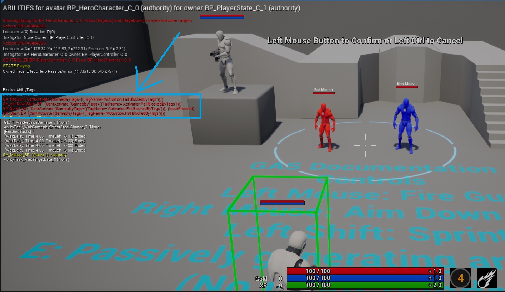

**[⬆ 返回顶部](#table-of-contents)**

<a name="concepts-ga-cancelabilities"></a>
#### 4.6.5 取消 Abilities

要从内部取消 `GameplayAbility`，调用 `CancelAbility()`。这会调用 `EndAbility()` 并将其 `WasCancelled` 参数设为 true。

要从外部取消 `GameplayAbility`，`ASC` 提供了一些函数：

```c++
/** 取消指定的技能 CDO。 */
void CancelAbility(UGameplayAbility* Ability);	

/** 取消由传入的 spec 句柄指示的技能。如果句柄在重新激活的技能中未找到，则什么也不发生。 */
void CancelAbilityHandle(const FGameplayAbilitySpecHandle& AbilityHandle);

/** 取消所有具有指定标签的技能。不会取消 Ignore 实例 */
void CancelAbilities(const FGameplayTagContainer* WithTags=nullptr, const FGameplayTagContainer* WithoutTags=nullptr, UGameplayAbility* Ignore=nullptr);

/** 取消所有技能，无论标签。不会取消 ignore 实例 */
void CancelAllAbilities(UGameplayAbility* Ignore=nullptr);

/** 取消所有技能并杀死任何剩余的实例化技能 */
virtual void DestroyActiveState();
```

**注意：** 我发现如果有 `Non-Instanced` `GameplayAbilities`，`CancelAllAbilities` 似乎不能正常工作。它似乎碰到 `Non-Instanced` `GameplayAbility` 就放弃了。`CancelAbilities` 可以更好地处理 `Non-Instanced` `GameplayAbilities`，这是示例项目使用的（Jump 是非实例化的 `GameplayAbility`）。你的情况可能有所不同。

**[⬆ 返回顶部](#table-of-contents)**

<a name="concepts-ga-definition-activeability"></a>
#### 4.6.6 获取已激活的 Abilities

初学者经常问"我如何获取激活的技能？"也许是为了在其上设置变量或取消它。一次可以有多个 `GameplayAbility` 激活，所以没有一个"激活的技能"。相反，你必须搜索 `ASC` 的 `ActivatableAbilities` 列表（`ASC` 拥有的已授予 `GameplayAbilities`）并找到匹配你要找的 [`Asset` 或 `Granted` `GameplayTag`](#concepts-ga-tags) 的那个。

`UAbilitySystemComponent::GetActivatableAbilities()` 返回一个 `TArray<FGameplayAbilitySpec>` 供你遍历。

`ASC` 还有另一个辅助函数，接受 `GameplayTagContainer` 作为参数来辅助搜索，而不是手动遍历 `GameplayAbilitySpecs` 列表。`bOnlyAbilitiesThatSatisfyTagRequirements` 参数只会返回满足其 `GameplayTag` 要求且现在可以激活的 `GameplayAbilitySpecs`。例如，你可以有两个基本攻击 `GameplayAbilities`，一个带武器一个赤手空拳，根据是否装备武器设置 `GameplayTag` 要求来激活正确的那个。更多信息请参见 Epic 对该函数的注释。
```c++
UAbilitySystemComponent::GetActivatableGameplayAbilitySpecsByAllMatchingTags(const FGameplayTagContainer& GameplayTagContainer, TArray < struct FGameplayAbilitySpec* >& MatchingGameplayAbilities, bool bOnlyAbilitiesThatSatisfyTagRequirements = true)
```

一旦找到你要的 `FGameplayAbilitySpec`，你可以对其调用 `IsActive()`。

**[⬆ 返回顶部](#table-of-contents)**

<a name="concepts-ga-instancing"></a>
#### 4.6.7 实例化策略

`GameplayAbility` 的 `Instancing Policy` 决定 `GameplayAbility` 在激活时是否以及如何被实例化。

| `Instancing Policy`     | 描述                                                                                      | 使用示例                                                                                                                                                                                                                                                                                                                                                                                             |
| ----------------------- | ------------------------------------------------------------------------------------------------ | ------------------------------------------------------------------------------------------------------------------------------------------------------------------------------------------------------------------------------------------------------------------------------------------------------------------------------------------------------------------------------------------------------------------ |
| Instanced Per Actor     | 每个 `ASC` 只有一个 `GameplayAbility` 实例，在激活之间重用。    | 这可能你会最常使用的 `Instancing Policy`。你可以将其用于任何技能，并在激活之间提供持久性。设计师负责在激活之间手动重置需要重置的变量。                                                                                                                                                               |
| Instanced Per Execution | 每次激活 `GameplayAbility` 时，都会创建 `GameplayAbility` 的新实例。 | 这些 `GameplayAbilities` 的好处是每次激活时变量都会重置。这些比 `Instanced Per Actor` 性能更差，因为它们每次激活都会生成新的 `GameplayAbilities`。示例项目不使用任何这些。                                                                                                                                 |
| Non-Instanced           | `GameplayAbility` 在其 `ClassDefaultObject` 上操作。不创建实例。            | 这三者中性能最好，但限制最多。`Non-Instanced` `GameplayAbilities` 不能存储状态，意味着没有动态变量，不能绑定到 `AbilityTask` 委托。使用它们的最佳位置是频繁使用的简单技能，如 MOBA 或 RTS 中小兵的基本攻击。示例项目的 Jump `GameplayAbility` 是 `Non-Instanced`。 |

**[⬆ 返回顶部](#table-of-contents)**

<a name="concepts-ga-net"></a>
#### 4.6.8 网络执行策略

`GameplayAbility` 的 `Net Execution Policy` 决定谁运行 `GameplayAbility` 以及以什么顺序。

| `Net Execution Policy` | 描述                                                                                                                                                                                                         |
| ---------------------- | ------------------------------------------------------------------------------------------------------------------------------------------------------------------------------------------------------------------- |
| `Local Only`           | `GameplayAbility` 只在拥有者客户端上运行。这对于只做本地装饰性更改的技能很有用。单人游戏应使用 `Server Only`。                                     |
| `Local Predicted`      | `Local Predicted` `GameplayAbilities` 首先在拥有者客户端上激活，然后在服务器上激活。服务器版本会纠正客户端预测错误的任何内容。参见[预测](#concepts-p)。 |
| `Server Only`          | `GameplayAbility` 只在服务器上运行。被动 `GameplayAbilities` 通常是 `Server Only`。单人游戏应使用此选项。                                                                  |
| `Server Initiated`     | `Server Initiated` `GameplayAbilities` 首先在服务器上激活，然后在拥有者客户端上激活。我个人很少使用这些（如果有的话）。                                                                     | 

**[⬆ 返回顶部](#table-of-contents)**

<a name="concepts-ga-tags"></a>
#### 4.6.9 Ability Tags

`GameplayAbilities` 自带带有内置逻辑的 `GameplayTagContainers`。这些 `GameplayTags` 都不被复制。

| `GameplayTag Container`     | 描述                                                                                                                                                                                   |
| --------------------------- | --------------------------------------------------------------------------------------------------------------------------------------------------------------------------------------------- |
| `Ability Tags`              | `GameplayAbility` 拥有的 `GameplayTags`。这些只是描述 `GameplayAbility` 的 `GameplayTags`。                                                                              |
| `Cancel Abilities with Tag` | 当此 `GameplayAbility` 激活时，其他在其 `Ability Tags` 中有这些 `GameplayTags` 的 `GameplayAbilities` 将被取消。                                                   |
| `Block Abilities with Tag`  | 当此 `GameplayAbility` 激活时，其他在其 `Ability Tags` 中有这些 `GameplayTags` 的 `GameplayAbilities` 被阻止激活。                                          |
| `Activation Owned Tags`     | 当此 `GameplayAbility` 激活时，这些 `GameplayTags` 会给予 `GameplayAbility` 的拥有者。记住这些不被复制。                                                    |
| `Activation Required Tags`  | 只有当拥有者拥有**所有**这些 `GameplayTags` 时，此 `GameplayAbility` 才能被激活。                                                                                                |
| `Activation Blocked Tags`   | 如果拥有者拥有**任何**这些 `GameplayTags`，此 `GameplayAbility` 不能被激活。                                                                                                  |
| `Source Required Tags`      | 只有当 `Source` 拥有**所有**这些 `GameplayTags` 时，此 `GameplayAbility` 才能被激活。`Source` `GameplayTags` 只在 `GameplayAbility` 由事件触发时设置。 |
| `Source Blocked Tags`       | 如果 `Source` 拥有**任何**这些 `GameplayTags`，此 `GameplayAbility` 不能被激活。`Source` `GameplayTags` 只在 `GameplayAbility` 由事件触发时设置。   |
| `Target Required Tags`      | 只有当 `Target` 拥有**所有**这些 `GameplayTags` 时，此 `GameplayAbility` 才能被激活。`Target` `GameplayTags` 只在 `GameplayAbility` 由事件触发时设置。 |
| `Target Blocked Tags`       | 如果 `Target` 拥有**任何**这些 `GameplayTags`，此 `GameplayAbility` 不能被激活。`Target` `GameplayTags` 只在 `GameplayAbility` 由事件触发时设置。   |

**[⬆ 返回顶部](#table-of-contents)**

<a name="concepts-ga-spec"></a>
#### 4.6.10 Gameplay Ability Spec

`GameplayAbilitySpec` 在 `GameplayAbility` 被授予后存在于 `ASC` 上，定义了可激活的 `GameplayAbility`——`GameplayAbility` 类、等级、输入绑定和必须与 `GameplayAbility` 类分开保存的运行时状态。

当 `GameplayAbility` 在服务器上被授予时，服务器将 `GameplayAbilitySpec` 复制到拥有者客户端，以便她可以激活它。

激活 `GameplayAbilitySpec` 会根据其 `Instancing Policy` 创建 `GameplayAbility` 的实例（或对于 `Non-Instanced` `GameplayAbilities` 不创建）。

**[⬆ 返回顶部](#table-of-contents)**

<a name="concepts-ga-data"></a>
#### 4.6.11 向 Abilities 传递数据

`GameplayAbilities` 的通用范式是 `激活->生成数据->应用->结束`。有时你需要处理现有数据。GAS 提供了几种将外部数据传入 `GameplayAbilities` 的选项：

| 方法                                          | 描述                                                                                                                                                                                                                                                                                                                                                                                                                                                                                                                                                                                                                                                                                                                                                                                   |
| ----------------------------------------------- | --------------------------------------------------------------------------------------------------------------------------------------------------------------------------------------------------------------------------------------------------------------------------------------------------------------------------------------------------------------------------------------------------------------------------------------------------------------------------------------------------------------------------------------------------------------------------------------------------------------------------------------------------------------------------------------------------------------------------------------------------------------------------------------------- |
| 通过事件激活 `GameplayAbility`             | 用包含数据负载的事件激活 `GameplayAbility`。事件的负载从客户端复制到服务器用于本地预测 `GameplayAbilities`。使用两个 `Optional Object` 或 [`TargetData`](#concepts-targeting-data) 变量来处理不适合任何现有变量的任意数据。缺点是它阻止你用输入绑定激活技能。要通过事件激活 `GameplayAbility`，`GameplayAbility` 必须在其 `Triggers` 中设置。分配一个 `GameplayTag` 并为 `GameplayEvent` 选择一个选项。要发送事件，使用函数 `UAbilitySystemBlueprintLibrary::SendGameplayEventToActor(AActor* Actor, FGameplayTag EventTag, FGameplayEventData Payload)`。 |
| 使用 `WaitGameplayEvent` `AbilityTask`           | 使用 `WaitGameplayEvent` `AbilityTask` 告诉 `GameplayAbility` 在激活后监听带有负载数据的事件。事件负载和发送过程与通过事件激活 `GameplayAbilities` 相同。缺点是事件不会被 `AbilityTask` 复制，只应用于 `Local Only` 和 `Server Only` `GameplayAbilities`。你 potentially 可以编写自己的 `AbilityTask` 来复制事件负载。                                                                                                                                                                                                                                                                                               |
| 使用 `TargetData`                                | 自定义 `TargetData` 结构体是在客户端和服务器之间传递任意数据的好方法。                                                                                                                                                                                                                                                                                                                                                                                                                                                                                                                                                                                                                                                                                              |
| 在 `OwnerActor` 或 `AvatarActor` 上存储数据 | 使用存储在 `OwnerActor`、`AvatarActor` 或任何你能获得引用的对象上的复制变量。此方法最灵活，可用于通过输入绑定激活的 `GameplayAbilities`。但是，它不保证数据在使用时从复制同步。你必须提前确保——意味着如果你设置一个复制变量然后立即激活 `GameplayAbility`，由于潜在的丢包，不能保证接收端的顺序。                                                                                                                                                                                                                                   |

**[⬆ 返回顶部](#table-of-contents)**

<a name="concepts-ga-commit"></a>
#### 4.6.12 Ability 消耗和冷却

`GameplayAbilities` 自带可选消耗和冷却功能。消耗是 `ASC` 激活 `GameplayAbility` 所需的预定义 `Attributes` 数量，用 `Instant` `GameplayEffect`（[`Cost GE`](#concepts-ge-cost)）实现。冷却是防止 `GameplayAbility` 重新激活直到过期的计时器，用 `Duration` `GameplayEffect`（[`Cooldown GE`](#concepts-ge-cooldown)）实现。

在 `GameplayAbility` 调用 `UGameplayAbility::Activate()` 之前，它调用 `UGameplayAbility::CanActivateAbility()`。此函数检查拥有 `ASC` 是否能负担消耗（`UGameplayAbility::CheckCost()`）并确保 `GameplayAbility` 不在冷却中（`UGameplayAbility::CheckCooldown()`）。

`GameplayAbility` 调用 `Activate()` 后，它可以在任何时候选择使用 `UGameplayAbility::CommitAbility()` 提交消耗和冷却，该函数调用 `UGameplayAbility::CommitCost()` 和 `UGameplayAbility::CommitCooldown()`。如果不应同时提交，设计师可以选择单独调用 `CommitCost()` 或 `CommitCooldown()`。提交消耗和冷却会再调用一次 `CheckCost()` 和 `CheckCooldown()`，这是 `GameplayAbility` 因它们而失败的最后机会。拥有 `ASC` 的 `Attributes` 可能在 `GameplayAbility` 激活后变化，在提交时不满足消耗。如果提交时[预测键](#concepts-p-key)有效，提交消耗和冷却可以[本地预测](#concepts-p)。

实现细节请参见 [`CostGE`](#concepts-ge-cost) 和 [`CooldownGE`](#concepts-ge-cooldown)。

**[⬆ 返回顶部](#table-of-contents)**

<a name="concepts-ga-leveling"></a>
#### 4.6.13 Ability 升级

有两种常见的技能升级方法：

| 升级方法                            | 描述                                                                                                                                                                                                      |
| ------------------------------------------ | ---------------------------------------------------------------------------------------------------------------------------------------------------------------------------------------------------------------- |
| 在新等级取消授予并重新授予       | 从 `ASC` 取消授予（移除）`GameplayAbility` 并在服务器上以下一级重新授予。如果当时技能处于激活状态，这会终止 `GameplayAbility`。                                   |
| 增加 `GameplayAbilitySpec` 的等级 | 在服务器上找到 `GameplayAbilitySpec`，增加其等级，并标记为脏以便复制到拥有者客户端。此方法不会在技能激活时终止 `GameplayAbility`。 |

两种方法的主要区别在于你是否希望激活的 `GameplayAbilities` 在升级时被取消。你很可能根据你的 `GameplayAbilities` 使用两种方法。我建议在你的 `UGameplayAbility` 子类中添加一个 `bool` 指定使用哪种方法。

**[⬆ 返回顶部](#table-of-contents)**

<a name="concepts-ga-sets"></a>
#### 4.6.14 Ability Sets

`GameplayAbilitySets` 是便捷的 `UDataAsset` 类，用于保存角色的输入绑定和启动 `GameplayAbilities` 列表，带有授予 `GameplayAbilities` 的逻辑。子类还可以包含额外的逻辑或属性。Paragon 每个英雄有一个 `GameplayAbilitySet`，包含所有给定的 `GameplayAbilities`。

我觉得这个类不必要，至少就我目前看到的而言。示例项目在 `GDCharacterBase` 及其子类中处理了 `GameplayAbilitySets` 的所有功能。

**[⬆ 返回顶部](#table-of-contents)**

<a name="concepts-ga-batching"></a>
#### 4.6.15 Ability 批处理

传统 `Gameplay Ability` 生命周期涉及从客户端到服务器至少两到三个 RPC。

1. `CallServerTryActivateAbility()`
1. `ServerSetReplicatedTargetData()`（可选）
1. `ServerEndAbility()`

如果 `GameplayAbility` 在一帧中以一个原子分组执行所有这些操作，我们可以优化此工作流将所有两到三个 RPC 批处理（合并）为一个 RPC。`GAS` 将此 RPC 优化称为 `Ability Batching`。使用 `Ability Batching` 的常见示例是即时命中的枪械。即时命中枪械激活、做线追踪、将 [`TargetData`](#concepts-targeting-data) 发送到服务器并在一帧的一个原子组中结束技能。[GASShooter](https://github.com/tranek/GASShooter) 示例项目为其即时命中枪械演示了此技术。

半自动枪械是最佳场景，将 `CallServerTryActivateAbility()`、`ServerSetReplicatedTargetData()`（子弹命中结果）和 `ServerEndAbility()` 批处理为一个 RPC 而不是三个 RPC。

全自动/点射枪械将第一颗子弹的 `CallServerTryActivateAbility()` 和 `ServerSetReplicatedTargetData()` 批处理为一个 RPC 而不是两个 RPC。每颗后续子弹是自己的 `ServerSetReplicatedTargetData()` RPC。最后，当枪停止射击时，`ServerEndAbility()` 作为单独的 RPC 发送。这是最坏的情况，我们只在第一颗子弹上节省一个 RPC 而不是两个。此场景也可以通过[`Gameplay Event`](#concepts-ga-data) 激活技能来实现，这会将子弹的 `TargetData` 从客户端通过 `EventPayload` 发送到服务器。后一种方法的缺点是 `TargetData` 必须在技能外部生成，而批处理方法在技能内部生成 `TargetData`。

`Ability Batching` 默认在 [`ASC`](#concepts-asc) 上禁用。要启用 `Ability Batching`，重写 `ShouldDoServerAbilityRPCBatch()` 返回 true：

```c++
virtual bool ShouldDoServerAbilityRPCBatch() const override { return true; }
```

现在 `Ability Batching` 已启用，在激活要批处理的技能之前，你必须事先创建一个 `FScopedServerAbilityRPCBatcher` 结构体。此特殊结构体会尝试批处理其作用域内之后的任何技能。一旦 `FScopedServerAbilityRPCBatcher` 离开作用域，任何激活的技能都不会尝试批处理。`FScopedServerAbilityRPCBatcher` 通过在可批处理的每个函数中有特殊代码来工作，这些代码拦截发送 RPC 的调用，而是将消息打包到批处理结构体中。当 `FScopedServerAbilityRPCBatcher` 离开作用域时，它会自动在 `UAbilitySystemComponent::EndServerAbilityRPCBatch()` 中将此批处理结构体 RPC 到服务器。服务器在 `UAbilitySystemComponent::ServerAbilityRPCBatch_Internal(FServerAbilityRPCBatch& BatchInfo)` 中接收批处理 RPC。`BatchInfo` 参数将包含技能是否应结束、激活时是否按下输入的标志以及如果包含的 `TargetData`。这是一个适合放断点的好函数，用于确认批处理是否正常工作。或者，使用 cvar `AbilitySystem.ServerRPCBatching.Log 1` 启用特殊的技能批处理日志。

此机制只能在 C++ 中完成，且只能通过其 `FGameplayAbilitySpecHandle` 激活技能。

```c++
bool UGSAbilitySystemComponent::BatchRPCTryActivateAbility(FGameplayAbilitySpecHandle InAbilityHandle, bool EndAbilityImmediately)
{
	bool AbilityActivated = false;
	if (InAbilityHandle.IsValid())
	{
		FScopedServerAbilityRPCBatcher GSAbilityRPCBatcher(this, InAbilityHandle);
		AbilityActivated = TryActivateAbility(InAbilityHandle, true);

		if (EndAbilityImmediately)
		{
			FGameplayAbilitySpec* AbilitySpec = FindAbilitySpecFromHandle(InAbilityHandle);
			if (AbilitySpec)
			{
				UGSGameplayAbility* GSAbility = Cast<UGSGameplayAbility>(AbilitySpec->GetPrimaryInstance());
				GSAbility->ExternalEndAbility();
			}
		}

		return AbilityActivated;
	}

	return AbilityActivated;
}
```

GASShooter 重用相同的批处理 `GameplayAbility` 用于半自动和全自动枪械，它们从不直接调用 `EndAbility()`（由一个本地技能在技能外部处理，该技能管理玩家输入并根据当前射击模式调用批处理技能）。由于所有 RPC 必须在 `FScopedServerAbilityRPCBatcher` 的作用域内发生，我提供 `EndAbilityImmediately` 参数，以便控制/管理的本地技能可以指定此技能是否应批处理 `EndAbility()` 调用（半自动），还是不批处理 `EndAbility()` 调用（全自动），`EndAbility()` 调用将稍后在自己的 RPC 中发生。

GASShooter 暴露了一个蓝图节点来允许批处理技能，上述本地技能使用它来触发批处理技能。

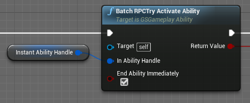

**[⬆ 返回顶部](#table-of-contents)**

<a name="concepts-ga-netsecuritypolicy"></a>
#### 4.6.16 网络安全策略

`GameplayAbility` 的 `NetSecurityPolicy` 决定技能应在网络上的何处执行。它提供了防止客户端尝试执行受限技能的保护。

| `NetSecurityPolicy`     | 描述                                                                                                                                        |
| ----------------------- | ------------------------------------------------------------------------------------------------------------------------------------------ |
| `ClientOrServer`        | 无安全要求。客户端或服务器可以自由触发此技能的执行和终止。                                           |
| `ServerOnlyExecution`   | 客户端请求执行此技能将被服务器忽略。客户端仍可请求服务器取消或结束此技能。 |
| `ServerOnlyTermination` | 客户端请求取消或结束此技能将被服务器忽略。客户端仍可请求执行技能。      |
| `ServerOnly`            | 服务器控制此技能的执行和终止。客户端的任何请求将被忽略。                                      |

**[⬆ 返回顶部](#table-of-contents)**

<a name="concepts-at"></a>
### 4.7 Ability Tasks

<a name="concepts-at-definition"></a>
### 4.7.1 Ability Task 定义

`GameplayAbilities` 只在一帧内执行。这本身不允许太多灵活性。要做随时间发生的动作或需要响应稍后某个时间点触发的委托，我们使用称为 `AbilityTasks` 的潜在操作。

GAS 自带许多 `AbilityTasks`：
* 用 `RootMotionSource` 移动 Characters 的任务
* 播放动画 Montage 的任务
* 响应 `Attribute` 变化的任务
* 响应 `GameplayEffect` 变化的任务
* 响应玩家输入的任务
* 等等

`UAbilityTask` 构造函数强制硬编码游戏范围内最多 1000 个并发 `AbilityTasks` 同时运行。在为世界上同时可能有数百个角色的游戏（如 RTS 游戏）设计 `GameplayAbilities` 时请记住这一点。

**[⬆ 返回顶部](#table-of-contents)**

<a name="concepts-at-definition"></a>
### 4.7.2 自定义 Ability Tasks

你经常会在 C++ 中创建自己的自定义 `AbilityTasks`。示例项目附带两个自定义 `AbilityTasks`：
1. `PlayMontageAndWaitForEvent` 是默认 `PlayMontageAndWait` 和 `WaitGameplayEvent` `AbilityTasks` 的组合。这允许动画 Montage 从 `AnimNotifies` 发送游戏事件回启动它们的 `GameplayAbility`。使用它在动画 Montage 期间的特定时间触发动作。
1. `WaitReceiveDamage` 监听 `OwnerActor` 受到伤害。被动护甲叠加 `GameplayAbility` 在英雄受到一次伤害时移除一层护甲。

`AbilityTasks` 由以下部分组成：
* 创建 `AbilityTask` 新实例的静态函数
* `AbilityTask` 完成其目的时广播的委托
* 启动其主要工作、绑定外部委托等的 `Activate()` 函数
* 用于清理的 `OnDestroy()` 函数，包括它绑定的外部委托
* 它绑定的任何外部委托的回调函数
* 成员变量和任何内部辅助函数

**注意：** `AbilityTasks` 只能声明一种类型的输出委托。所有输出委托必须是此类型，无论它们是否使用参数。为未使用的委托参数传递默认值。

`AbilityTasks` 只在运行拥有 `GameplayAbility` 的客户端或服务器上运行；但是，`AbilityTasks` 可以通过在 `AbilityTask` 构造函数中设置 `bSimulatedTask = true;`、重写 `virtual void InitSimulatedTask(UGameplayTasksComponent& InGameplayTasksComponent);` 并设置任何成员变量为复制来在模拟客户端上运行。这只在少数情况下有用，如移动 `AbilityTasks`，你不想复制每个移动变化而是模拟整个移动 `AbilityTask`。所有 `RootMotionSource` `AbilityTasks` 都这样做。以 `AbilityTask_MoveToLocation.h/.cpp` 为例。

`AbilityTasks` 可以 `Tick`，如果你在 `AbilityTask` 构造函数中设置 `bTickingTask = true;` 并重写 `virtual void TickTask(float DeltaTime);`。当你需要在帧之间平滑插值值时很有用。以 `AbilityTask_MoveToLocation.h/.cpp` 为例。

**[⬆ 返回顶部](#table-of-contents)**

<a name="concepts-at-using"></a>
### 4.7.3 使用 Ability Tasks

在 C++ 中创建和激活 `AbilityTask`（来自 `GDGA_FireGun.cpp`）：
```c++
UGDAT_PlayMontageAndWaitForEvent* Task = UGDAT_PlayMontageAndWaitForEvent::PlayMontageAndWaitForEvent(this, NAME_None, MontageToPlay, FGameplayTagContainer(), 1.0f, NAME_None, false, 1.0f);
Task->OnBlendOut.AddDynamic(this, &UGDGA_FireGun::OnCompleted);
Task->OnCompleted.AddDynamic(this, &UGDGA_FireGun::OnCompleted);
Task->OnInterrupted.AddDynamic(this, &UGDGA_FireGun::OnCancelled);
Task->OnCancelled.AddDynamic(this, &UGDGA_FireGun::OnCancelled);
Task->EventReceived.AddDynamic(this, &UGDGA_FireGun::EventReceived);
Task->ReadyForActivation();
```

在蓝图中，我们只使用为 `AbilityTask` 创建的蓝图节点。我们不必调用 `ReadyForActivation()`。这由 `Engine/Source/Editor/GameplayTasksEditor/Private/K2Node_LatentGameplayTaskCall.cpp` 自动调用。`K2Node_LatentGameplayTaskCall` 还会在你的 `AbilityTask` 类中自动调用 `BeginSpawningActor()` 和 `FinishSpawningActor()`（如果存在）（参见 `AbilityTask_WaitTargetData`）。重申一下，`K2Node_LatentGameplayTaskCall` 只为蓝图做自动化魔法。在 C++ 中，我们必须手动调用 `ReadyForActivation()`、`BeginSpawningActor()` 和 `FinishSpawningActor()`。

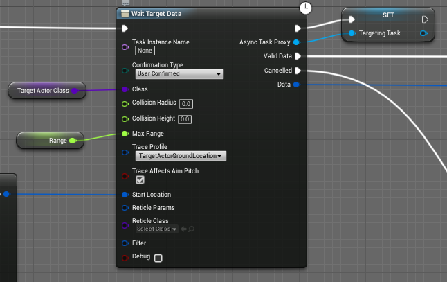

要手动取消 `AbilityTask`，只需在蓝图中（称为 `Async Task Proxy`）或 C++ 中的 `AbilityTask` 对象上调用 `EndTask()`。

**[⬆ 返回顶部](#table-of-contents)**

<a name="concepts-at-rms"></a>
### 4.7.4 Root Motion Source Ability Tasks

GAS 自带使用连接到 `CharacterMovementComponent` 的 `Root Motion Sources` 随时间移动 `Characters` 的 `AbilityTasks`，用于击退、复杂跳跃、拉扯和冲刺等。

**注意：** 预测 `RootMotionSource` `AbilityTasks` 在引擎版本 4.19 和 4.25+ 中有效。引擎版本 4.20-4.24 的预测有 bug；但 `AbilityTasks` 在多人游戏中仍能执行其功能并带有轻微的网络纠正，在单人游戏中完美工作。可以将 4.25 中的[预测修复](https://github.com/EpicGames/UnrealEngine/commit/94107438dd9f490e7b743f8e13da46927051bf33#diff-65f6196f9f28f560f95bd578e07e290c)挑选到自定义 4.20-4.24 引擎中。

**[⬆ 返回顶部](#table-of-contents)**

<a name="concepts-gc"></a>
### 4.8 Gameplay Cues

<a name="concepts-gc-definition"></a>
#### 4.8.1 Gameplay Cue 定义

`GameplayCues`（`GC`）执行非游戏玩法相关的事情，如音效、粒子效果、相机抖动等。`GameplayCues` 通常被复制（除非显式本地 `Executed`、`Added` 或 `Removed`）和预测。

我们通过向 `GameplayCueManager` 发送相应的 `GameplayTag`（**必须的父级名称为 `GameplayCue.`**）和事件类型（`Execute`、`Add` 或 `Remove`）通过 `ASC` 来触发 `GameplayCues`。`GameplayCueNotify` 对象和其他实现 `IGameplayCueInterface` 的 `Actors` 可以基于 `GameplayCue` 的 `GameplayTag`（`GameplayCueTag`）订阅这些事件。

**注意：** 再强调一次，`GameplayCue` `GameplayTags` 需要以父级 `GameplayTag` `GameplayCue` 开头。例如，有效的 `GameplayCue` `GameplayTag` 可能是 `GameplayCue.A.B.C`。

有两种 `GameplayCueNotifies` 类，`Static` 和 `Actor`。它们响应不同的事件，不同类型的 `GameplayEffects` 可以触发它们。用你的逻辑重写相应的事件。

| `GameplayCue` 类                                                                                                                  | 事件             | `GameplayEffect` 类型    | 描述                                                                                                                                                                                                                                                                                                                                                                                                                                                                                                          |
| ------------------------------------------------------------------------------------------------------------------------------------ | ----------------- | ------------------------ | -------------------------------------------------------------------------------------------------------------------------------------------------------------------------------------------------------------------------------------------------------------------------------------------------------------------------------------------------------------------------------------------------------------------------------------------------------------------------------------------------------------------- |
| [`GameplayCueNotify_Static`](https://docs.unrealengine.com/en-US/API/Plugins/GameplayAbilities/UGameplayCueNotify_Static/index.html) | `Execute`         | `Instant` 或 `Periodic`  | 静态 `GameplayCueNotifies` 在 `ClassDefaultObject`（意味着无实例）上操作，非常适合一次性效果如撞击效果。                                                                                                                                                                                                                                                                                                                                                                        |
| [`GameplayCueNotify_Actor`](https://docs.unrealengine.com/en-US/BlueprintAPI/GameplayCueNotify/index.html)                           | `Add` 或 `Remove` | `Duration` 或 `Infinite` | Actor `GameplayCueNotifies` 在 `Added` 时生成新实例。因为它们是实例化的，可以在 `Removed` 之前随时间执行操作。这些适用于循环声音和粒子效果，在支持它们的 `Duration` 或 `Infinite` `GameplayEffect` 被移除或手动调用移除时会被移除。这些还带有管理同时允许 `Added` 多少个的选项，以便同一效果的多次应用只启动一次声音或粒子。 |

`GameplayCueNotifies` 技术上可以响应任何事件，但这通常是我们使用它们的方式。

**注意：** 使用 `GameplayCueNotify_Actor` 时，勾选 `Auto Destroy on Remove`，否则后续调用 `Add` 该 `GameplayCueTag` 将不起作用。

当使用 `Full` 以外的 `ASC` [复制模式](#concepts-asc-rm)时，`Add` 和 `Remove` `GC` 事件会在服务器玩家（监听服务器）上触发两次——一次用于应用 `GE`，一次从"Minimal" `NetMultiCast` 到客户端。但是，`WhileActive` 事件仍只触发一次。所有事件在客户端上只触发一次。

示例项目包含用于眩晕和冲刺效果的 `GameplayCueNotify_Actor`。它还有用于 FireGun 投射物撞击的 `GameplayCueNotify_Static`。这些 `GC` 可以通过[本地触发](#concepts-gc-local)而不是通过 `GE` 复制来进一步优化。我选择在示例项目中展示初学者的使用方式。

**[⬆ 返回顶部](#table-of-contents)**

<a name="concepts-gc-trigger"></a>
#### 4.8.2 触发 Gameplay Cues

当 `GameplayEffect` 成功应用时（未被标签或免疫阻止），在其内部填写应触发的所有 `GameplayCues` 的 `GameplayTags`。

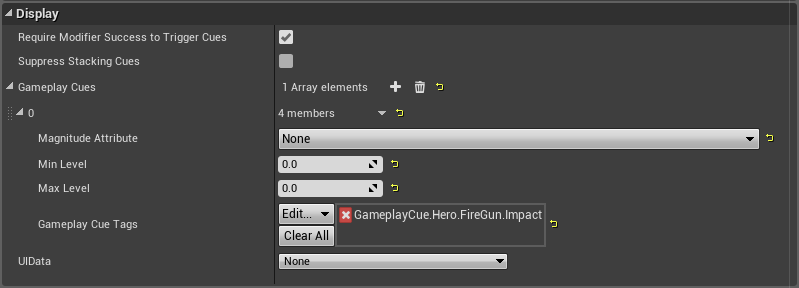

`UGameplayAbility` 提供蓝图节点来 `Execute`、`Add` 或 `Remove` `GameplayCues`。

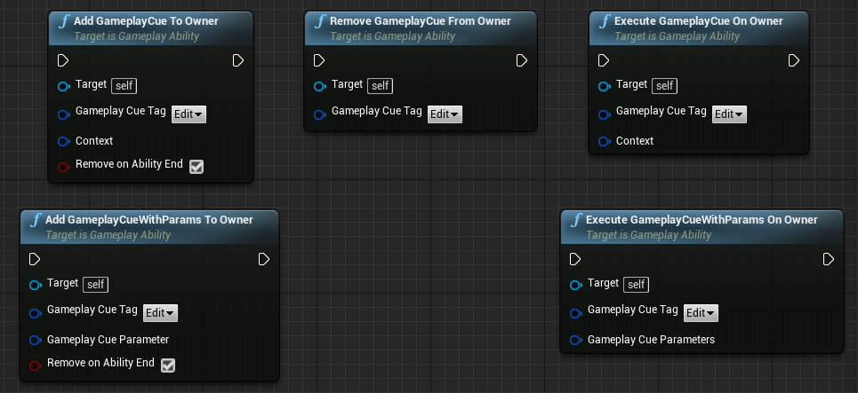

在 C++ 中，你可以直接在 `ASC` 上调用函数（或在你的 `ASC` 子类中暴露给蓝图）：

```c++
/** GameplayCues 也可以单独出现。这些接受可选的效果上下文来传递命中结果等 */
void ExecuteGameplayCue(const FGameplayTag GameplayCueTag, FGameplayEffectContextHandle EffectContext = FGameplayEffectContextHandle());
void ExecuteGameplayCue(const FGameplayTag GameplayCueTag, const FGameplayCueParameters& GameplayCueParameters);

/** 添加持久游戏提示 */
void AddGameplayCue(const FGameplayTag GameplayCueTag, FGameplayEffectContextHandle EffectContext = FGameplayEffectContextHandle());
void AddGameplayCue(const FGameplayTag GameplayCueTag, const FGameplayCueParameters& GameplayCueParameters);

/** 移除持久游戏提示 */
void RemoveGameplayCue(const FGameplayTag GameplayCueTag);
	
/** 移除任何单独添加的 GameplayCue，即不作为 GameplayEffect 一部分的。 */
void RemoveAllGameplayCues();
```

**[⬆ 返回顶部](#table-of-contents)**

<a name="concepts-gc-local"></a>
#### 4.8.3 本地 Gameplay Cues

从 `GameplayAbilities` 和 `ASC` 触发 `GameplayCues` 的暴露函数默认是复制的。每个 `GameplayCue` 事件是一个多播 RPC。这可能导致大量 RPC。GAS 还强制每次网络更新最多两个相同的 `GameplayCue` RPC。我们通过在可能的地方使用本地 `GameplayCues` 来避免这一点。本地 `GameplayCues` 只在单个客户端上 `Execute`、`Add` 或 `Remove`。

我们可以使用本地 `GameplayCues` 的场景：
* 投射物撞击
* 近战碰撞撞击
* 从动画 Montage 触发的 `GameplayCues`

应添加到你的 `ASC` 子类的本地 `GameplayCue` 函数：

```c++
UFUNCTION(BlueprintCallable, Category = "GameplayCue", Meta = (AutoCreateRefTerm = "GameplayCueParameters", GameplayTagFilter = "GameplayCue"))
void ExecuteGameplayCueLocal(const FGameplayTag GameplayCueTag, const FGameplayCueParameters& GameplayCueParameters);

UFUNCTION(BlueprintCallable, Category = "GameplayCue", Meta = (AutoCreateRefTerm = "GameplayCueParameters", GameplayTagFilter = "GameplayCue"))
void AddGameplayCueLocal(const FGameplayTag GameplayCueTag, const FGameplayCueParameters& GameplayCueParameters);

UFUNCTION(BlueprintCallable, Category = "GameplayCue", Meta = (AutoCreateRefTerm = "GameplayCueParameters", GameplayTagFilter = "GameplayCue"))
void RemoveGameplayCueLocal(const FGameplayTag GameplayCueTag, const FGameplayCueParameters& GameplayCueParameters);
```

```c++
void UPAAbilitySystemComponent::ExecuteGameplayCueLocal(const FGameplayTag GameplayCueTag, const FGameplayCueParameters & GameplayCueParameters)
{
	UAbilitySystemGlobals::Get().GetGameplayCueManager()->HandleGameplayCue(GetOwner(), GameplayCueTag, EGameplayCueEvent::Type::Executed, GameplayCueParameters);
}

void UPAAbilitySystemComponent::AddGameplayCueLocal(const FGameplayTag GameplayCueTag, const FGameplayCueParameters & GameplayCueParameters)
{
	UAbilitySystemGlobals::Get().GetGameplayCueManager()->HandleGameplayCue(GetOwner(), GameplayCueTag, EGameplayCueEvent::Type::OnActive, GameplayCueParameters);
	UAbilitySystemGlobals::Get().GetGameplayCueManager()->HandleGameplayCue(GetOwner(), GameplayCueTag, EGameplayCueEvent::Type::WhileActive, GameplayCueParameters);
}

void UPAAbilitySystemComponent::RemoveGameplayCueLocal(const FGameplayTag GameplayCueTag, const FGameplayCueParameters & GameplayCueParameters)
{
	UAbilitySystemGlobals::Get().GetGameplayCueManager()->HandleGameplayCue(GetOwner(), GameplayCueTag, EGameplayCueEvent::Type::Removed, GameplayCueParameters);
}
```

如果 `GameplayCue` 是本地 `Added` 的，应本地 `Removed`。如果是通过复制 `Added` 的，应通过复制 `Removed`。

**[⬆ 返回顶部](#table-of-contents)**

<a name="concepts-gc-parameters"></a>
#### 4.8.4 Gameplay Cue 参数

`GameplayCues` 接收一个包含 `GameplayCue` 额外信息的 `FGameplayCueParameters` 结构体作为参数。如果你从 `GameplayAbility` 或 `ASC` 上的函数手动触发 `GameplayCue`，则必须手动填写传递给 `GameplayCue` 的 `GameplayCueParameters` 结构体。如果 `GameplayCue` 由 `GameplayEffect` 触发，则 `GameplayCueParameters` 结构体上会自动填写以下变量：

* AggregatedSourceTags
* AggregatedTargetTags
* GameplayEffectLevel
* AbilityLevel
* [EffectContext](#concepts-ge-context)
* Magnitude（如果 `GameplayEffect` 在 `GameplayCue` 标签容器上方的下拉菜单中选择了用于幅度的 `Attribute`，且有影响该 `Attribute` 的相应 `Modifier`）

`GameplayCueParameters` 结构体中的 `SourceObject` 变量可能是手动触发 `GameplayCue` 时向其传递任意数据的好地方。

**注意：** 参数结构体中的一些变量如 `Instigator` 可能已存在于 `EffectContext` 中。`EffectContext` 还可以包含 `FHitResult`，用于在世界中生成 `GameplayCue` 的位置。子类化 `EffectContext` 可能是向 `GameplayCues` 传递更多数据的好方法，特别是那些由 `GameplayEffect` 触发的。

有关更多信息，请参见 [`UAbilitySystemGlobals`](#concepts-asg) 中填充 `GameplayCueParameters` 结构体的 3 个函数。它们是虚拟的，所以你可以重写它们以自动填充更多信息。

```c++
/** 初始化 GameplayCue 参数 */
virtual void InitGameplayCueParameters(FGameplayCueParameters& CueParameters, const FGameplayEffectSpecForRPC &Spec);
virtual void InitGameplayCueParameters_GESpec(FGameplayCueParameters& CueParameters, const FGameplayEffectSpec &Spec);
virtual void InitGameplayCueParameters(FGameplayCueParameters& CueParameters, const FGameplayEffectContextHandle& EffectContext);
```

**[⬆ 返回顶部](#table-of-contents)**

<a name="concepts-gc-manager"></a>
#### 4.8.5 Gameplay Cue 管理器

默认情况下，`GameplayCueManager` 会扫描整个游戏目录查找 `GameplayCueNotifies` 并在播放时将它们加载到内存中。我们可以通过在 `DefaultGame.ini` 中设置来更改 `GameplayCueManager` 扫描的路径。

```
[/Script/GameplayAbilities.AbilitySystemGlobals]
GameplayCueNotifyPaths="/Game/GASDocumentation/Characters"
```

我们确实希望 `GameplayCueManager` 扫描并找到所有 `GameplayCueNotifies`；但是，我们不希望它在播放时异步加载每一个。这会将每个 `GameplayCueNotify` 及其引用的所有声音和粒子放入内存，无论它们是否在关卡中使用。在像 Paragon 这样的大型游戏中，这可能是数百兆字节的不需要的资产在内存中，并导致启动时的卡顿和游戏冻结。

在启动时异步加载每个 `GameplayCue` 的替代方法是在游戏中触发 `GameplayCues` 时才异步加载它们。这减轻了不必要的内存使用和潜在的游戏硬冻结，代价是在游戏中首次触发特定 `GameplayCue` 时可能延迟效果。这种潜在延迟对 SSD 来说不存在。我没有在 HDD 上测试过。如果在 UE 编辑器中使用此选项，首次加载 GameplayCues 时如果编辑器需要编译粒子系统可能会有轻微卡顿或冻结。这在构建版本中不是问题，因为粒子系统已经编译好了。

首先我们必须子类化 `UGameplayCueManager` 并告诉 `AbilitySystemGlobals` 类在 `DefaultGame.ini` 中使用我们的 `UGameplayCueManager` 子类。

```
[/Script/GameplayAbilities.AbilitySystemGlobals]
GlobalGameplayCueManagerClass="/Script/ParagonAssets.PBGameplayCueManager"
```

在我们的 `UGameplayCueManager` 子类中，重写 `ShouldAsyncLoadRuntimeObjectLibraries()`。

```c++
virtual bool ShouldAsyncLoadRuntimeObjectLibraries() const override
{
	return false;
}
```

**[⬆ 返回顶部](#table-of-contents)**

<a name="concepts-gc-prevention"></a>
#### 4.8.6 阻止 Gameplay Cues 触发

有时我们不希望 `GameplayCues` 触发。例如如果我们格挡了攻击，我们可能不希望播放附加到伤害 `GameplayEffect` 的撞击效果，或者改为播放自定义的。我们可以在 [`GameplayEffectExecutionCalculations`](#concepts-ge-ec) 内部通过调用 `OutExecutionOutput.MarkGameplayCuesHandledManually()` 然后手动将我们的 `GameplayCue` 事件发送到 `Target` 或 `Source` 的 `ASC` 来做到这一点。

如果你不希望在特定 `ASC` 上触发任何 `GameplayCues`，可以设置 `AbilitySystemComponent->bSuppressGameplayCues = true;`。

**[⬆ 返回顶部](#table-of-contents)**

<a name="concepts-gc-batching"></a>
#### 4.8.7 Gameplay Cue 批处理

每个触发的 `GameplayCue` 是一个不可靠的 NetMulticast RPC。在我们同时触发多个 `GCs` 的情况下，有几种优化方法将它们压缩为一个 RPC 或通过发送更少数据来节省带宽。

<a name="concepts-gc-batching-manualrpc"></a>
##### 4.8.7.1 手动 RPC

假设你有一把射击八颗弹丸的霰弹枪。那是八个追踪和撞击 `GameplayCues`。[GASShooter](https://github.com/tranek/GASShooter) 采用偷懒的方法，将它们全部存储到 [`EffectContext`](#concepts-ge-ec) 中作为 [`TargetData`](#concepts-targeting-data) 合并为一个 RPC。虽然这将 RPC 从八个减少到一个，但它在那个 RPC 中仍然发送大量数据（约 500 字节）。更优化的方法是发送一个带有自定义结构体的 RPC，你高效地编码命中位置，或者也许给它一个随机种子号在接收端重新创建/近似撞击位置。客户端然后解包此自定义结构体并转换回[本地执行的 `GameplayCues`](#concepts-gc-local)。

工作原理：
1. 声明一个 `FScopedGameplayCueSendContext`。这会抑制 `UGameplayCueManager::FlushPendingCues()` 直到它离开作用域，意味着所有 `GameplayCues` 将排队直到 `FScopedGameplayCueSendContext` 离开作用域。
1. 重写 `UGameplayCueManager::FlushPendingCues()` 将可以基于某些自定义 `GameplayTag` 批处理在一起的 `GameplayCues` 合并到你的自定义结构体并 RPC 到客户端。
1. 客户端接收自定义结构体并解包为本地执行的 `GameplayCues`。

此方法也可用于当你需要 `GameplayCues` 的特定参数（不适合 `GameplayCueParameters` 提供的）且不想将它们添加到 `EffectContext` 时，如伤害数字、暴击指示器、破盾指示器、致命一击指示器等。

https://forums.unrealengine.com/development-discussion/c-gameplay-programming/1711546-fscopedgameplaycuesendcontext-gameplaycuemanager

<a name="concepts-gc-batching-gcsonge"></a>
##### 4.8.7.2 一个 GE 上的多个 GC

`GameplayEffect` 上的所有 `GameplayCues` 已经在一个 RPC 中发送。默认情况下，`UGameplayCueManager::InvokeGameplayCueAddedAndWhileActive_FromSpec()` 会在不可靠 NetMulticast 中发送整个 `GameplayEffectSpec`（但转换为 `FGameplayEffectSpecForRPC`），无论 `ASC` 的 `Replication Mode`。根据 `GameplayEffectSpec` 中的内容，这可能是大量带宽。我们可以通过设置 cvar `AbilitySystem.AlwaysConvertGESpecToGCParams 1` 来潜在优化此问题。这会将 `GameplayEffectSpecs` 转换为 `FGameplayCueParameter` 结构体并 RPC 它们而不是整个 `FGameplayEffectSpecForRPC`。这潜在节省带宽但信息也更少，取决于 `GESpec` 如何转换为 `GameplayCueParameters` 以及你的 `GCs` 需要知道什么。

**[⬆ 返回顶部](#table-of-contents)**

<a name="concepts-gc-events"></a>
#### 4.8.8 Gameplay Cue 事件

`GameplayCues` 响应特定的 `EGameplayCueEvents`：

| `EGameplayCueEvent` | 描述                                                                                                                                                                                                                                                                                                                         |
| ------------------- | ------------------------------------------------------------------------------------------------------------------------------------------------------------------------------------------------------------------------------------------------------------------------------------------------------------------- |
| `OnActive`          | 当 `GameplayCue` 被激活（添加）时调用。                                                                                                                                                                                                                                                                                   |
| `WhileActive`       | 当 `GameplayCue` 激活时调用，即使它实际上不是刚应用的（加入游戏等）。这不是 `Tick`！它像 `OnActive` 一样在 `GameplayCueNotify_Actor` 被添加或变得相关时调用一次。如果你需要 `Tick()`，只需使用 `GameplayCueNotify_Actor` 的 `Tick()`。它毕竟是个 `AActor`。 |
| `Removed`           | 当 `GameplayCue` 被移除时调用。响应此事件的蓝图 `GameplayCue` 函数是 `OnRemove`。                                                                                                                                                                                                             |
| `Executed`          | 当 `GameplayCue` 被执行时调用：即时效果或周期性 `Tick()`。响应此事件的蓝图 `GameplayCue` 函数是 `OnExecute`。                                                                                                                                                                     |

将 `OnActive` 用于 `GameplayCue` 中在 `GameplayCue` 开始时发生但后加入者错过也没关系的事情。将 `WhileActive` 用于你希望后加入者看到的 `GameplayCue` 中的持续效果。例如，如果你有一个用于 MOBA 中塔结构爆炸的 `GameplayCue`，你会将初始爆炸粒子系统和爆炸声音放在 `OnActive` 中，将任何残留的持续火焰粒子或声音放在 `WhileActive` 中。在这种情况下，后加入者从 `OnActive` 重放初始爆炸没有意义，但你希望他们看到 `WhileActive` 中爆炸后地面上持续的循环火焰效果。`OnRemove` 应清理 `OnActive` 和 `WhileActive` 中添加的所有内容。每次 Actor 进入 `GameplayCueNotify_Actor` 的相关范围时都会调用 `WhileActive`。每次 Actor 离开 `GameplayCueNotify_Actor` 的相关范围时都会调用 `OnRemove`。

**[⬆ 返回顶部](#table-of-contents)**

<a name="concepts-gc-reliability"></a>
#### 4.8.9 Gameplay Cue 可靠性

`GameplayCues` 通常应被视为不可靠的，因此不适合任何直接影响游戏玩法的事情。

**Executed `GameplayCues`：** 这些 `GameplayCues` 通过不可靠多播应用，始终不可靠。

**从 `GameplayEffects` 应用的 `GameplayCues`：**
* 自主代理可靠接收 `OnActive`、`WhileActive` 和 `OnRemove`  
`FActiveGameplayEffectsContainer::NetDeltaSerialize()` 调用 `UAbilitySystemComponent::HandleDeferredGameplayCues()` 来调用 `OnActive` 和 `WhileActive`。`FActiveGameplayEffectsContainer::RemoveActiveGameplayEffectGrantedTagsAndModifiers()` 调用 `OnRemoved`。
* 模拟代理可靠接收 `WhileActive` 和 `OnRemove`  
`UAbilitySystemComponent::MinimalReplicationGameplayCues` 的复制调用 `WhileActive` 和 `OnRemove`。`OnActive` 事件由不可靠多播调用。

**不带 `GameplayEffect` 应用的 `GameplayCues`：**
* 自主代理可靠接收 `OnRemove`  
`OnActive` 和 `WhileActive` 事件由不可靠多播调用。
* 模拟代理可靠接收 `WhileActive` 和 `OnRemove`  
`UAbilitySystemComponent::MinimalReplicationGameplayCues` 的复制调用 `WhileActive` 和 `OnRemove`。`OnActive` 事件由不可靠多播调用。

如果你需要 `GameplayCue` 中的某些东西是"可靠的"，则从 `GameplayEffect` 应用它并使用 `WhileActive` 添加 FX 和 `OnRemove` 移除 FX。

**[⬆ 返回顶部](#table-of-contents)**

<a name="concepts-asg"></a>
### 4.9 Ability System Globals

[`AbilitySystemGlobals`](https://docs.unrealengine.com/en-US/API/Plugins/GameplayAbilities/UAbilitySystemGlobals/index.html) 类持有关于 GAS 的全局信息。大多数变量可以从 `DefaultGame.ini` 设置。通常你不必与此类交互，但你应该知道它的存在。如果你需要子类化 [`GameplayCueManager`](#concepts-gc-manager) 或 [`GameplayEffectContext`](#concepts-ge-context) 等东西，你必须通过 `AbilitySystemGlobals` 来做。

要子类化 `AbilitySystemGlobals`，在 `DefaultGame.ini` 中设置类名：
```
[/Script/GameplayAbilities.AbilitySystemGlobals]
AbilitySystemGlobalsClassName="/Script/ParagonAssets.PAAbilitySystemGlobals"
```

<a name="concepts-asg-initglobaldata"></a>
#### 4.9.1 InitGlobalData()

在 UE 4.24 到 5.2 之间，必须调用 `UAbilitySystemGlobals::Get().InitGlobalData()` 才能使用 [`TargetData`](#concepts-targeting-data)，否则你会得到与 `ScriptStructCache` 相关的错误，客户端会与服务器断开连接。此函数只需在项目中调用一次。Fortnite 从 `UAssetManager::StartInitialLoading()` 调用它，Paragon 从 `UEngine::Init()` 调用它。我发现将其放在 `UAssetManager::StartInitialLoading()` 中是个好地方，如示例项目所示。我认为这是你应复制到项目中的样板代码，以避免 `TargetData` 的问题。从 5.3 开始它被自动调用。

如果你在使用 `AbilitySystemGlobals` `GlobalAttributeSetDefaultsTableNames` 时遇到崩溃，可能需要稍后调用 `UAbilitySystemGlobals::Get().InitGlobalData()`，像 Fortnite 那样在 `AssetManager` 或 `GameInstance` 中。

**[⬆ 返回顶部](#table-of-contents)**

<a name="concepts-p"></a>
### 4.10 预测

GAS 开箱即用支持客户端预测；但是，它不预测一切。GAS 中的客户端预测意味着客户端不必等待服务器的许可来激活 `GameplayAbility` 和应用 `GameplayEffects`。它可以"预测"服务器给予它许可这样做，并预测它会将 `GameplayEffects` 应用到的目标。服务器然后在客户端激活后网络延迟时间运行 `GameplayAbility`，并告诉客户端他的预测是否正确。如果客户端在任何一个预测中错了，他会"回滚"他的"误预测"更改以匹配服务器。

GAS 相关预测的权威来源是插件源代码中的 `GameplayPrediction.h`。

Epic 的心态是只预测你能"侥幸逃脱"的东西。例如，Paragon 和 Fortnite 不预测伤害。最有可能他们使用 [`ExecutionCalculations`](#concepts-ge-ec) 来处理伤害，这无论如何都不能预测。这不是说你不能尝试预测某些东西如伤害。如果你这样做了并且对你很有效，那很好。

> ... 我们也不是完全投入"预测一切：无缝且自动"的解决方案。我们仍然觉得玩家预测最好保持在最低限度（意味着：预测你能逃脱的最少数量的东西）。

*Dave Ratti 来自 Epic 对新[网络预测插件](#concepts-p-npp)的评论*

**预测的内容：**
> * 技能激活
> *	触发的事件
> *	GameplayEffect 应用：
>    * Attribute 修改（例外：Executions 目前不预测，只有属性修饰符）
>    * GameplayTag 修改
> * Gameplay Cue 事件（来自预测游戏效果和单独的）
> * Montages
> * 移动（内置于 UE 的 UCharacterMovement）

**不预测的内容：**
> * GameplayEffect 移除
> * GameplayEffect 周期效果（DOT 滴答）

*来自 `GameplayPrediction.h`*

虽然我们可以预测 `GameplayEffect` 应用，但我们不能预测 `GameplayEffect` 移除。我们可以解决此限制的一种方法是当我们想要移除 `GameplayEffect` 时预测反向效果。假设我们预测 40% 的移动速度减速。我们可以通过应用 40% 的移动速度增益来预测性地移除它。然后同时移除两个 `GameplayEffects`。这不适用于每个场景，仍然需要支持预测 `GameplayEffect` 移除。Epic 的 Dave Ratti 表达了将其添加到[GAS 未来迭代](https://epicgames.ent.box.com/s/m1egifkxv3he3u3xezb9hzbgroxyhx89)的愿望。

因为我们不能预测 `GameplayEffects` 的移除，所以我们不能完全预测 `GameplayAbility` 冷却，且没有反向 `GameplayEffect` 变通方法。服务器复制的 `Cooldown GE` 会存在于客户端上，任何绕过此的尝试（例如使用 `Minimal` 复制模式）都会被服务器拒绝。这意味着高延迟客户端需要更长时间告诉服务器进入冷却和接收服务器 `Cooldown GE` 的移除。这意味着高延迟玩家的射速低于低延迟玩家，使他们对低延迟玩家处于劣势。Fortnite 通过使用自定义记账而不是 `Cooldown GEs` 来避免此问题。

关于预测伤害，我个人不推荐，尽管它是大多数人开始使用 GAS 时首先尝试的事情之一。我特别不推荐尝试预测死亡。虽然你可以预测伤害，但这样做很棘手。如果你误预测应用伤害，玩家会看到敌人生命值跳回。如果你尝试预测死亡，这可能特别尴尬和令人沮丧。假设你误预测了 `Character` 的死亡，它开始布娃娃效果，结果当服务器纠正时停止布娃娃并继续向你射击。

**注意：** 改变 `Attributes` 的 `Instant` `GameplayEffects`（如 `Cost GEs`）可以在自己身上无缝预测，预测对其他角色的 `Instant` `Attribute` 变化会在其 `Attributes` 中显示短暂的异常或"闪烁"。预测的 `Instant` `GameplayEffects` 实际上被当作 `Infinite` `GameplayEffects` 处理，以便在误预测时可以回滚。当服务器的 `GameplayEffect` 被应用时，可能存在两个相同的 `GameplayEffect` 导致 `Modifier` 被应用两次或短暂完全不应用。它最终会自我纠正，但有时闪烁对玩家来说是可注意到的。

GAS 的预测实现试图解决的问题：
> 1. "我能这样做吗？"预测的基本协议。
> 2. "撤销"预测失败时如何撤销副作用。
> 3. "重做"如何避免重放我们本地预测但也从服务器复制的副作用。
> 4. "完整性"如何确保我们/真的/预测了所有副作用。
> 5. "依赖性"如何管理依赖预测和预测事件链。
> 6. "覆盖"如何预测性地覆盖原本由服务器复制/拥有的状态。

*来自 `GameplayPrediction.h`*

**[⬆ 返回顶部](#table-of-contents)**

<a name="concepts-p-key"></a>
#### 4.10.1 预测键

GAS 的预测基于 `Prediction Key` 的概念，这是一个客户端在激活 `GameplayAbility` 时生成的整数标识符。

* 客户端在激活 `GameplayAbility` 时生成预测键。这是 `Activation Prediction Key`。
* 客户端通过 `CallServerTryActivateAbility()` 将此预测键发送到服务器。
* 客户端将此预测键添加到预测键有效时应用的所有 `GameplayEffects`。
* 客户端的预测键离开作用域。同一 `GameplayAbility` 中进一步的预测效果需要新的[作用域预测窗口](#concepts-p-windows)。


* 服务器从客户端接收预测键。
* 服务器将此预测键添加到它应用的所有 `GameplayEffects`。
* 服务器将预测键复制回客户端。


* 客户端从服务器接收带有用于应用它们的预测键的复制的 `GameplayEffects`。如果任何复制的 `GameplayEffects` 与客户端以相同预测键应用的 `GameplayEffects` 匹配，它们被正确预测。目标上将临时存在两个 `GameplayEffect` 副本，直到客户端移除其预测的。
* 客户端从服务器接收回预测键。这是 `Replicated Prediction Key`。此预测键现在被标记为过期。
* 客户端移除使用现在过期的复制预测键创建的**所有** `GameplayEffects`。服务器复制的 `GameplayEffects` 将持续存在。客户端添加但未从服务器收到匹配复制版本的任何 `GameplayEffects` 都是误预测。

预测键保证在 `GameplayAbilities` 中从激活预测键的 `Activation` 开始的指令"窗口"原子分组期间有效。你可以将其视为仅在一帧内有效。来自潜在操作 `AbilityTasks` 的任何回调将不再有有效的预测键，除非 `AbilityTask` 有内置的同步点生成新的[作用域预测窗口](#concepts-p-windows)。

**[⬆ 返回顶部](#table-of-contents)**

<a name="concepts-p-windows"></a>
#### 4.10.2 在 Abilities 中创建新的预测窗口

要在 `AbilityTasks` 的回调中预测更多操作，我们需要用新的作用域预测键创建新的作用域预测窗口。这有时被称为客户端和服务器之间的同步点。一些 `AbilityTasks` 如所有输入相关的带有内置功能创建新的作用域预测窗口，意味着 `AbilityTasks` 回调中的原子代码有有效的范围预测键可用。其他任务如 `WaitDelay` 任务没有为其回调创建新作用域预测窗口的内置代码。如果你需要在没有内置代码创建作用域预测窗口的 `AbilityTask`（如 `WaitDelay`）之后预测操作，我们必须使用 `WaitNetSync` `AbilityTask` 并选择 `OnlyServerWait` 手动完成。当客户端遇到 `OnlyServerWait` 的 `WaitNetSync` 时，它基于 `GameplayAbility` 的激活预测键生成新的范围预测键，将其 RPC 到服务器，并将其添加到它应用的任何新 `GameplayEffects`。当服务器遇到 `OnlyServerWait` 的 `WaitNetSync` 时，它会等待从客户端收到新的范围预测键再继续。此范围预测键与激活预测键做相同的舞蹈——应用到 `GameplayEffects` 并复制回客户端标记为过期。范围预测键在离开作用域之前有效，意味着范围预测窗口已关闭。所以同样，只有原子操作，没有潜在操作，可以使用新的范围预测键。

你可以根据需要创建任意数量的作用域预测窗口。

如果你想将同步点功能添加到你自己的自定义 `AbilityTasks`，请查看输入相关任务如何基本上将 `WaitNetSync` `AbilityTask` 代码注入它们。

**注意：** 使用 `WaitNetSync` 时，这确实会阻止服务器的 `GameplayAbility` 继续执行直到它听到客户端的消息。这可能被恶意用户滥用，他们黑客游戏并故意延迟发送新的范围预测键。虽然 Epic 很少使用 `WaitNetSync`，但它建议如果你担心此问题，可能构建一个带有延迟的新版本 `AbilityTask`，如果没有客户端会自动继续。

示例项目在 Sprint `GameplayAbility` 中使用 `WaitNetSync` 在每次应用耐力消耗时创建新的作用域预测窗口，以便我们可以预测它。理想情况下，我们希望在应用消耗和冷却时有有效的预测键。

如果你有一个预测的 `GameplayEffect` 在拥有者客户端上播放两次，你的预测键已过期，你正在经历"重做"问题。你通常可以通过在应用 `GameplayEffect` 之前放置一个带有 `OnlyServerWait` 的 `WaitNetSync` `AbilityTask` 来创建新的范围预测键来解决此问题。

**[⬆ 返回顶部](#table-of-contents)**

<a name="concepts-p-spawn"></a>
#### 4.10.3 预测性生成 Actors

在客户端上预测性地生成 `Actors` 是一个高级主题。GAS 不提供开箱即用处理此问题的功能（`SpawnActor` `AbilityTask` 只在服务器上生成 `Actor`）。关键概念是在客户端和服务器上都生成一个复制的 `Actor`。

如果 `Actor` 只是装饰性的或不服务于任何游戏玩法目的，简单的解决方案是重写 `Actor` 的 `IsNetRelevantFor()` 函数来限制服务器复制到拥有者客户端。拥有者客户端会有其本地生成的版本，服务器和其他客户端会有服务器复制的版本。
```c++
bool APAReplicatedActorExceptOwner::IsNetRelevantFor(const AActor * RealViewer, const AActor * ViewTarget, const FVector & SrcLocation) const
{
	return !IsOwnedBy(ViewTarget);
}
```

如果生成的 `Actor` 影响游戏玩法，如需要预测伤害的投射物，那么你需要超出本文档范围的高级逻辑。看看 Epic Games 的 GitHub 上 UnrealTournament 如何预测性地生成投射物。他们有一个只在拥有者客户端生成的虚拟投射物，与服务器的复制投射物同步。

**[⬆ 返回顶部](#table-of-contents)**

<a name="concepts-p-future"></a>
#### 4.10.4 GAS 预测的未来

`GameplayPrediction.h` 声明未来他们可能添加预测 `GameplayEffect` 移除和周期性 `GameplayEffects` 的功能。

Epic 的 Dave Ratti [表示有兴趣](https://epicgames.ent.box.com/s/m1egifkxv3he3u3xezb9hzbgroxyhx89)修复预测冷却的`延迟调节`问题，使高延迟玩家相对于低延迟玩家处于劣势。

Epic 的新[`网络预测`插件](#concepts-p-npp)预计将像 `CharacterMovementComponent` *之前*那样与 GAS 完全互操作。

**[⬆ 返回顶部](#table-of-contents)**

<a name="concepts-p-npp"></a>
#### 4.10.5 网络预测插件

Epic 最近开始了一项倡议，用新的 `网络预测` 插件替换 `CharacterMovementComponent`。此插件仍处于非常早期的阶段，但可在虚幻引擎 GitHub 上进行非常早期的访问。现在说它将在哪个未来版本的引擎中作为实验性 beta 首次亮相还为时过早。

**[⬆ 返回顶部](#table-of-contents)**

<a name="concepts-targeting"></a>
### 4.11 目标选取

<a name="concepts-targeting-data"></a>
#### 4.11.1 Target Data

[`FGameplayAbilityTargetData`](https://docs.unrealengine.com/en-US/API/Plugins/GameplayAbilities/Abilities/FGameplayAbilityTargetData/index.html) 是用于在网络间传递的目标数据的通用结构体。`TargetData` 通常持有 `AActor`/`UObject` 引用、`FHitResults` 和其他通用的位置/方向/原点信息。但是，你可以子类化它，将你想要的任何东西放进去，作为在 `GameplayAbilities` 中[在客户端和服务器之间传递数据](#concepts-ga-data)的简单方式。基础结构体 `FGameplayAbilityTargetData` 不打算直接使用，而是子类化。`GAS` 自带几个子类化的 `FGameplayAbilityTargetData` 结构体，位于 `GameplayAbilityTargetTypes.h`。

`TargetData` 通常由 [`Target actors`](#concepts-targeting-actors) 产生或**手动创建**，由 [`AbilityTasks`](#concepts-at) 和 [`GameplayEffects`](#concepts-ge) 通过 [`EffectContext`](#concepts-ge-context) 消耗。由于在 `EffectContext` 中，[`Executions`](#concepts-ge-ec)、[`MMCs`](#concepts-ge-mmc)、[`GameplayCues`](#concepts-gc) 和 [`AttributeSet`](#concepts-as) 后端函数可以访问 `TargetData`。

我们通常不直接传递 `FGameplayAbilityTargetData`，而是使用 [`FGameplayAbilityTargetDataHandle`](https://docs.unrealengine.com/en-US/API/Plugins/GameplayAbilities/Abilities/FGameplayAbilityTargetDataHandle/index.html)，它有一个指向 `FGameplayAbilityTargetData` 的指针的内部 TArray。此中间结构体提供了 `TargetData` 的多态支持。

继承 `FGameplayAbilityTargetData` 的示例：
```c++
USTRUCT(BlueprintType)
struct MYGAME_API FGameplayAbilityTargetData_CustomData : public FGameplayAbilityTargetData
{
    GENERATED_BODY()
public:

    FGameplayAbilityTargetData_CustomData()
    { }

    UPROPERTY()
    FName CoolName = NAME_None;

    UPROPERTY()
    FPredictionKey MyCoolPredictionKey;

    // FGameplayAbilityTargetData 的所有子结构体都需要此函数
    virtual UScriptStruct* GetScriptStruct() const override
    {
    	return FGameplayAbilityTargetData_CustomData::StaticStruct();
    }

	// FGameplayAbilityTargetData 的所有子结构体都需要此函数
    bool NetSerialize(FArchive& Ar, class UPackageMap* Map, bool& bOutSuccess)
    {
	    // 引擎已经为 FName & FPredictionKey 定义了 NetSerialize，感谢 Epic！
        CoolName.NetSerialize(Ar, Map, bOutSuccess);
        MyCoolPredictionKey.NetSerialize(Ar, Map, bOutSuccess);
        bOutSuccess = true;
        return true;
    }
}

template<>
struct TStructOpsTypeTraits<FGameplayAbilityTargetData_CustomData> : public TStructOpsTypeTraitsBase2<FGameplayAbilityTargetData_CustomData>
{
	enum
	{
        WithNetSerializer = true // 这对 FGameplayAbilityTargetDataHandle 网络序列化工作是必需的
	};
};
```
将目标数据添加到句柄：
```c++
UFUNCTION(BlueprintPure)
FGameplayAbilityTargetDataHandle MakeTargetDataFromCustomName(const FName CustomName)
{
	// 创建我们的目标数据类型，
	// 句柄在句柄析构时自动清理和删除此数据，
	// 如果你不将此添加到句柄，要小心因为这涉及内存管理和内存泄漏，所以始终在帧中某个时候将其添加到句柄是安全的！
	FGameplayAbilityTargetData_CustomData* MyCustomData = new FGameplayAbilityTargetData_CustomData();
	// 设置结构体的信息以使用输入的名称和我们可能想做的任何其他更改
	MyCustomData->CoolName = CustomName;
	
	// 为蓝图使用制作我们的句柄包装器
	FGameplayAbilityTargetDataHandle Handle;
	// 将目标数据添加到我们的句柄
	Handle.Add(MyCustomData);
	// 将我们的句柄输出到蓝图
	return Handle
}
```

获取值需要做类型安全检查，因为从句柄的目标数据获取值的唯一方法是使用通用 C/C++ 转换，这*不*是类型安全的，可能导致对象切片和崩溃。对于类型检查有多种方法（诚实地说你想要怎么做都行）两种常见方式是：
- Gameplay Tag(s)：你可以使用子类层次结构，其中你知道每当某个代码架构功能发生时，你可以转换为基础父类型并获取其 gameplay tag(s)，然后与那些进行比较以转换继承类。
- Script Struct & Static Structs：你可以转而做直接类比较（这可能涉及很多 IF 语句或制作一些模板函数），下面是做这个的示例，但基本上你可以从任何 `FGameplayAbilityTargetData` 获取 script struct（这是它作为 `USTRUCT` 并要求任何继承类在 `GetScriptStruct` 中指定结构体类型的一个好优势）并比较它是否是你要找的类型。下面是使用这些函数进行类型检查的示例：
```c++
UFUNCTION(BlueprintPure)
FName GetCoolNameFromTargetData(const FGameplayAbilityTargetDataHandle& Handle, const int Index)
{   
    // 注意，有两个版本的 '::Get(int32 Index)' 函数；
    // 1) const 版本返回 'const FGameplayAbilityTargetData*'，适合读取目标数据值
    // 2) 非 const 版本返回 'FGameplayAbilityTargetData*'，适合修改目标数据值
    FGameplayAbilityTargetData* Data = Handle.Get(Index); // 这会为你有效检查索引
    
    // 有效检查我们有东西可用，null 数据意味着没有东西可转换
    if(Data == nullptr)
    {
       	return NAME_None;
    }
    // 这基本上是类型检查通过，static_cast 没有类型安全，这就是我们做此检查的原因。
    // 如果我们不这样做，它将对象切片结构体，因此我们无法确保它是那个类型。
    if(Data->GetScriptStruct() == FGameplayAbilityTargetData_CustomData::StaticStruct())
    {
        // 这里是我们做转换的时候，因为我们知道已经是正确类型
        FGameplayAbilityTargetData_CustomData* CustomData = static_cast<FGameplayAbilityTargetData_CustomData*>(Data);    
        return CustomData->CoolName;
    }
    return NAME_None;
}
```

**[⬆ 返回顶部](#table-of-contents)**

<a name="concepts-targeting-actors"></a>
#### 4.11.2 Target Actors

`GameplayAbilities` 使用 `WaitTargetData` `AbilityTask` 生成 [`TargetActors`](https://docs.unrealengine.com/en-US/API/Plugins/GameplayAbilities/Abilities/AGameplayAbilityTargetActor/index.html) 来可视化和捕获世界中的目标选取信息。`TargetActors` 可以选择使用 [`GameplayAbilityWorldReticles`](#concepts-targeting-reticles) 来显示当前目标。确认后，目标选取信息作为 [`TargetData`](#concepts-targeting-data) 返回，然后可以传递到 `GameplayEffects`。

`TargetActors` 基于 `AActor`，所以它们可以有任何类型的可见组件来表示**在哪里**以及**如何**选取目标，如静态网格体或贴花。静态网格体可用于可视化你的角色将建造的对象的放置。贴花可用于在地面显示效果区域。示例项目使用 [`AGameplayAbilityTargetActor_GroundTrace`](https://docs.unrealengine.com/en-US/API/Plugins/GameplayAbilities/Abilities/AGameplayAbilityTargetActor_Grou-/index.html) 在地面放置贴花来表示 Meteor 技能的伤害范围效果。它们也不需要显示任何东西。例如，对于即时追踪到目标的即时命中枪械，显示任何东西都不合理，如 [GASShooter](https://github.com/tranek/GASShooter) 中使用的。

它们使用基本追踪或碰撞重叠捕获目标选取信息，并根据 `TargetActor` 实现将结果转换为 `FHitResults` 或 `AActor` 数组到 `TargetData`。`WaitTargetData` `AbilityTask` 通过其 `TEnumAsByte<EGameplayTargetingConfirmation::Type> ConfirmationType` 参数确定目标何时确认。当**不**使用 `TEnumAsByte<EGameplayTargetingConfirmation::Type::Instant` 时，`TargetActor` 通常在 `Tick()` 上执行追踪/重叠并根据其实现更新其位置到 `FHitResult`。虽然在 `Tick()` 上执行追踪/重叠，但通常不会太糟糕，因为它不被复制且你通常一次不会有超过一个（虽然你可以有更多）`TargetActor` 运行。只需注意它使用 `Tick()`，一些复杂的 `TargetActors` 可能在上面做很多工作，如 GASShooter 中火箭发射器的副技能。虽然在 `Tick()` 上追踪对客户端非常响应，但如果性能损失太大，你可以考虑降低 `TargetActor` 的 tick 率。在 `TEnumAsByte<EGameplayTargetingConfirmation::Type::Instant` 的情况下，`TargetActor` 立即生成、产生 `TargetData` 并销毁。`Tick()` 从不被调用。

| `EGameplayTargetingConfirmation::Type` | 何时确认目标                                                                                                                                                                                                                                                                                                                                     |
| -------------------------------------- | -------------------------------------------------------------------------------------------------------------------------------------------------------------------------------------------------------------------------------------------------------------------------------------------------------------------------------------------------------------- |
| `Instant`                              | 目标选取立即发生，没有特殊逻辑或用户输入决定何时"发射"。                                                                                                                                                                                                                                                                   |
| `UserConfirmed`                        | 当用户确认目标选取时发生，通过[技能绑定到 `Confirm` 输入](#concepts-ga-input)或调用 `UAbilitySystemComponent::TargetConfirm()`。`TargetActor` 还会响应绑定的 `Cancel` 输入或调用 `UAbilitySystemComponent::TargetCancel()` 来取消目标选取。                              |
| `Custom`                               | GameplayTargeting 技能负责通过调用 `UGameplayAbility::ConfirmTaskByInstanceName()` 决定目标数据何时准备好。`TargetActor` 还会响应 `UGameplayAbility::CancelTaskByInstanceName()` 来取消目标选取。                                                                                              |
| `CustomMulti`                          | GameplayTargeting 技能负责通过调用 `UGameplayAbility::ConfirmTaskByInstanceName()` 决定目标数据何时准备好。`TargetActor` 还会响应 `UGameplayAbility::CancelTaskByInstanceName()` 来取消目标选取。不应在数据产生时结束 `AbilityTask`。                                       |

并非每个 `TargetActor` 都支持每个 EGameplayTargetingConfirmation::Type。例如，`AGameplayAbilityTargetActor_GroundTrace` 不支持 `Instant` 确认。

`WaitTargetData` `AbilityTask` 接受 `AGameplayAbilityTargetActor` 类作为参数，会在每次激活 `AbilityTask` 时生成实例并在 `AbilityTask` 结束时销毁 `TargetActor`。`WaitTargetDataUsingActor` `AbilityTask` 接受已生成的 `TargetActor`，但仍在 `AbilityTask` 结束时销毁它。这两个 `AbilityTasks` 都效率不高，因为它们要么生成要么要求每次使用新生成的 `TargetActor`。它们很适合原型设计，但在生产中如果你有不断产生 `TargetData` 的情况（如自动步枪的情况），你可能会探索优化它。GASShooter 有 [`AGameplayAbilityTargetActor`](https://github.com/tranek/GASShooter/blob/master/Source/GASShooter/Public/Characters/Abilities/GSGATA_Trace.h) 的自定义子类和从头编写的新的 [`WaitTargetDataWithReusableActor`](https://github.com/tranek/GASShooter/blob/master/Source/GASShooter/Public/Characters/Abilities/AbilityTasks/GSAT_WaitTargetDataUsingActor.h) `AbilityTask`，允许你重用 `TargetActor` 而不销毁它。

`TargetActors` 默认不被复制；但是，如果在你的游戏中有意义显示其他玩家本地玩家在哪里选取目标，可以使其复制。它们确实包含通过 `WaitTargetData` `AbilityTask` 上的 RPC 与服务器通信的默认功能。如果 `TargetActor` 的 `ShouldProduceTargetDataOnServer` 属性设置为 `false`，则客户端在确认时通过 `UAbilityTask_WaitTargetData::OnTargetDataReadyCallback()` 中的 `CallServerSetReplicatedTargetData()` 将其 `TargetData` RPC 到服务器。如果 `ShouldProduceTargetDataOnServer` 为 `true`，客户端将在 `UAbilityTask_WaitTargetData::OnTargetDataReadyCallback()` 中发送通用确认事件 `EAbilityGenericReplicatedEvent::GenericConfirm` RPC 到服务器，服务器在收到 RPC 后执行追踪或重叠检查以在服务器上产生数据。如果客户端取消目标选取，它将在 `UAbilityTask_WaitTargetData::OnTargetDataCancelledCallback` 中发送通用取消事件 `EAbilityGenericReplicatedEvent::GenericCancel` RPC 到服务器。如你所见，`TargetActor` 和 `WaitTargetData` `AbilityTask` 上都有很多委托。`TargetActor` 响应输入以产生和广播 `TargetData` 就绪、确认或取消委托。`WaitTargetData` 监听 `TargetActor` 的 `TargetData` 就绪、确认和取消委托，并将该信息中继回 `GameplayAbility` 和服务器。如果你向服务器发送 `TargetData`，你可能想在服务器上做验证以确保 `TargetData` 看起来合理以防止作弊。在服务器上直接产生 `TargetData` 完全避免此问题，但可能导致拥有者客户端的误预测。

根据你使用的特定 `AGameplayAbilityTargetActor` 子类，不同的 `ExposeOnSpawn` 参数会暴露在 `WaitTargetData` `AbilityTask` 节点上。一些常见参数包括：

| 常见 `TargetActor` 参数 | 定义                                                                                                                                                                                                                                                                                                               |
| ------------------------------- | ------------------------------------------------------------------------------------------------------------------------------------------------------------------------------------------------------------------------------------------------------------------------------------------------------------------------ |
| Debug                           | 如果为 `true`，每当 `TargetActor` 在非发布版本中执行追踪时，会绘制调试追踪/重叠信息。记住，非 `Instant` `TargetActors` 会在 `Tick()` 上执行追踪，所以这些调试绘制调用也会在 `Tick()` 上发生。                                                        |
| Filter                          | [可选] 特殊结构体，用于在追踪/重叠发生时从目标中过滤掉（移除）`Actors`。典型用例是过滤掉玩家的 `Pawn`，要求目标为特定类。更多高级用例请参见[Target Data 过滤器](#concepts-target-data-filters)。 |
| Reticle Class                   | [可选] `TargetActor` 将生成的 `AGameplayAbilityWorldReticle` 子类。                                                                                                                                                                                                                                 |
| Reticle Parameters              | [可选] 配置你的 Reticles。参见[Reticles](#concepts-targeting-reticles)。                                                                                                                                                                                                                                        |
| Start Location                  | 特殊结构体，表示追踪应从哪里开始。通常这是玩家的视角、武器枪口或 `Pawn` 的位置。                                                                                                                                                                          |

使用默认 `TargetActor` 类时，`Actors` 只有在直接在追踪/重叠中时才是有效目标。如果它们离开追踪/重叠（它们移动或你看向别处），它们不再是有效的。如果你希望 `TargetActor` 记住最后的有效目标，你需要将此功能添加到自定义 `TargetActor` 类。我将这些称为持久目标，因为它们会持续存在直到 `TargetActor` 收到确认或取消、`TargetActor` 在其追踪/重叠中找到新的有效目标或目标不再有效（被销毁）。GASShooter 使用持久目标用于其火箭发射器副技能的制导火箭目标选取。

**[⬆ 返回顶部](#table-of-contents)**

<a name="concepts-target-data-filters"></a>
#### 4.11.3 Target Data 过滤器

使用 `Make GameplayTargetDataFilter` 和 `Make Filter Handle` 节点，你可以过滤掉玩家的 `Pawn` 或只选择特定类。如果你需要更高级的过滤，可以子类化 `FGameplayTargetDataFilter` 并重写 `FilterPassesForActor` 函数。
```c++
USTRUCT(BlueprintType)
struct GASDOCUMENTATION_API FGDNameTargetDataFilter : public FGameplayTargetDataFilter
{
	GENERATED_BODY()

	/** 如果 actor 通过过滤器且将被选取，则返回 true */
	virtual bool FilterPassesForActor(const AActor* ActorToBeFiltered) const override;
};
```

但是，这不会直接在 `Wait Target Data` 节点中工作，因为它需要 `FGameplayTargetDataFilterHandle`。必须制作新的自定义 `Make Filter Handle` 来接受子类：
```c++
FGameplayTargetDataFilterHandle UGDTargetDataFilterBlueprintLibrary::MakeGDNameFilterHandle(FGDNameTargetDataFilter Filter, AActor* FilterActor)
{
	FGameplayTargetDataFilter* NewFilter = new FGDNameTargetDataFilter(Filter);
	NewFilter->InitializeFilterContext(FilterActor);

	FGameplayTargetDataFilterHandle FilterHandle;
	FilterHandle.Filter = TSharedPtr<FGameplayTargetDataFilter>(NewFilter);
	return FilterHandle;
}
```

**[⬆ 返回顶部](#table-of-contents)**

<a name="concepts-targeting-reticles"></a>
#### 4.11.4 Gameplay Ability World Reticles

[`AGameplayAbilityWorldReticles`](https://docs.unrealengine.com/en-US/API/Plugins/GameplayAbilities/Abilities/AGameplayAbilityWorldReticle/index.html)（`Reticles`）在使用非 `Instant` 确认的 [`TargetActors`](#concepts-targeting-actors) 选取目标时可视化你正在选取**谁**。`TargetActors` 负责所有 `Reticles` 的生成和销毁生命周期。`Reticles` 是 `AActors`，所以它们可以使用任何类型的视觉组件来表示。[GASShooter](https://github.com/tranek/GASShooter) 中常见的实现是使用 `WidgetComponent` 在屏幕空间（始终面向玩家相机）显示 UMG Widget。`Reticles` 不知道它们在哪个 `AActor` 上，但你可以在自定义 `TargetActor` 上子类化此功能。`TargetActors` 通常会在每个 `Tick()` 上将 `Reticle` 的位置更新到目标的位置。

GASShooter 使用 `Reticles` 显示火箭发射器副技能制导火箭的锁定目标。敌人身上的红色指示器是 `Reticle`。类似的白色图像是火箭发射器的准星。
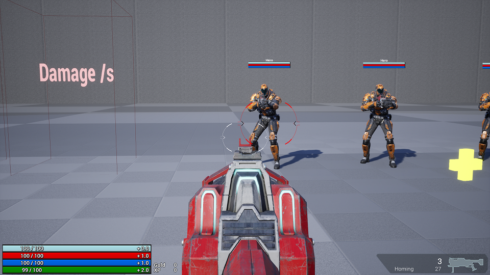

`Reticles` 带有一些设计师的 `BlueprintImplementableEvents`（它们旨在蓝图中开发）：

```c++
/** 当 bIsTargetValid 改变值时调用。 */
UFUNCTION(BlueprintImplementableEvent, Category = Reticle)
void OnValidTargetChanged(bool bNewValue);

/** 当 bIsTargetAnActor 改变值时调用。 */
UFUNCTION(BlueprintImplementableEvent, Category = Reticle)
void OnTargetingAnActor(bool bNewValue);

UFUNCTION(BlueprintImplementableEvent, Category = Reticle)
void OnParametersInitialized();

UFUNCTION(BlueprintImplementableEvent, Category = Reticle)
void SetReticleMaterialParamFloat(FName ParamName, float value);

UFUNCTION(BlueprintImplementableEvent, Category = Reticle)
void SetReticleMaterialParamVector(FName ParamName, FVector value);
```

`Reticles` 可以选择使用 `TargetActor` 提供的 [`FWorldReticleParameters`](https://docs.unrealengine.com/en-US/API/Plugins/GameplayAbilities/Abilities/FWorldReticleParameters/index.html) 进行配置。默认结构体只提供一个变量 `FVector AOEScale`。虽然技术上你可以子类化此结构体，但 `TargetActor` 只接受基础结构体。不允许子类化似乎有点短视。但是，如果你制作自己的自定义 `TargetActor`，你可以提供自己的自定义 reticle 参数结构体，并在生成它们时手动传递给 `AGameplayAbilityWorldReticles` 的子类。

`Reticles` 默认不被复制，但如果在你的游戏中有意义显示其他玩家本地玩家正在选取谁，可以使其复制。

`Reticles` 只在默认 `TargetActors` 的当前有效目标上显示。例如，如果你使用 `AGameplayAbilityTargetActor_SingleLineTrace` 追踪目标，`Reticle` 只在敌人直接在追踪路径上时出现。如果你看向别处，敌人不再是有效目标，`Reticle` 会消失。如果你希望 `Reticle` 留在最后的有效目标上，你需要自定义 `TargetActor` 记住最后的有效目标并将 `Reticle` 留在它们身上。我将这些称为持久目标，因为它们会持续存在直到 `TargetActor` 收到确认或取消、`TargetActor` 在其追踪/重叠中找到新的有效目标或目标不再有效（被销毁）。GASShooter 使用持久目标用于其火箭发射器副技能的制导火箭目标选取。

**[⬆ 返回顶部](#table-of-contents)**

<a name="concepts-targeting-containers"></a>
#### 4.11.5 Gameplay Effect Containers 目标选取

[`GameplayEffectContainers`](#concepts-ge-containers) 带有可选的高效产生 [`TargetData`](#concepts-targeting-data) 的方式。此目标选取在客户端和服务器上应用 `EffectContainer` 时即时发生。它比 [`TargetActors`](#concepts-targeting-actors) 更高效，因为它在目标选取对象的 CDO 上运行（不生成和销毁 `Actors`），但它缺少玩家输入，即时发生无需确认，不能取消，且不能从客户端向服务器发送数据（在两端产生数据）。它适用于即时追踪和碰撞重叠。Epic 的 [Action RPG 示例项目](https://www.unrealengine.com/marketplace/en-US/product/action-rpg) 包含两种使用其容器的目标选取示例类型——目标技能拥有者和从事件中拉取 `TargetData`。它还在蓝图中实现了一种在玩家偏移处（由子蓝图类设置）做即时球体追踪的方法。你可以在 C++ 或蓝图中子类化 `URPGTargetType` 来制作自己的目标选取类型。

**[⬆ 返回顶部](#table-of-contents)**

<a name="cae"></a>
## 5. 常见实现的 Abilities 和 Effects

<a name="cae-stun"></a>
### 5.1 眩晕

通常对于眩晕，我们想要取消 `Character` 所有激活的 `GameplayAbilities`，阻止新的 `GameplayAbility` 激活，并在眩晕期间阻止移动。示例项目的 Meteor `GameplayAbility` 对命中目标应用眩晕。

要取消目标激活的 `GameplayAbilities`，我们在眩晕 [`GameplayTag` 被添加](#concepts-gt-change)时调用 `AbilitySystemComponent->CancelAbilities()`。

要在眩晕时阻止新的 `GameplayAbilities` 激活，`GameplayAbilities` 在其 [`Activation Blocked Tags` `GameplayTagContainer`](#concepts-ga-tags) 中有眩晕 `GameplayTag`。

要在眩晕时阻止移动，我们重写 `CharacterMovementComponent` 的 `GetMaxSpeed()` 函数，在拥有者有眩晕 `GameplayTag` 时返回 0。

**[⬆ 返回顶部](#table-of-contents)**

<a name="cae-sprint"></a>
### 5.2 冲刺

示例项目提供了如何冲刺的示例——按住 `左 Shift` 时跑得更快。

更快的移动由 `CharacterMovementComponent` 通过向服务器发送标志来预测性处理。详情参见 `GDCharacterMovementComponent.h/cpp`。

`GA` 处理响应 `左 Shift` 输入、告诉 `CMC` 开始和停止冲刺，并在按住 `左 Shift` 时预测性消耗耐力。详情参见 `GA_Sprint_BP`。

**[⬆ 返回顶部](#table-of-contents)**

<a name="cae-ads"></a>
### 5.3 瞄准镜

示例项目以与冲刺完全相同的方式处理此操作，但降低移动速度而不是增加。

关于预测性降低移动速度的详情参见 `GDCharacterMovementComponent.h/cpp`。

关于处理输入的详情参见 `GA_AimDownSight_BP`。瞄准镜没有耐力消耗。

**[⬆ 返回顶部](#table-of-contents)**

<a name="cae-ls"></a>
### 5.4 生命偷取

我在伤害 [`ExecutionCalculation`](#concepts-ge-ec) 内部处理生命偷取。`GameplayEffect` 上有一个 `GameplayTag` 如 `Effect.CanLifesteal`。`ExecutionCalculation` 检查 `GameplayEffectSpec` 是否有那个 `Effect.CanLifesteal` `GameplayTag`。如果 `GameplayTag` 存在，`ExecutionCalculation` [创建一个动态 `Instant` `GameplayEffect`](#concepts-ge-dynamic)，以要给予的生命值作为修饰符并将其应用回 `Source` 的 `ASC`。

```c++
if (SpecAssetTags.HasTag(FGameplayTag::RequestGameplayTag(FName("Effect.Damage.CanLifesteal"))))
{
	float Lifesteal = Damage * LifestealPercent;

	UGameplayEffect* GELifesteal = NewObject<UGameplayEffect>(GetTransientPackage(), FName(TEXT("Lifesteal")));
	GELifesteal->DurationPolicy = EGameplayEffectDurationType::Instant;

	int32 Idx = GELifesteal->Modifiers.Num();
	GELifesteal->Modifiers.SetNum(Idx + 1);
	FGameplayModifierInfo& Info = GELifesteal->Modifiers[Idx];
	Info.ModifierMagnitude = FScalableFloat(Lifesteal);
	Info.ModifierOp = EGameplayModOp::Additive;
	Info.Attribute = UPAAttributeSetBase::GetHealthAttribute();

	SourceAbilitySystemComponent->ApplyGameplayEffectToSelf(GELifesteal, 1.0f, SourceAbilitySystemComponent->MakeEffectContext());
}
```

**[⬆ 返回顶部](#table-of-contents)**

<a name="cae-random"></a>
### 5.5 在客户端和服务器上生成随机数

有时你需要在 `GameplayAbility` 内部生成"随机"数用于子弹后坐力或散布等。客户端和服务器都希望生成相同的随机数。为此，我们必须在 `GameplayAbility` 激活时将 `random seed` 设置为相同。每次激活 `GameplayAbility` 时都要设置 `random seed`，以防客户端误预测激活且其随机数序列与服务器不同步。

| 种子设置方法                                                          | 描述                                                                                                                                                                                                                                                                                                                                                                                                                                                                                                                                    |
| ---------------------------------------------------------------------------- | ---------------------------------------------------------------------------------------------------------------------------------------------------------------------------------------------------------------------------------------------------------------------------------------------------------------------------------------------------------------------------------------------------------------------------------------------------------------------------------------------------------------------------------------------- |
| 使用激活预测键                                            | `GameplayAbility` 激活预测键是一个 int16，保证在 `Activation()` 中在客户端和服务器上同步且可用。你可以在客户端和服务器上将其设置为 `random seed`。此方法的缺点是预测键每次游戏开始时都从零开始，并在生成键之间一致递增值。这意味着每场比赛将有完全相同的随机数序列。这可能对你来说可能足够随机也可能不够。 |
| 通过事件负载在激活 `GameplayAbility` 时发送种子 | 通过事件激活你的 `GameplayAbility`，并通过复制的事件负载从客户端向服务器发送随机生成的种子。这允许更多随机性，但客户端可以轻松黑客其游戏以每次只发送相同的种子值。另外通过事件激活 `GameplayAbilities` 会阻止它们从输入绑定激活。                                                                                                                                                                     |

如果你的随机偏差很小，大多数玩家不会注意到序列每场都相同，使用激活预测键作为 `random seed` 应该对你有效。如果你在做需要防黑客的更复杂的事情，也许使用 `Server Initiated` `GameplayAbility` 会更好，服务器可以创建预测键或生成 `random seed` 通过事件负载发送。

**[⬆ 返回顶部](#table-of-contents)**

<a name="cae-crit"></a>
### 5.6 暴击

我在伤害 [`ExecutionCalculation`](#concepts-ge-ec) 内部处理暴击。`GameplayEffect` 上有一个 `GameplayTag` 如 `Effect.CanCrit`。`ExecutionCalculation` 检查 `GameplayEffectSpec` 是否有那个 `Effect.CanCrit` `GameplayTag`。如果 `GameplayTag` 存在，`ExecutionCalculation` 生成一个对应暴击几率（从 `Source` 捕获的 `Attribute`）的随机数，如果成功则添加暴击伤害（也是从 `Source` 捕获的 `Attribute`）。由于我不预测伤害，我不必担心在客户端和服务器上同步随机数生成器，因为 `ExecutionCalculation` 只在服务器上运行。如果你尝试使用 `MMC` 做伤害计算来预测性地做此操作，你必须从 `GameplayEffectSpec->GameplayEffectContext->GameplayAbilityInstance` 获取 `random seed` 的引用。

看看 [GASShooter](https://github.com/tranek/GASShooter) 如何做爆头。概念相同，只是不依赖随机数来判断几率，而是检查 `FHitResult` 骨骼名称。

**[⬆ 返回顶部](#table-of-contents)**

<a name="cae-nonstackingge"></a>
### 5.7 不叠加的 Gameplay Effects 但只有最大幅度实际影响目标

Paragon 中的减速效果不叠加。每个减速实例正常应用并跟踪其生命周期，但只有最大幅度的减速效果实际影响 `Character`。GAS 通过 `AggregatorEvaluateMetaData` 开箱即用提供此场景。详情和实现参见 [`AggregatorEvaluateMetaData()`](#concepts-as-onattributeaggregatorcreated)。

**[⬆ 返回顶部](#table-of-contents)**

<a name="cae-paused"></a>
### 5.8 在游戏暂停时生成 Target Data

如果你需要在等待从 `WaitTargetData` `AbilityTask` 生成 [`TargetData`](#concepts-targeting-data) 时暂停游戏，我建议不要暂停而是使用 `slomo 0`。

**[⬆ 返回顶部](#table-of-contents)**

<a name="cae-onebuttoninteractionsystem"></a>
### 5.9 单按钮交互系统

[GASShooter](https://github.com/tranek/GASShooter) 实现了一个单按钮交互系统，玩家可以按或按住'E'与可交互对象交互，如复活玩家、打开武器箱和打开或关闭滑动门。

**[⬆ 返回顶部](#table-of-contents)**

<a name="debugging"></a>
## 6. 调试 GAS

调试 GAS 相关问题时，你通常想知道：
> * "我的属性值是什么？"
> * "我有什么 gameplay tags？"
> * "我目前有什么 gameplay effects？"
> * "我有什么已授予的技能，哪些在运行，哪些被阻止激活？"

GAS 自带两种在运行时回答这些问题的技术——[`showdebug abilitysystem`](#debugging-sd) 和 [`GameplayDebugger`](#debugging-gd) 中的钩子。

**提示：** 虚幻引擎喜欢优化 C++ 代码，这使一些函数难以调试。你在深入代码时会很少遇到这种情况。如果将 Visual Studio 解决方案配置设置为 `DebugGame Editor` 仍然阻止跟踪代码或检查变量，你可以通过用 `UE_DISABLE_OPTIMIZATION` 和 `UE_ENABLE_OPTIMIZATION` 宏或 CoreMiscDefines.h 中定义的发布变体包裹优化函数来禁用所有优化。这不能用于插件代码，除非你从源代码重建插件。这可能对内联函数有效也可能无效，取决于它们做什么以及在哪里。调试完成后务必删除宏！

```c++
UE_DISABLE_OPTIMIZATION
void MyClass::MyFunction(int32 MyIntParameter)
{
	// 我的代码
}
UE_ENABLE_OPTIMIZATION
```

**[⬆ 返回顶部](#table-of-contents)**

<a name="debugging-sd"></a>
### 6.1 showdebug abilitysystem

在游戏内控制台输入 `showdebug abilitysystem`。此功能分为三个"页面"。所有三个页面都会显示你当前拥有的 `GameplayTags`。在控制台输入 `AbilitySystem.Debug.NextCategory` 在页面之间循环。

第一页显示所有 `Attributes` 的 `CurrentValue`：
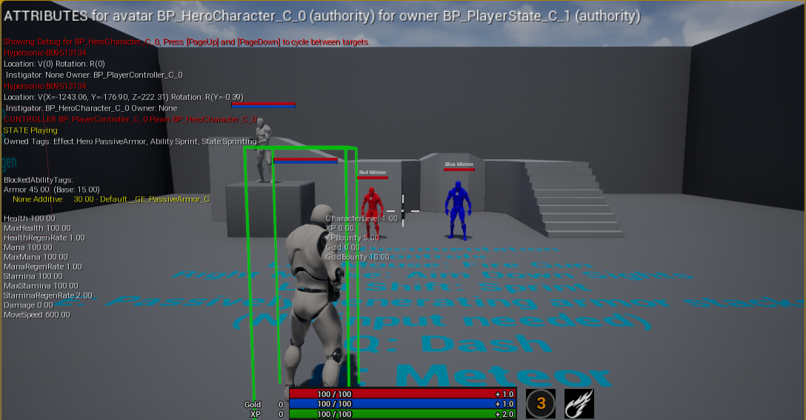

第二页显示你所有的 `Duration` 和 `Infinite` `GameplayEffects`、其叠加数、它们给予的 `GameplayTags` 和它们给予的 `Modifiers`。
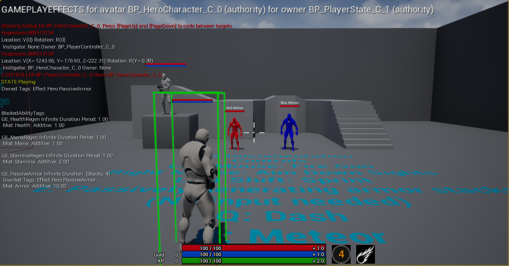

第三页显示所有已授予你的 `GameplayAbilities`、它们是否当前运行、是否被阻止激活以及当前运行 `AbilityTasks` 的状态。
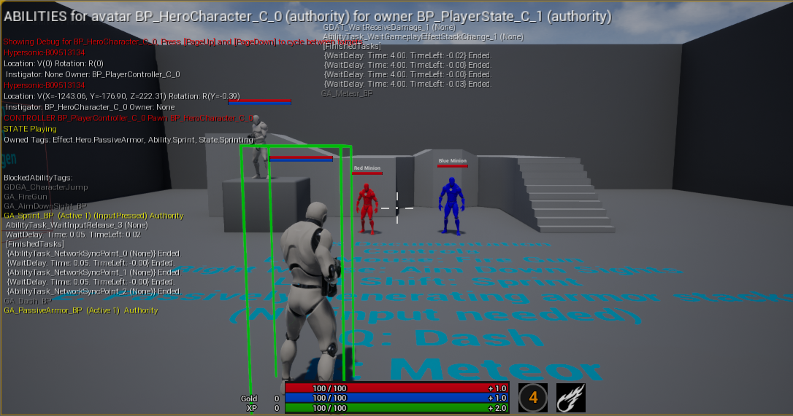

要在目标之间循环（由 Actor 周围的绿色长方体表示），使用 `PageUp` 键或 `NextDebugTarget` 控制台命令转到下一个目标，`PageDown` 键或 `PreviousDebugTarget` 控制台命令转到上一个目标。

**注意：** 为了让技能系统信息根据当前选择的调试 Actor 更新，你需要在 `AbilitySystemGlobals` 中设置 `bUseDebugTargetFromHud=true`，在 `DefaultGame.ini` 中如下：
```
[/Script/GameplayAbilities.AbilitySystemGlobals]
bUseDebugTargetFromHud=true
```

**注意：** 要使 `showdebug abilitysystem` 工作，GameMode 中必须选择实际的 HUD 类。否则命令未找到并返回"Unknown Command"。

**[⬆ 返回顶部](#table-of-contents)**

<a name="debugging-gd"></a>
### 6.2 Gameplay Debugger

GAS 向 Gameplay Debugger 添加功能。用撇号（'）键访问 Gameplay Debugger。按数字小键盘上的 3 启用 Abilities 类别。类别可能因你拥有的插件而异。如果你的键盘没有数字小键盘如笔记本电脑，你可以在项目设置中更改键绑定。

当你想查看**其他** `Characters` 上的 `GameplayTags`、`GameplayEffects` 和 `GameplayAbilities` 时使用 Gameplay Debugger。不幸的是它不显示目标 `Attributes` 的 `CurrentValue`。它会将屏幕中心的 `Character` 作为目标。你可以通过在编辑器的 World Outliner 中选择它们或查看不同的 `Character` 并再次按撇号（'）来更改目标。当前检查的 `Character` 上方有最大的红色圆圈。

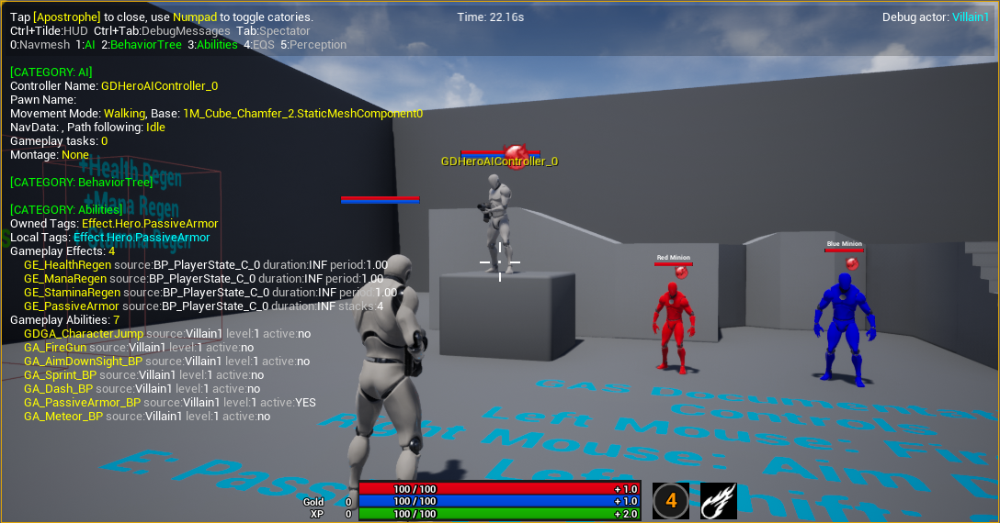

**[⬆ 返回顶部](#table-of-contents)**

<a name="debugging-log"></a>
### 6.3 GAS 日志

GAS 源代码包含大量在不同详细级别生成的日志语句。你最可能看到这些为 `ABILITY_LOG()` 语句。默认详细级别为 `Display`。更高的级别默认不会显示在控制台中。

要更改日志类别的详细级别，在控制台输入：

```
log [category] [verbosity]
```

例如，要打开 `ABILITY_LOG()` 语句，你可以在控制台输入：
```
log LogAbilitySystem VeryVerbose
```

要重置为默认，输入：
```
log LogAbilitySystem Display
```

要显示所有日志类别，输入：
```
log list
```

值得注意的 GAS 相关日志类别：

| 日志类别          | 默认详细级别 |
| ------------------------- | ----------------------- |
| LogAbilitySystem          | Display                 |
| LogAbilitySystemComponent | Log                     |
| LogGameplayCueDetails     | Log                     |
| LogGameplayCueTranslator  | Display                 |
| LogGameplayEffectDetails  | Log                     |
| LogGameplayEffects        | Display                 |
| LogGameplayTags           | Log                     |
| LogGameplayTasks          | Log                     |
| VLogAbilitySystem         | Display                 |

更多信息请参见[日志 Wiki](https://unrealcommunity.wiki/logging-lgpidy6i)。

**[⬆ 返回顶部](#table-of-contents)**

<a name="optimizations"></a>
## 7. 优化

<a name="optimizations-abilitybatching"></a>
### 7.1 Ability 批处理

激活、可选地向服务器发送 `TargetData` 并在一帧内结束的 [`GameplayAbilities`](#concepts-ga) 可以[批处理将两到三个 RPC 压缩为一个 RPC](#concepts-ga-batching)。这些类型的技能通常用于即时命中枪械。

<a name="optimizations-gameplaycuebatching"></a>
### 7.2 Gameplay Cue 批处理

如果你同时发送许多 [`GameplayCues`](#concepts-gc)，考虑[将它们批处理为一个 RPC](#concepts-gc-batching)。目标是减少 RPC 数量（`GameplayCues` 是不可靠的 NetMulticasts）并尽可能少发送数据。

<a name="optimizations-ascreplicationmode"></a>
### 7.3 AbilitySystemComponent 复制模式

默认情况下，[`ASC`](#concepts-asc) 处于[`Full Replication Mode`](#concepts-asc-rm)。这会将所有 [`GameplayEffects`](#concepts-ge) 复制到每个客户端（这对单人游戏没问题）。在多人游戏中，将玩家拥有的 `ASC` 设置为 `Mixed Replication Mode`，AI 控制的角色设置为 `Minimal Replication Mode`。这将使玩家角色上应用的 `GEs` 只复制给该角色的拥有者，AI 控制角色上应用的 `GEs` 永远不会将 `GEs` 复制到客户端。无论 `Replication Mode` 如何，[`GameplayTags`](#concepts-gt) 仍会复制，[`GameplayCues`](#concepts-gc) 仍会是不可靠的 NetMulticast 到所有客户端。这将减少所有客户端不需要看到时 `GEs` 被复制的网络数据。

<a name="optimizations-attributeproxyreplication"></a>
### 7.4 Attribute 代理复制

在像 Fortnite Battle Royale（FNBR）这样有许多玩家的大型游戏中，会有很多位于始终相关的 `PlayerStates` 上的 [`ASC`](#concepts-asc) 复制大量 [`Attributes`](#concepts-a)。为了优化此瓶颈，Fortnite 在 `PlayerState::ReplicateSubobjects()` 中对**模拟的玩家控制代理**完全禁用了 `ASC` 及其 [`AttributeSets`](#concepts-as) 的复制。自主代理和 AI 控制的 `Pawns` 仍根据其[`复制模式`](#concepts-asc-rm)完全复制。FNBR 不是在始终相关的 `PlayerStates` 上的 `ASC` 上复制 `Attributes`，而是在玩家的 `Pawn` 上使用复制的代理结构体。当 `Attributes` 在服务器的 `ASC` 上变化时，它们也在代理结构体上变化。客户端从代理结构体接收复制的 `Attributes` 并将更改推回其本地 `ASC`。这允许 `Attribute` 复制使用 `Pawn` 的相关性和 `NetUpdateFrequency`。此代理结构体还以位掩码复制一小部分白名单 `GameplayTags`。此优化减少了网络上的数据量并允许我们利用 pawn 相关性。AI 控制的 `Pawns` 的 `ASC` 在 `Pawn` 上，已使用其相关性，因此不需要此优化。

> 我不确定随着之后做的其他服务器端优化（Replication Graph 等）是否仍然必要，而且这不是最易维护的模式。

*Dave Ratti 来自 Epic 对[社区问题 #3](https://epicgames.ent.box.com/s/m1egifkxv3he3u3xezb9hzbgroxyhx89)的回答*

<a name="optimizations-asclazyloading"></a>
### 7.5 ASC 懒加载

Fortnite Battle Royale（FNBR）在世界中有很多可受伤害的 `AActors`（树、建筑等），每个都有 [`ASC`](#concepts-asc)。这会在内存成本上累积。FNBR 通过只在需要时（当它们首次被玩家伤害时）懒加载 `ASC` 来优化此问题。这减少了整体内存使用，因为一些 `AActors` 可能在一场比赛中永远不会被伤害。

**[⬆ 返回顶部](#table-of-contents)**

<a name="qol"></a>
## 8. 提升开发体验的建议

<a name="qol-gameplayeffectcontainers"></a>
### 8.1 Gameplay Effect Containers

[GameplayEffectContainers](#concepts-ge-containers) 将 [`GameplayEffectSpecs`](#concepts-ge-spec)、[`TargetData`](#concepts-targeting-data)、[简单目标选取](#concepts-targeting-containers)和相关功能组合成易于使用的结构体。这些非常适合将 `GameplayEffectSpecs` 传递给从技能生成的投射物，后者将在稍后碰撞时应用它们。

<a name="qol-asynctasksascdelegates"></a>
### 8.2 绑定 ASC 委托的 Blueprint AsyncTasks

为了增加设计师友好的迭代时间，特别是在设计 UI 的 UMG Widgets 时，创建 Blueprint AsyncTasks（在 C++ 中）以直接从你的 UMG 蓝图图形绑定到 `ASC` 上的常见变化委托。唯一的注意事项是它们必须被手动销毁（如当 widget 被销毁时），否则它们将永远留在内存中。示例项目包含三个 Blueprint AsyncTasks。

监听 `Attribute` 变化：

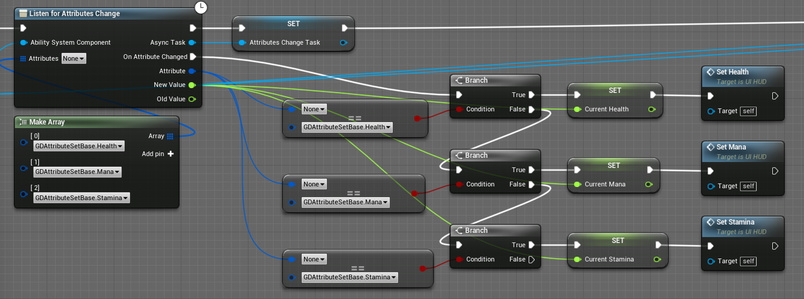

监听冷却变化：


监听 `GE` 叠加变化：


**[⬆ 返回顶部](#table-of-contents)**

<a name="troubleshooting"></a>
## 9. 故障排除

<a name="troubleshooting-notlocal"></a>
### 9.1 `LogAbilitySystem: Warning: Can't activate LocalOnly or LocalPredicted ability %s when not local!`
你需要[在客户端上初始化 `ASC`](#concepts-asc-setup)。

**[⬆ 返回顶部](#table-of-contents)**

<a name="troubleshooting-scriptstructcache"></a>
### 9.2 `ScriptStructCache` 错误
你需要调用 [`UAbilitySystemGlobals::InitGlobalData()`](#concepts-asg-initglobaldata)。

**[⬆ 返回顶部](#table-of-contents)**

<a name="troubleshooting-replicatinganimmontages"></a>
### 9.3 动画 Montage 不复制到客户端
确保你在 [GameplayAbilities](#concepts-ga) 中使用 `PlayMontageAndWait` 蓝图节点而不是 `PlayMontage`。此 [AbilityTask](#concepts-at) 通过 `ASC` 自动复制 montage，而 `PlayMontage` 节点不会。

**[⬆ 返回顶部](#table-of-contents)**

<a name="troubleshooting-duplicatingblueprintactors"></a>
### 9.4 复制蓝图 Actor 时 AttributeSets 被设为 nullptr

[虚幻引擎中有一个 bug](https://issues.unrealengine.com/issue/UE-81109)，会将复制自现有蓝图 Actor 类的蓝图 Actor 类上的 `AttributeSet` 指针设为 nullptr。有几种变通方法。我成功地在类上不创建定制的 `AttributeSet` 指针（.h 中没有指针，构造函数中不调用 `CreateDefaultSubobject`），而是直接在 `PostInitializeComponents()` 中将 `AttributeSets` 添加到 `ASC`（示例项目中未显示）。复制的 `AttributeSets` 仍会存在于 `ASC` 的 `SpawnedAttributes` 数组中。它看起来像这样：

```c++
void AGDPlayerState::PostInitializeComponents()
{
	Super::PostInitializeComponents();

	if (AbilitySystemComponent)
	{
		AbilitySystemComponent->AddSet<UGDAttributeSetBase>();
		// ... 你可能有的任何其他 AttributeSets
	}
}
```

在这种情况下，你会使用 `ASC` 上的函数读取和设置 `AttributeSet` 中的值，而不是[调用从宏制作的 `AttributeSet` 上的函数](#concepts-as-attributes)。

```c++
/** 返回属性的当前（最终）值 */
float GetNumericAttribute(const FGameplayAttribute &Attribute) const;

/** 设置属性的基础值。现有的活动修饰符不会被清除，将作用于新的基础值。 */
void SetNumericAttributeBase(const FGameplayAttribute &Attribute, float NewBaseValue);
```

所以 `GetHealth()` 看起来像这样：

```c++
float AGDPlayerState::GetHealth() const
{
	if (AbilitySystemComponent)
	{
		return AbilitySystemComponent->GetNumericAttribute(UGDAttributeSetBase::GetHealthAttribute());
	}

	return 0.0f;
}
```

设置（初始化）生命值 `Attribute` 看起来像这样：

```c++
const float NewHealth = 100.0f;
if (AbilitySystemComponent)
{
	AbilitySystemComponent->SetNumericAttributeBase(UGDAttributeSetBase::GetHealthAttribute(), NewHealth);
}
```

提醒一下，`ASC` 每个类只期望最多一个 `AttributeSet` 对象。

**[⬆ 返回顶部](#table-of-contents)**

<a name="troubleshooting-unresolvedexternalsymbolmarkpropertydirty"></a>
### 9.5 Unresolved external symbol UEPushModelPrivate::MarkPropertyDirty(int,int)

如果你收到如下编译器错误：

```
error LNK2019: unresolved external symbol "__declspec(dllimport) void __cdecl UEPushModelPrivate::MarkPropertyDirty(int,int)" (__imp_?MarkPropertyDirty@UEPushModelPrivate@@YAXHH@Z) referenced in function "public: void __cdecl FFastArraySerializer::IncrementArrayReplicationKey(void)" (?IncrementArrayReplicationKey@FFastArraySerializer@@QEAAXXZ)
```

这是因为尝试在 `FFastArraySerializer` 上调用 `MarkItemDirty()`。我在更新 `ActiveGameplayEffect`（如更新冷却持续时间）时遇到了这个问题。

```c++
ActiveGameplayEffects.MarkItemDirty(*AGE);
```

发生的事情是 `WITH_PUSH_MODEL` 在多个地方被定义。`PushModelMacros.h` 将其定义为 0，而在多个地方定义为 1。`PushModel.h` 看到它是 1 但 `PushModel.cpp` 看到它是 0。

解决方案是将 `NetCore` 添加到你的项目 `Build.cs` 中的 `PublicDependencyModuleNames`。

**[⬆ 返回顶部](#table-of-contents)**

<a name="troubleshooting-enumnamesarenowpathnames"></a>
### 9.6 枚举名称现在由路径名表示

如果你收到如下编译器警告：

```
warning C4996: 'FGameplayAbilityInputBinds::FGameplayAbilityInputBinds': Enum names are now represented by path names. Please use a version of FGameplayAbilityInputBinds constructor that accepts FTopLevelAssetPath. Please update your code to the new API before upgrading to the next release, otherwise your project will no longer compile.
```

UE 5.1 弃用了在 `BindAbilityActivationToInputComponent()` 的构造函数中使用 `FString`。相反，我们必须传入 `FTopLevelAssetPath`。

旧的弃用方式：
```c++
AbilitySystemComponent->BindAbilityActivationToInputComponent(InputComponent, FGameplayAbilityInputBinds(FString("ConfirmTarget"),
	FString("CancelTarget"), FString("EGDAbilityInputID"), static_cast<int32>(EGDAbilityInputID::Confirm), static_cast<int32>(EGDAbilityInputID::Cancel)));
```

新方式：
```c++
FTopLevelAssetPath AbilityEnumAssetPath = FTopLevelAssetPath(FName("/Script/GASDocumentation"), FName("EGDAbilityInputID"));
AbilitySystemComponent->BindAbilityActivationToInputComponent(InputComponent, FGameplayAbilityInputBinds(FString("ConfirmTarget"),
	FString("CancelTarget"), AbilityEnumAssetPath, static_cast<int32>(EGDAbilityInputID::Confirm), static_cast<int32>(EGDAbilityInputID::Cancel)));
```

更多信息请参见 `Engine\Source\Runtime\CoreUObject\Public\UObject\TopLevelAssetPath.h`。

**[⬆ 返回顶部](#table-of-contents)**

<a name="acronyms"></a>
## 10. 常见 GAS 缩写

| 名称                                                                                                   | 缩写            |
|------------------------------------------------------------------------------------------------------- | ------------------- |
| AbilitySystemComponent                                                                                 | ASC                 |
| AbilityTask                                                                                            | AT                  |
| [Epic 的 Action RPG 示例项目](https://www.unrealengine.com/marketplace/en-US/product/action-rpg) | ARPG, ARPG Sample   |
| CharacterMovementComponent                                                                             | CMC                 |
| GameplayAbility                                                                                        | GA                  |
| GameplayAbilitySystem                                                                                  | GAS                 |
| GameplayCue                                                                                            | GC                  |
| GameplayEffect                                                                                         | GE                  |
| GameplayEffectExecutionCalculation                                                                     | ExecCalc, Execution |
| GameplayTag                                                                                            | Tag, GT             |
| ModifierMagnitudeCalculation                                                                           | ModMagCalc, MMC     |

**[⬆ 返回顶部](#table-of-contents)**

<a name="resources"></a>
## 11. 其他资源

* [官方文档](https://docs.unrealengine.com/en-US/Gameplay/GameplayAbilitySystem/index.html)
* 源代码！
   * 特别是 `GameplayPrediction.h`
* [Epic 的 Lyra 示例项目](https://unrealengine.com/marketplace/en-US/learn/lyra)
* [Epic 的 Action RPG 示例项目](https://www.unrealengine.com/marketplace/en-US/product/action-rpg)
* [Unreal Slackers Discord](https://unrealslackers.org/) 有一个专门用于 GAS 的文字频道 `#gameplay-ability-system`
   * 查看置顶消息
* [Dan 'Pan' 的 GitHub 资源仓库](https://github.com/Pantong51/GASContent)
* [SabreDartStudios 的 YouTube 视频](https://www.youtube.com/channel/UCCFUhQ6xQyjXDZ_d6X_H_-A)

<a name="resources-daveratti"></a>
### 11.1 与 Epic Games 的 Dave Ratti 的问答

<a name="resources-daveratti-community1"></a>
#### 11.1.1 社区问题 1

[Dave Ratti 对 Unreal Slackers Discord 服务器社区关于 GAS 问题的回复](https://epicgames.ent.box.com/s/m1egifkxv3he3u3xezb9hzbgroxyhx89)：

1. 我们如何在 `GameplayAbilities` 之外或不考虑 `GameplayAbilities` 按需创建作用域预测窗口？例如，即发即弃的投射物如何在击中敌人时本地预测伤害 `GameplayEffect`？

> PredictionKey 系统并不是真的为此设计的。从根本上说，这个系统的工作方式是客户端发起预测动作，用键告诉服务器，然后客户端和服务器运行相同的东西并将预测副作用与给定的预测键关联。例如，"我正在预测性地激活一个技能"或"我已产生目标数据并要预测性地运行 WaitTargetData 任务之后的技能图部分"。
>
> 使用此模式，PredictionKey 从服务器"反弹"并通过 UAbilitySystemComponent::ReplicatedPredictionKeyMap（复制属性）回到客户端。一旦键从服务器复制回来，客户端就能撤销所有本地预测副作用（GameplayCues、GameplayEffects）：复制的版本*将在那里*，如果不在那就是误预测。确切知道何时撤销预测副作用在这里至关重要：如果太早你会看到间隙，如果太晚你会有"双重"。（注意这指的是有状态的预测，如循环 GameplayCue 或基于持续时间的 Gameplay Effect。"突发"GameplayCues 和即时 Gameplay Effects 从不"撤销"或回滚。如果与预测键关联，它们只在客户端上被跳过）。
>
> 进一步强调这一点：预测动作是服务器自己不做、只在客户端告诉它时才做的事情，这至关重要。所以有一个通用的"按需创建键并告诉服务器以便我能运行某些东西"不起作用，除非那个"某些东西"是服务器只在客户端告诉它时才做的事情。
>
> 回到原始问题：像即发即弃的投射物。Paragon 和 Fortnite 都有使用 GameplayCues 的投射物 actor 类。但我们不使用 Prediction Key 系统来做这些。相反，我们有 Non-Replicated GameplayCues 的概念。GameplayCues 只在本地触发，完全被服务器跳过。本质上这些都是对 UGameplayCueManager::HandleGameplayCue 的直接调用。它们不通过 UAbilitySystemComponent 路由，因此没有预测键检查/提前返回。
>
> 非复制 GameplayCues 的缺点是，它们不被复制。所以由投射物类/蓝图确保调用这些函数的代码路径在每个人上运行。我们有提示启动（在 BeginPlay 中调用）、爆炸、撞墙/角色等。
>
> 这些类型的事件已经在客户端生成，所以调用非复制 gameplay cue 没什么大不了的。复杂的蓝图可能很棘手，由作者确保他们理解什么在哪里运行。

2. 当在本地预测的 `GameplayAbility` 中使用 `WaitNetSync` `AbilityTask` 和 `OnlyServerWait` 创建作用域预测窗口时，玩家是否可能通过延迟其到服务器的数据包来控制 `GameplayAbility` 时机来作弊，因为服务器在等待他们带预测键的 RPC？这在 Paragon 或 Fortnite 中是否曾经是问题，如果是，Epic 做了什么来补救？

> 是的，这是一个有效的担忧。在服务器上运行的任何等待客户端"信号"的技能蓝图都可能容易受到 lag switch 类型攻击。
>
> Paragon 有一个类似于 UAbilityTask_WaitTargetData 的自定义目标选取任务。在这个任务中我们有超时，或我们会在即时目标选取模式中等待客户端的"最大延迟"。如果目标选取模式在等待用户确认（按钮按下），那么它会被忽略，因为允许用户慢慢来。但对于即时确认目标选取的技能，我们只会等待一定时间然后 A) 在服务器端生成目标数据或 B) 取消技能。
>
> 我们对 WaitNetSync 从没有这样的机制，我们很少使用它。
>
> 我不认为 Fortnite 使用任何类似的东西。Fortnite 中的武器技能被特殊处理批处理为单个 fortnite 特定的 RPC：一个 RPC 激活技能、提供目标数据并结束技能。所以武器技能在 Battle Royale 中本质上不容易受到此攻击。
>
> 我的看法是这可能是可以系统解决的问题，但我不认为我们很快会自己做。为提到的情况修复 WaitNetSync 以包含最大延迟可能是一个合理的任务，但同样——我们不太可能在近期在我们的端做这件事。


3. Paragon 和 Fortnite 使用哪种 `EGameplayEffectReplicationMode`？Epic 对何时使用每种有什么建议？

> 两款游戏基本上对其玩家控制角色使用 Mixed 模式，对 AI 控制（AI 小兵、野怪、AI Husks 等）使用 Minimal。这是我在多人游戏中使用系统时推荐大多数人的。你越早设置这些越好。
>
> Fortnite 在其优化方面更进一步。它实际上对模拟代理完全不复制 UAbilitySystemComponent。组件和属性子对象在拥有 fortnite player state 类的 ::ReplicateSubobjects() 内部被跳过。我们确实将能力系统组件的最基本复制数据推送到 pawn 本身上的结构体（基本上是属性值的子集和以位掩码复制下去的标签白名单子集）。我们称之为"代理"。在接收端，我们获取在 pawn 上复制的代理数据，并将其推回 player state 上的能力系统组件。所以你确实在 FNBR 中每个玩家有一个 ASC，它只是不直接复制：相反，它通过 pawn 上的最小代理结构体复制数据，然后在接收端路由回 ASC。这是优势，因为 A) 是更少的数据集 B) 利用 pawn 相关性。
>
> 我不确定随着之后做的其他服务器端优化（ReplicationGraph 等）是否仍然必要，而且这不是最易维护的模式。


4. 由于我们无法按照 `GameplayPrediction.h` 预测 `GameplayEffects` 的移除，是否有任何策略来减轻延迟对移除 `GameplayEffects` 的影响？例如，当移除移动速度减速时，我们目前必须等待服务器复制 `GameplayEffect` 移除，导致玩家角色位置的突然跳变。

> 这是一个棘手的问题，我没有好的答案。我们通常通过容差和平滑来绕过这些问题。我完全同意能力系统与角色移动系统的精确同步不在一个好的状态，我们确实想修复。
>
> 我曾搁置允许预测性移除 GE 的想法，但在不得不继续之前无法解决所有边缘情况。但这并不能解决所有问题，因为角色移动仍然有内部保存的移动缓冲区，它不知道能力系统和可能的移动速度修饰符等任何东西。即使在不预测移除 GE 之外，仍然可能进入纠正反馈循环。
>
> 如果你认为你的情况真的绝望，你可以预测性地添加一个会抑制你的移动速度 GE 的 GE。我从没自己做过但之前理论化过。它可能能够帮助某类问题。


5. 我们知道 `AbilitySystemComponent` 在 Paragon 和 Fortnite 中位于 `PlayerState` 上，在 Action RPG 示例中位于 `Character` 上。Epic 关于 AbilitySystemComponent 应该位于何处、其 `Owner` 应该是什么的内部规则、指导方针或建议是什么？

> 总的来说，我会说任何不需要重生的东西应该让 Owner 和 Avatar actor 是同一个东西。任何像 AI 敌人、建筑、世界道具等。
>
> 任何会重生的东西应该让 Owner 和 Avatar 不同，这样 Ability System Component 不需要在重生后保存/重新创建/恢复。PlayerState 是逻辑选择，它复制到所有客户端（而 PlayerController 不会）。缺点是 PlayerStates 始终相关，所以你在 100 人游戏中可能会遇到问题（参见 FN 在问题 #3 中做的）。


6. 拥有多个具有相同所有者但不同化身的 `AbilitySystemComponents` 是否可行（例如在 pawn 和武器/物品/投射物上，`Owner` 设置为 `PlayerState`）？

> 我看到的第一个问题是在拥有者 actor 上实现 IGameplayTagAssetInterface 和 IAbilitySystemInterface。前者可能是可行的：只需聚合所有 ASC 的标签（但要注意——HasAllMatchingGameplayTags 可能只能通过跨 ASC 聚合来满足。仅将调用转发到每个 ASC 并将结果 OR 在一起是不够的）。但后者更棘手：哪个 ASC 是权威的？如果有人想应用一个 GE——应该接收它的是哪个？也许你可以解决这些问题，但问题的这一面将是最难的：拥有者下面会有多个 ASC。
>
> 在 pawn 和武器上分开的 ASC 本身可能是合理的。例如，区分描述武器的标签和描述拥有者 pawn 的标签。也许授予武器的标签也"适用"于拥有者且仅此而已（例如，属性和 GE 是独立的，但拥有者会像我所描述的那样聚合拥有的标签）是合理的。这可能是行得通的，我确信。但拥有多个具有相同所有者的 ASC 可能会有风险。


7. 有没有办法阻止服务器覆盖拥有者客户端上本地预测技能的冷却持续时间？在高延迟场景中，这将允许拥有者客户端在其本地冷却过期但服务器仍在冷却中时"尝试"再次激活技能。当拥有者客户端的激活请求通过网络到达服务器时，服务器可能已不在冷却中或服务器可能能够将激活请求排队剩余的毫秒数。否则按现状，高延迟客户端在重新激活技能之前比低延迟客户端有更长的延迟。这在冷却非常短的技能（如基本攻击）上最明显，冷却可能不到一秒。如果没有办法阻止服务器覆盖拥有者客户端上本地预测技能的冷却持续时间，Epic 的策略是什么来减轻高延迟对重新激活技能的影响？用基于示例的方式来说，Epic 如何设计 Paragon 的基本攻击和其他技能使高延迟玩家能以与低延迟玩家相同的速度攻击或激活？简单回答是没有办法阻止这个，Paragon 确实有这个问题。更高延迟连接的基本攻击会有更低的 ROF。
>
> 我尝试通过添加"GE 调节"来修复此问题，在计算 GE 持续时间时考虑延迟。本质上允许服务器吃掉一些总 GE 时间，以便客户端的 GE 有效时间在任何延迟量下都是 100% 一致的（尽管波动仍可能导致问题）。但我从未使其达到可发布状态，项目进展很快，我们从未完全解决它。
>
> Fortnite 对武器射速有自己的记账：它不对武器使用 GE 进行冷却。如果这对你的游戏是关键问题，我推荐这样做。


8. Epic 对 GameplayAbilitySystem 插件的路线图是什么？Epic 计划在 2019 年及以后添加哪些功能？

> 我们觉得系统在这一点上整体相当稳定，我们没有人在做主要的新功能。偶尔为 Fortnite 或从 UDN/pull 请求做 bug 修复和小改进，但就是这样。
>
> 更长期来看，我认为我们最终会做"V2"或一些大改变。我们从编写此系统中学到了很多，觉得我们做对了很多也做错了很多。我很乐意有机会纠正这些错误并改进一些上面指出的致命缺陷。
>
> 如果 V2 真的到来，提供升级路径将是最重要的。我们从不会做 V2 而让 Fortnite 永远留在 V1：会有某种路径或程序自动迁移尽可能多的内容，尽管几乎肯定仍需要一些手动重制。
>
> 高优先级修复将是：
> * 与角色移动系统更好的互操作性。统一客户端预测。
> * GE 移除预测（问题 #4）
> * GE 延迟调节（问题 #7）
> * 通用网络优化，如批处理 RPC 和代理结构体。主要是我们为 Fortnite 做的东西，但找到将其分解为更通用形式的方法，至少让游戏能更容易地编写自己的游戏特定优化。
>
> 我会考虑做的更通用的重构类型更改：
> * 我想看看从根本上让 GE 不再直接引用电子表格值，而是它们能发出参数，这些参数可以由绑定到电子表格值的某个更高级对象填充。当前模型的问题是由于与曲线表行的紧密耦合，GE 变得不可共享。我认为可以编写一个通用的参数化系统，并成为 V2 系统的基础。
> * 减少 UGameplayAbility 上的"策略"数量。我会移除 ReplicationPolicy 和 InstancingPolicy。复制几乎从来不需要且会引起混淆，我认为。InstancingPolicy 应该被替换，通过使 FGameplayAbilitySpec 成为可以子类化的 UObject。这应该是具有事件且可蓝图的"非实例化技能对象"。UGameplayAbility 应该是"每次执行实例化"对象。如果你需要实际实例化则是可选的：相反"非实例化"技能将通过新的 UGameplayAbilitySpec 对象实现。 
> * 系统应提供更多"中级"构造，如"过滤 GE 应用容器"（数据驱动将哪些 GE 应用到哪些 actor 并带有更高级的游戏逻辑）、"重叠体积支持"（基于碰撞基元重叠事件应用"过滤 GE 应用容器"）等。这些是每个项目最终以自己方式实现的构建块。做好它们并不简单，所以我认为我们应该更好地提供一些基本实现。 
> * 总的来说，减少项目启动和运行所需的样板代码。可能是一个单独的模块"Ex 库"或其他，可以开箱即用地提供被动技能或基本即时命中武器等内容。此模块是可选的，但能让你快速启动和运行。
> * 我想将 GameplayCues 移到不与能力系统耦合的单独模块。我认为这里有很多可以做的改进。


> 这只是我的个人意见，不是任何人的承诺。我认为最现实的行动方案是随着新的引擎技术倡议到来，能力系统将需要更新，那将是做这类事情的时候。这些倡议可能与脚本、网络或物理/角色移动相关。这都是非常长远的事，所以我不能给出承诺或时间表估计。

**[⬆ 返回顶部](#table-of-contents)**

<a name="resources-daveratti-community2"></a>
#### 11.1.2 社区问题 2

社区成员 [iniside](https://github.com/iniside) 与 Dave Ratti 的问答：

1. 是否计划支持解耦固定 tick？我想让游戏线程固定（如 30/60fps），让渲染线程自由运行。我问这是否是我们未来应该期望的东西，以便对游戏玩法应该如何工作做一些假设。我问主要是因为现在物理有固定的异步 tick，这提出了系统的其余部分未来可能如何工作的问题。我不隐瞒，能够拥有固定 tick 游戏线程而不也固定引擎其余部分的 tick 率将是非常棒的。

> 没有计划解耦渲染帧率和游戏线程 tick 帧率。我认为由于这些系统的复杂性以及保持与先前引擎版本向后兼容的要求，这已经不可能了。
>
> 相反，我们采取的方向是有一个异步"物理线程"，以固定 tick 率运行，独立于游戏线程。需要以固定速率运行的东西可以在这里运行，游戏线程/渲染可以像以前一样运行。
>
> 值得澄清的是，网络预测支持它所谓的独立 tick 和固定 tick 模式。我的长期计划是保持独立 tick 大致像今天在网络预测中的样子，它在游戏线程上以可变帧率运行，没有"组/世界"预测，只是经典的"客户端预测自己的 pawn 和拥有的 actor"模型。固定 tick 将是使用异步物理东西的东西，允许你预测非客户端控制/拥有的 actor，如物理对象和其他客户端/pawn/载具等。


2. 是否有网络预测与能力系统集成的计划？例如固定帧技能激活（所以服务器获得技能被激活和任务执行的帧而不是预测键）？

> 是的，计划是重写/移除能力系统的预测键并用网络预测构造替换它们。NetworkPredictionExtras 中的 MockAbility 示例展示了这可能如何工作，但它们比 GAS 要求的更"硬编码"。
>
> 主要想法是我们移除 ASC RPC 中的显式客户端->服务器 Prediction Key 交换。将不再有预测窗口或作用域预测键。相反，一切都锚定在网络预测帧。重要的是客户端和服务器就事情何时发生达成一致。示例将是：
>
> * 技能何时被激活/结束/取消
> * Gameplay Effects 何时被应用/移除
> * Attribute 值（某帧 X 时属性的值是什么）
>
> 我认为这可以在能力系统级别通用完成。但实际使 UGameplayAbility 内部的用户定义逻辑完全可回滚仍需要更多工作。我们可能最终有 UGameplayAbility 的子类，完全可回滚且访问更有限的功能集或只有标记为回滚友好的 Ability Tasks。类似的东西。动画事件和 root motion 以及它们如何处理也有很多影响。
>
> 希望我有更清晰的答案，但在再次接触 GAS 之前把基础做对真的很重要。移动和物理必须扎实，然后才能更改更高级的系统。


3. 是否有计划将网络预测开发移向主分支？说实话，我真的很想检查最新代码。不管其状态如何。

> 我们正在朝这个方向努力。系统工作仍在 NetworkPrediction 中进行（参见 NetworkPhysics.h），底层异步物理东西应该都可用（RewindData.h 等）。但我们在 Fortnite 中也有用例，我们一直在专注这些用例，显然不能公开。我们正在解决 bug、性能优化等。
>
> 更多背景：在开发此系统的早期版本时，我们非常关注"前端"——状态和模拟如何定义和编写。我们学到了很多。但随着异步物理东西上线，我们更专注于在这个系统中让真实的东西工作，代价是丢弃了一些早期抽象。目标是当真实的东西工作时再回头统一。例如，回到"前端"并在我们现在工作的核心技术之上制作最终版本。


4. 有一段时间主分支上有一个用于发送 Gameplay Messages（看起来像事件/消息总线）的插件，但被移除了。有计划恢复它吗？有了 Game Features/Modular Gameplay 插件，有通用事件总线调度器将非常有用。

> 我想你指的是 GameplayMessages 插件。这可能会在某个时候回来——API 还没有真正最终确定，作者也没打算让它公开。我同意它对模块化游戏设计应该有用。但这不是我的领域，所以我没有更多信息。


5. 我最近一直在玩异步固定物理，结果很有希望，不过如果未来有 NP 更新，我可能就只是玩玩并等待，因为要让它工作我仍需要让整个引擎进入固定 tick，另一方面我尝试将物理保持在 33ms。如果一切都在 30 fps，体验不好（：。

我注意到有一些 Async CharacterMovementComponent 的工作，但不确定这是否会使用网络预测，还是单独的努力？

既然我注意到了它，我也继续尝试实现我的自定义异步移动以固定 tick 率，工作正常，但在此基础上我还需要添加单独的插值更新。设置是在单独的工作线程上以固定 33ms 更新运行模拟 tick，做计算，保存结果，并在游戏线程上插值以匹配当前帧率。不完美，但完成了工作。

我的问题是，这是否是未来可能更容易设置的东西，因为有相当多的样板代码要写（插值部分），而且逐个插值每个移动物体并不特别高效。

异步东西真的很有趣，因为它允许你真正以固定更新速率运行游戏模拟（这将使固定线程不需要）并有更可预测的结果。这是否是未来的意图，或更多是选择性系统的好处？据我所记得，actor 变换不异步更新，蓝图也不完全线程安全。换句话说，这是否计划在框架级别支持，还是每个游戏必须自己解决？

> Async CharacterMovementComponent
>
> 这基本上是将 CMC 原样移植到物理线程的早期原型/实验。我不认为它是 CMC 的未来，但它可能演变成那样。目前没有网络支持，所以它不是我真正关注的东西。做它的人主要关心测量此系统会增加的输入延迟以及如何减轻。
>
> 我仍需要让整个引擎进入固定 tick，另一方面我尝试将物理保持在 33ms。如果一切都在 30 fps，体验不好（：。
>
> 异步东西真的很有趣，因为它允许你真正以固定更新速率运行游戏模拟（这将使固定线程不需要）
>
> 是的。这里的目标是启用异步物理后，你可以以可变 tick 率运行引擎，而物理和"核心"游戏模拟可以以固定速率运行（如角色移动、载具、GAS 等）。
>
> 这些是现在需要设置以启用此功能的 cvar：（我想你已经想明白了）
> `p.DefaultAsyncDt=0.03333`  
> `p.RewindCaptureNumFrames=64`
>
> Chaos 确实为物理状态提供插值（例如，推回 UPrimitiveComponent 并对游戏代码可见的变换）。现在有一个 cvar `p.AsyncInterpolationMultiplier` 控制它，如果你想看的话。你应该看到物理体的平滑连续运动，无需编写任何额外代码。
>
> 如果你想插值非物理状态，现在仍由你来做。示例就像一个你想要在异步物理线程上更新（tick）但希望在游戏线程上看到平滑连续插值的冷却，以便每个渲染帧冷却可视化都更新。我们最终会做到这一点但目前没有示例。
>
> 有相当多的样板代码要写，
>
> 是的，所以这是系统到现在的普遍大问题。我们想提供一个经验丰富的程序员可以用来最大化性能和安全性（编写"就能工作"的预测游戏代码而没有大量危险和你能做但最好不要的东西的能力）的接口。所以像 CharacterMovement 可能会做一堆自定义的东西来最大化其性能——例如，编写模板代码和批量更新、并行、将更新循环分解为不同阶段等。我们想为此用例提供良好的"低级"接口进入异步线程和回滚系统。在这种情况下也是合理的，角色移动系统本身以自己的方式可扩展。例如，提供一种方式来蓝图自定义移动模式并提供线程安全的蓝图 API。
>
> 但我们认识到这对不需要自己"系统"的更简单游戏对象来说是不可接受的。更内联于 Unreal 的东西是需要的。例如，使用反射系统、具有通用蓝图支持等。有蓝图在其他线程上使用的例子（参见 BlueprintThreadSafe 关键字和动画系统一直在努力的方向）。所以我认为有一天会有某种形式。但同样，我们还没到那。
>
> 我意识到你只是在问插值，但这是通用答案：现在我们让你手动做所有事情如 NetSerialize、ShouldReconcile、Interpolate 等，但最终我们会像"如果你只想使用反射系统，你不必手动写这些东西"的方式。我们只是不想*强制*所有人使用反射系统，因为那会施加我们认为不想在系统最低层承担的其他限制。
>
> 然后将其与我之前说的联系起来——现在我们真的专注于让几个非常具体的例子工作和高性能，然后我们会将注意力转回前端，使东西友好使用和迭代，减少样板代码等供所有人使用。

**[⬆ 返回顶部](#table-of-contents)**

<a name="changelog"></a>
## 12. GAS 更新日志

这是从官方虚幻引擎升级更新日志和我遇到的未记录更改编译的 GAS 值得注意的更改（修复、更改和新功能）列表。如果你发现这里没有列出的内容，请提 issue 或 pull request。

<a name="changelog-5.3"></a>
### 5.3
* 崩溃修复：修复了无缝旅行后尝试应用 Gameplay Cues 时的崩溃。
* 崩溃修复：修复了使用 Live Coding 时 GlobalAbilityTaskCount 引起的崩溃。
* 崩溃修复：修复了 UAbilityTask::OnDestroy 在递归调用时（如 UAbilityTask_StartAbilityState 的情况）不崩溃的问题。
* Bug 修复：现在可以在子类中安全调用 `Super::ActivateAbility`。之前它会调用 `CommitAbility`。
* Bug 修复：添加了对正确复制不同类型 FGameplayEffectContext 的支持。
* Bug 修复：FGameplayEffectContextHandle 现在会在检索"Actors"之前检查数据是否有效。
* Bug 修复：保留 Gameplay Ability System Target Data LocationInfo 的旋转。
* Bug 修复：Gameplay Ability System 现在只在找到有效 PC 时停止搜索 PC。
* Bug 修复：在 RemoveGameplayCue_Internal 中如果存在则使用现有的 GameplayCueparameters 而不是默认参数对象。
* Bug 修复：GameplayAbilityWorldReticle 现在面向源 Actor 而不是 TargetingActor。
* Bug 修复：如果触发事件数据通过 GiveAbilityAndActivateOnce 传入且技能列表被锁定，则缓存触发事件数据。
* Bug 修复：添加了对 FInheritedGameplayTags 立即更新其 CombinedTags 而不是等待 Save 的支持。
* Bug 修复：将 ShouldAbilityRespondToEvent 从仅客户端代码路径移到服务器和客户端。
* Bug 修复：修复了 FAttributeSetInitterDiscreteLevels 由于曲线简化在 Cooked Builds 中不工作的问题。
* Bug 修复：在 GameplayAbility 中设置 CurrentEventData。
* Bug 修复：确保 MinimalReplicationTags 在潜在执行回调之前正确设置。
* Bug 修复：修复了 ShouldAbilityRespondToEvent 未在实例化 GameplayAbility 上调用的问题。
* Bug 修复：在子 Actor 上执行的 Gameplay Cue Notify Actors 不再在 gc.PendingKill 禁用时泄漏内存。
* Bug 修复：修复了 GameplayCueManager 中 GameplayCueNotify_Actors 由于哈希冲突可能"丢失"的问题。
* Bug 修复：WaitGameplayTagQuery 现在即使 Actor 上没有 Gameplay Tags 也会尊重其 Query。
* Bug 修复：PostAttributeChange 和 AttributeValueChangeDelegates 现在将有正确的 OldValue。
* Bug 修复：修复了 FGameplayTagQuery 如果结构体由原生代码创建则不显示正确 Query Description 的问题。
* Bug 修复：确保 UAbilitySystemGlobals::InitGlobalData 在能力系统使用时被调用。之前如果用户不调用它，Gameplay Ability System 不能正确运行。
* Bug 修复：修复了从 UGameplayAbility::EndAbility 链接/取消链接动画层时的问题。
* Bug 修复：更新了 Ability System Component 函数以在使用前检查 Spec 的技能指针。
* 新增：在 FGameplayTagRequirements 中添加了 GameplayTagQuery 字段，以启用更复杂的要求规范。
* 新增：引入 FGameplayEffectQuery::SourceAggregateTagQuery 以增强 SourceTagQuery。
* 新增：扩展了从控制台命令执行和取消 Gameplay Abilities 和 Gameplay Effects 的功能。
* 新增：添加了对 Gameplay Ability Blueprints 执行"审计"的能力，将显示它们如何开发和预期使用的信息。
* 更改：OnAvatarSet 现在在 instanced per Actor Gameplay Abilities 的主实例上调用而不是 CDO。
* 更改：允许在同一 Gameplay Ability Graph 中同时 Activate Ability 和 Activate Ability From Event。
* 更改：AnimTask_PlayMontageAndWait 现在有一个切换，允许在 BlendOut 事件后 Completed 和 Interrupted。
* 更改：ModMagnitudeCalc 包装函数已声明为 const。
* 更改：FGameplayTagQuery::Matches 现在对空查询返回 false。
* 更改：更新了 FGameplayAttribute::PostSerialize 以将包含的属性标记为可搜索名称。
* 更改：更新了 GetAbilitySystemComponent 以默认参数为 Self。
* 更改：在 AbilityTask_WaitTargetData 中将函数标记为 virtual。
* 更改：移除了未使用的函数 FGameplayAbilityTargetData::AddTargetDataToGameplayCueParameters。
* 更改：移除了残留的 GameplayAbility::SetMovementSyncPoint。
* 更改：从 Gameplay tasks 和 Ability system components 中移除了未使用的复制标志。
* 更改：将一些游戏效果功能移到可选组件中。如有必要，所有现有内容将在 PostCDOCompiled 期间自动更新为使用组件。

https://docs.unrealengine.com/5.3/en-US/unreal-engine-5.3-release-notes/

<a name="changelog-5.2"></a>
### 5.2
* Bug 修复：修复了 `UAbilitySystemBlueprintLibrary::MakeSpecHandle` 函数中的崩溃。
* Bug 修复：修复了 Gameplay Ability System 中非控制 Pawn 被视为远程的逻辑问题，即使它在服务器上本地生成（例如载具）。
* Bug 修复：正确设置被服务器拒绝的预测实例化技能的激活信息。
* Bug 修复：修复了 GameplayCues 在远程实例上卡住的 bug。
* Bug 修复：修复了链式调用 WaitGameplayEvent 时的内存踩踏。
* Bug 修复：在蓝图中调用 AbilitySystemComponent `GetOwnedGameplayTags()` 函数时不再保留先前调用的返回值（当同一节点多次执行时）。
* Bug 修复：修复了 GameplayEffectContext 复制对永远不会被复制的动态对象引用的问题。
  * 这阻止了 GameplayEffect 调用 `Owner->HandleDeferredGameplayCues(this)`，因为 `bHasMoreUnmappedReferences` 总是为 true。
* 新增：[Gameplay Targeting System](https://docs.unrealengine.com/en-US/gameplay-targeting-system-in-unreal-engine/) 是一种创建数据驱动目标选取请求的方式。
* 新增：添加了对 GameplayTag Queries 的自定义序列化支持。
* 新增：添加了对复制派生 FGameplayEffectContext 类型的支持。
* 新增：资产中的 Gameplay Attributes 现在在保存时注册为可搜索名称，允许在引用查看器中看到对属性的引用。
* 新增：为 AbilitySystemComponent 添加了一些基本单元测试。
* 新增：Gameplay Ability System Attributes 现在尊重 Core Redirects。这意味着你现在可以在代码中重命名 Attribute Sets 及其 Attributes，并通过向 DefaultEngine.ini 添加重定向条目使它们在以旧名称保存的资产中正确加载。
* 更改：允许从代码更改 Gameplay Effect Modifier 的评估通道。
* 更改：从 Gameplay Abilities Plugin 中移除了先前未使用的变量 `FGameplayModifierInfo::Magnitude`。
* 更改：移除了能力系统组件和 Smart Object 实例标签之间的同步逻辑。

https://docs.unrealengine.com/5.2/en-US/unreal-engine-5.2-release-notes/

<a name="changelog-5.1"></a>
### 5.1
* Bug 修复：修复了复制的松散 gameplay tags 不复制到拥有者的问题。
* Bug 修复：修复了技能可能被阻止及时垃圾回收的 AbilityTask bug。
* Bug 修复：修复了当监听基于 tag 激活的 gameplay ability 无法激活的问题。当有多个 Gameplay Ability 监听此 tag 且列表中第一个无效或没有权限激活时会发生此问题。
* Bug 修复：修复了使用 Data Registries 的 GameplayEffects 在加载时正确警告的问题并改进了警告文本。
* Bug 修复：移除了 UGameplayAbility 中错误地只向 Blueprint 调试器注册最后一个实例化技能用于断点的代码。
* Bug 修复：修复了如果在 ApplyGameplayEffectSpecToTarget 内部的锁中调用 EndAbility 时 Gameplay Ability System Ability 卡住的问题。
* 新增：添加了对 Gameplay Effects 添加阻止技能标签的支持。
* 新增：添加了 WaitGameplayTagQuery 节点。一个基于 UAbilityTask，另一个基于 UAbilityAsync。此节点指定一个 TagQuery，当查询变为 true 或 false 时（根据配置）触发其输出引脚。
* 新增：修改了 Console Variables 中的 AbilityTask 调试，以在非发布版本中默认启用调试记录和打印到日志（可根据需要 hotfix 开关）。
* 新增：你现在可以设置 AbilitySystem.AbilityTask.Debug.RecordingEnabled 为 0 禁用，1 在非发布版本启用，2 在所有版本启用（包括发布）。
* 新增：你可以使用 AbilitySystem.AbilityTask.Debug.AbilityTaskDebugPrintTopNResults 只在日志中打印前 N 个结果（以避免日志刷屏）。
* 新增：STAT_AbilityTaskDebugRecording 可用于测试这些默认调试更改对性能的影响。
* 新增：添加了过滤 GameplayCue 事件的调试命令。
* 新增：向 Gameplay Ability System 添加了新的调试命令 AbilitySystem.DebugAbilityTags、AbilitySystem.DebugBlockedTags 和 AbilitySystem.DebugAttribute。
* 新增：添加了一个 Blueprint 函数来获取 Gameplay Attribute 的调试字符串表示。
* 新增：添加了新的 Gameplay Task 资源重叠策略以取消现有任务。
* 更改：现在 Ability Tasks 应确保在它们对 Ability 指针做任何需要的事情之后才调用 Super::OnDestroy，因为它在调用后会被置空。
* 更改：将 FGameplayAbilitySpec/Def::SourceObject 转换为弱引用。
* 更改：将 Ability Task 中的 Ability System Component 引用改为弱指针，以便垃圾回收可以删除它。
* 更改：移除了冗余的枚举 EWaitGameplayTagQueryAsyncTriggerCondition。
* 更改：GameplayTasksComponent 和 AbilitySystemComponent 现在支持注册的子对象 API。
* 更改：添加了更好的日志来指示 Gameplay Abilities 激活失败的原因。
* 更改：移除了 AbilitySystem.Debug.NextTarget 和 PrevTarget 命令，转而使用全局 HUD NextDebugTarget 和 PrevDebugTarget 命令。

https://docs.unrealengine.com/5.1/en-US/unreal-engine-5.1-release-notes/

<a name="changelog-5.0"></a>
### 5.0

https://docs.unrealengine.com/5.0/en-US/unreal-engine-5.0-release-notes/

<a name="changelog-4.27"></a>
### 4.27
* 崩溃修复：修复了当 Actor 完成执行使用恒定力 root motion task 且带有强度随时间修饰符的技能时，网络客户端可能崩溃的 root motion source 问题。
* Bug 修复：修复了使用 GameplayCues 时编辑器加载时间的回归。
* Bug 修复：GameplayEffectsContainer 的 `SetActiveGameplayEffectLevel` 方法在设置相同 EffectLevel 时不再弄脏 FastArray。
* Bug 修复：修复了 GameplayEffect 混合复制模式中未显式被网络连接拥有但通过 `GetNetConnection` 利用该连接的 Actors 不会收到混合复制更新的边缘情况。
* Bug 修复：修复了 GameplayAbility 类方法 `EndAbility` 中发生的无限递归，该递归由从 `K2_OnEndAbility` 再次调用 `EndAbility` 引起。
* Bug 修复：GameplayTags 蓝图引脚如果在标签注册之前加载将不再被静默清除。它们现在与 GameplayTag 变量的工作方式相同，两者都可以通过项目设置中的 ClearInvalidTags 选项更改行为。
* Bug 修复：改进了 GameplayTag 操作的线程安全性。
* 新增：将 SourceObject 暴露给 GameplayAbility 的 `K2_CanActivateAbility` 方法。
* 新增：原生 GameplayTags。引入新的 `FNativeGameplayTag`，这使得一次性原生标签成为可能，在模块加载和卸载时正确注册和注销。
* 新增：更新了 `GiveAbilityAndActivateOnce` 以传入 FGameplayEventData 参数。
* 新增：改进了 GameplayAbilities 插件中的 ScalableFloats 以支持从新的 Data Registry System 动态查找曲线表。添加了 ScalableFloat 头文件以便在 abilities 插件外部更容易重用通用结构体。
* 新增：添加了代码支持，通过 GameplayTagsEditorModule 在其他编辑器自定义中使用 GameplayTag UI。
* 新增：修改了 UGameplayAbility 的 PreActivate 方法以可选地接收触发事件数据。
* 新增：添加了更多支持以使用项目特定过滤器在编辑器中过滤 GameplayTags。`OnFilterGameplayTag` 提供引用属性和标签源，因此你可以根据请求标签的资产过滤标签。
* 新增：添加了在初始化后调用 GameplayEffectSpec 的类方法 `SetContext` 时保留原始捕获 SourceTags 的选项。
* 新增：改进了从特定插件注册 GameplayTags 的 UI。新的标签 UI 现在允许你为新添加的 GameplayTag 源选择磁盘上的插件位置。
* 新增：向 Sequencer 添加了新轨道，以允许在使用 GameplayAbiltiySystem 构建的 Actor 上触发 notify states。与 notifies 一样，GameplayCueTrack 可以利用基于范围的事件或基于触发器的事件。
* 更改：将 GameplayCueInterface 更改为通过引用传递 GameplayCueparameters 结构体。
* 优化：对此选项进行了几项加载和重新生成 GameplayTag 表的性能改进。

https://docs.unrealengine.com/en-US/WhatsNew/Builds/ReleaseNotes/4_27/

<a name="changelog-4.26"></a>
### 4.26
* GAS 插件不再标记为 beta。
* 崩溃修复：修复了没有有效标签源选择时添加 gameplay tag 的崩溃。
* 崩溃修复：向消息添加了路径字符串参数以修复 UGameplayCueManager::VerifyNotifyAssetIsInValidPath 中的崩溃。
* 崩溃修复：修复了 AbilitySystemComponent_Abilities 中使用 ptr 未检查的访问冲突崩溃。
* Bug 修复：修复了叠加 GEs 不在效果应用额外实例时重置持续时间的 bug。
* Bug 修复：修复了 CancelAllAbilities 只取消非实例化技能的问题。
* 新增：向 gameplay ability commit 函数添加了可选 tag 参数。
* 新增：向 PlayMontageAndWait ability task 添加了 StartTimeSeconds 并改进了注释。
* 新增：向 FGameplayAbilitySpec 添加了标签容器"DynamicAbilityTags"。这些是随 spec 复制的可选技能标签。它们也被应用的 gameplay effects 捕获为源标签。
* 新增：GameplayAbility IsLocallyControlled 和 HasAuthority 函数现在可从蓝图调用。
* 新增：Visual logger 现在只在我们当前记录视觉日志数据时收集和存储即时 GE 的信息。
* 新增：添加了对蓝图节点中 gameplay attribute 引脚上的重定向器的支持。
* 新增：添加了新功能，当 root motion 移动相关 ability tasks 结束时，它们会将移动组件的移动模式返回到任务开始前的移动模式。

https://docs.unrealengine.com/en-US/WhatsNew/Builds/ReleaseNotes/4_26/

<a name="changelog-4.25.1"></a>
### 4.25.1
* 已修复！UE-92787 保存带有 Get Float Attribute 节点且 attribute 引脚内联设置的蓝图时崩溃
* 已修复！UE-92810 生成带有内联更改的实例可编辑 gameplay tag 属性的 actor 时崩溃

<a name="changelog-4.25"></a>
### 4.25
* 修复了 `RootMotionSource` `AbilityTasks` 的预测
* [`GAMEPLAYATTRIBUTE_REPNOTIFY()`](#concepts-as-attributes) 现在额外接受旧的 `Attribute` 值。我们必须将其作为可选参数提供给 `OnRep` 函数。之前，它读取属性值尝试获取旧值。但是，如果从复制函数调用，旧值在到达 SetBaseAttributeValueFromReplication 之前已被丢弃，所以我们会得到新值。
* 向 `UGameplayAbility` 添加了 [`NetSecurityPolicy`](#concepts-ga-netsecuritypolicy)。
* 崩溃修复：修复了没有有效标签源选择时添加 gameplay tag 的崩溃。
* 崩溃修复：移除了攻击者通过能力系统崩溃服务器的几种方式。
* 崩溃修复：我们现在确保在检查标签要求之前有 GameplayEffect 定义。
* Bug 修复：修复了 gameplay tag 类别如果它们是函数终止节点的一部分则不应用于蓝图中函数参数的问题。
* Bug 修复：修复了 gameplay effects 的标签不随多个视口复制的问题。
* Bug 修复：修复了 gameplay ability spec 可能被 InternalTryActivateAbility 函数在遍历触发技能时失效的 bug。
* Bug 修复：更改了我们在标签计数容器内更新 gameplay tags 的方式。当推迟 gameplay tags 移除时父标签的更新，我们现在会在父标签更新后调用与变化相关的委托。这确保委托广播时标签表处于一致状态。
* Bug 修复：我们现在在确认目标时在内部遍历生成的目标 actor 数组之前制作副本，因为某些回调可能修改数组。
* Bug 修复：修复了叠加 GameplayEffects 不在效果应用额外实例时重置持续时间且使用 set by caller 持续时间时只有叠加中第一个实例正确设置持续时间的 bug。叠加中所有其他 GE specs 的持续时间为 1 秒。添加了自动化测试来检测此情况。
* Bug 修复：修复了如果处理 gameplay event 委托修改了 gameplay event 委托列表可能发生的 bug。
* Bug 修复：修复了 GiveAbilityAndActivateOnce 行为不一致的 bug。
* Bug 修复：重新排序了 FGameplayEffectSpec::Initialize 内部的一些操作以处理潜在的排序依赖。
* 新增：UGameplayAbility 现在有 OnRemoveAbility 函数。它遵循与 OnGiveAbility 相同的模式，只在技能的主实例或类默认对象上调用。
* 新增：显示阻止技能标签时，调试文本现在包含阻止标签的总数。
* 新增：重命名 UAbilitySystemComponent::InternalServerTryActiveAbility 为 UAbilitySystemComponent::InternalServerTryActivateAbility。调用 InternalServerTryActiveAbility 的代码现在应调用 InternalServerTryActivateAbility。
* 新增：添加或删除标签时继续使用过滤文本显示 gameplay tags。之前的行为是清除过滤器。
* 新增：在编辑器中添加新标签时不重置标签源。
* 新增：添加了查询能力系统组件所有具有指定标签集的激活 gameplay effects 的能力。新函数称为 GetActiveEffectsWithAllTags，可通过代码或蓝图访问。
* 新增：当 root motion 移动相关 ability tasks 结束时，它们现在将移动组件的移动模式返回到任务开始前的移动模式。
* 新增：将 SpawnedAttributes 设为 transient，这样它不会保存可能变得陈旧和不正确的数据。添加了空检查以防止任何当前保存的陈旧数据传播。这防止与 SpawnedAttributes 中存储的坏数据相关的问题。
* API 更改：AddDefaultSubobjectSet 已弃用。应改用 AddAttributeSetSubobject。
* 新增：Gameplay Abilities 现在可以指定要在其上播放 montage 的 Anim Instance。

https://docs.unrealengine.com/en-US/WhatsNew/Builds/ReleaseNotes/4_25/

<a name="changelog-4.24"></a>
### 4.24
* 修复了编译时蓝图节点 `Attribute` 变量重置为 `None` 的问题。
* 需要调用 [`UAbilitySystemGlobals::InitGlobalData()`](#concepts-asg-initglobaldata) 才能使用 [`TargetData`](#concepts-targeting-data)，否则你会得到 `ScriptStructCache` 错误，客户端会与服务器断开连接。我的建议是现在在每个项目中都调用此函数，而在 4.24 之前它是可选的。
* 修复了将 `GameplayTag` setter 复制到之前未定义变量的蓝图时的崩溃。
* `UGameplayAbility::MontageStop()` 函数现在正确使用 `OverrideBlendOutTime` 参数。
* 修复了组件上的 `GameplayTag` 查询变量在编辑时不被修改的问题。
* 添加了 `GameplayEffectExecutionCalculations` 支持对"临时变量"的 scoped modifiers 的能力，这些变量不需要由属性捕获支持。
  * 实现基本上允许创建 `GameplayTag` 标识的聚合器作为执行暴露临时值以用 scoped modifiers 操作的方式；你现在可以构建想要可操作值的公式，这些值不需要从源或目标捕获。
  * 要使用，执行必须向新成员变量 `ValidTransientAggregatorIdentifiers` 添加标签；这些标签将显示在 scoped mods 底部的计算修饰符数组中，标记为临时变量——带有相应的更新细节自定义以支持功能
* 添加了受限标签的质量改进。移除了受限 `GameplayTag` 源的默认选项。我们在添加受限标签时不再重置源，以便更容易连续添加多个。
* `APawn::PossessedBy()` 现在将 `Pawn` 的所有者设置为新的 `Controller`。有用因为如果 `ASC` 位于 `Pawn` 上，[Mixed Replication Mode](#concepts-asc-rm) 期望 `Pawn` 的所有者是 `Controller`。
* 修复了 `FAttributeSetInitterDiscreteLevels` 中 POD (Plain Old Data) 的 bug。

https://docs.unrealengine.com/en-US/WhatsNew/Builds/ReleaseNotes/4_24/

**[⬆ 返回顶部](#table-of-contents)**
