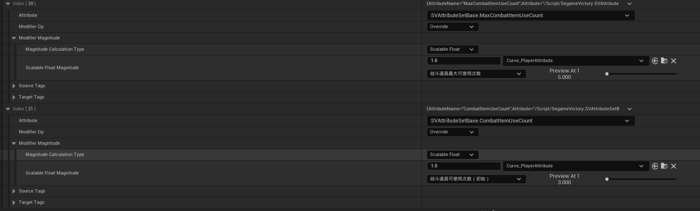

## 需求
1. 战斗中可使用的次数，基本3次，可通过配置修改
2. 战斗中可使用的次数，额外增加的次数，每十级（等级）增加1次，可增加3次(战斗中可使用的最大次数 - 基本次数)
3. 战斗中可使用的最大次数，默认6次，可通过配置修改

## 角色基本属性

| 名称 | 持续类型 | 修改位置 | 修改值 |
|------|----------|----------|--------|
| 战斗中可使用的次数 | Instant | BaseValue 进行即时永久更改 | 3 |
| 战斗中可使用的最大次数 | Instant | BaseValue 进行即时永久更改 | 6 |

**GE_PlayerDefaultAttribute**

**Curve_PlayerAttribute**

![\[图片\]](Snipaste_2026-07-09_13-23-58.png)

## 初始化（重置）次数的GE
**GE_InitCombatItemCount**
