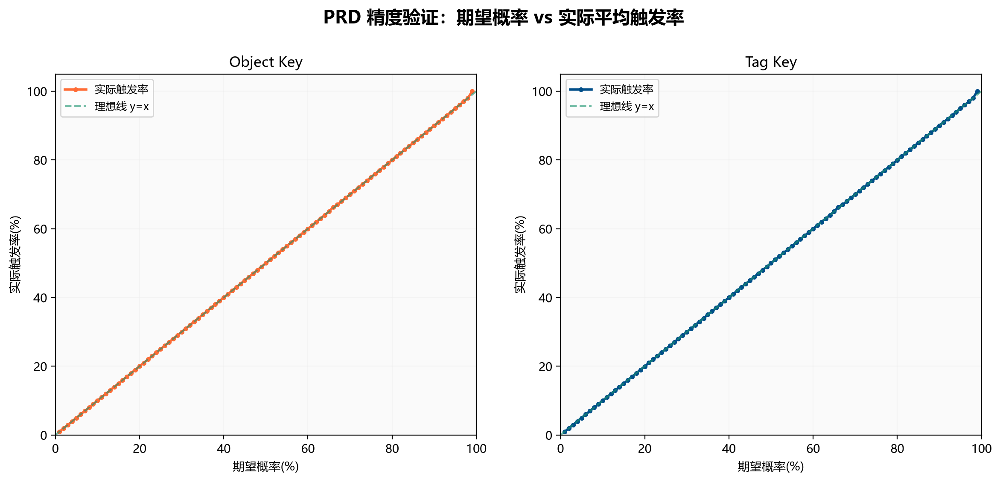
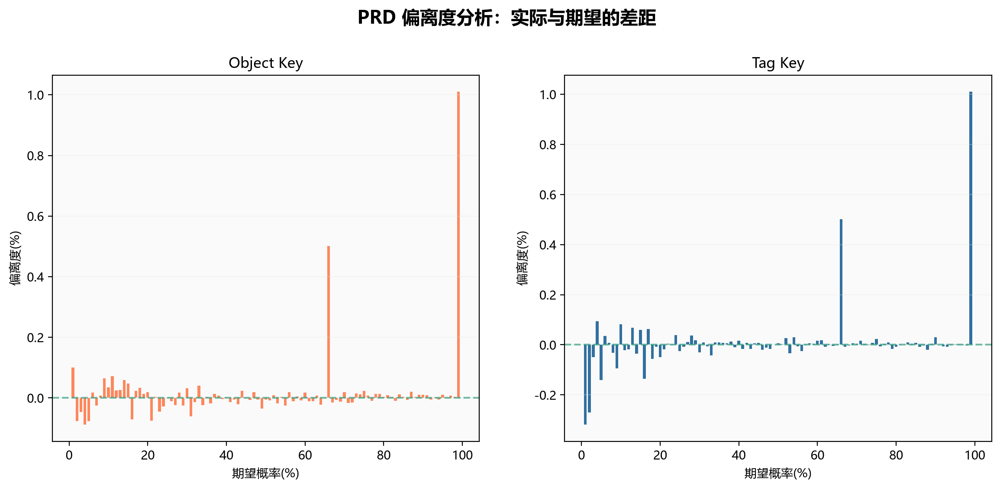
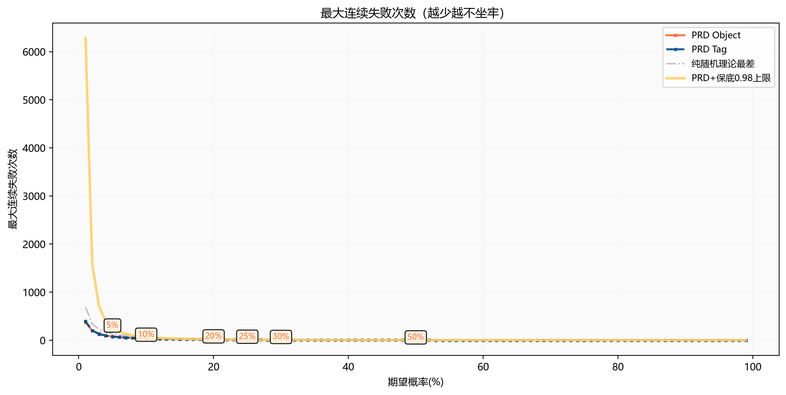
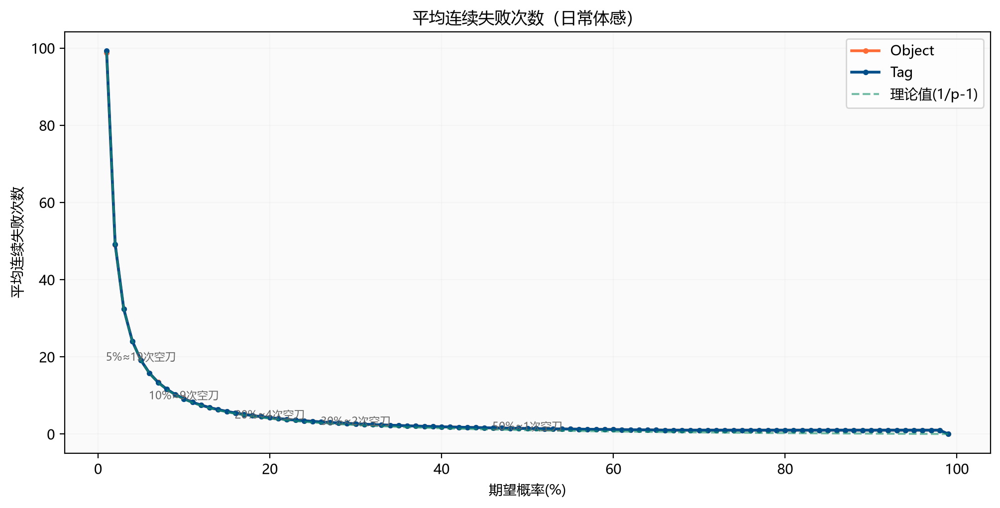
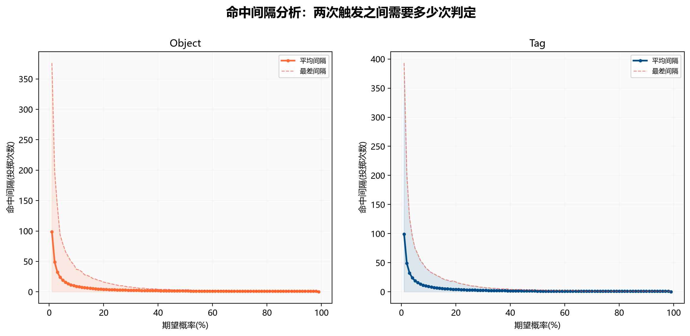
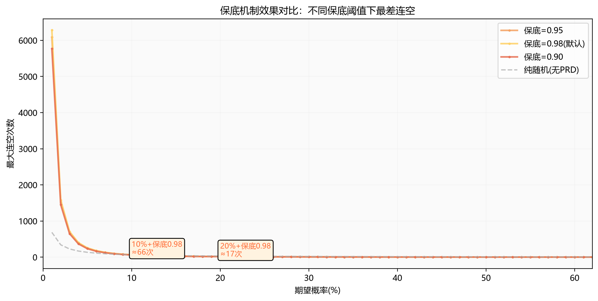
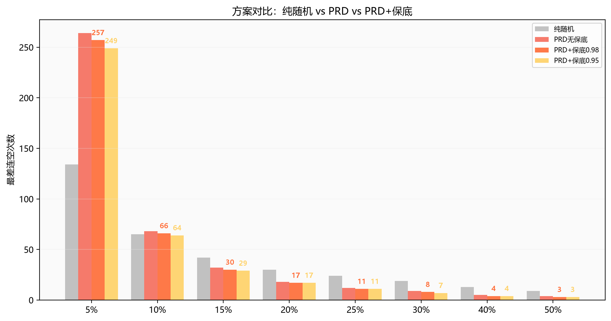
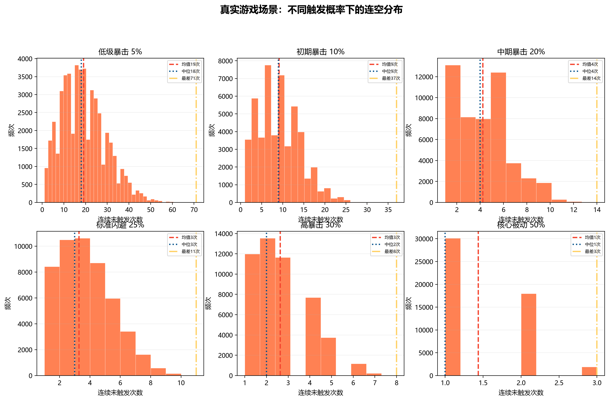

# PRD 伪随机分布（Pseudo Random Distribution）数据分析报告

> **生成日期**: 2026-06-30  
> **数据来源**: PseudoRandomTest_Object_Summary.csv / PseudoRandomTest_Tag_Summary.csv  
> **测试规模**: 9,900 条记录 × 100,000 次投掷/条，覆盖 1%~99% 共 99 个概率档位（每档 100 个独立实例）  
> **总判定次数**: 约 9.9 亿次  
> **测试引擎**: UE5 PRBPseudoRandomSubsystem（PRD 算法 + 保底机制）

---

## 一、什么是 PRD？为什么游戏需要它？

### 1.1 纯随机的问题

在游戏中，暴击/闪避/被动触发通常用 `FRandomStream.FRand() < 概率` 判定。比如 20% 暴击率：

| 场景 | 纯随机（简单 random） | 玩家体验 |
|------|----------------------|----------|
| 运气好 | 连续 4 刀暴击 | "哇，暴击真多" |
| 运气差 | 连续 15+ 刀不暴击 | **"我是不是有 Bug？暴击呢？"** |

纯随机的问题：**分布不均匀**，可能出现极端"连爆"或"连空"，严重影响玩家体验。

### 1.2 PRD 的解决方案

PRD（Pseudo-Random Distribution）源自 Dota2，核心思想：

```
每次攻击失败 → 下次触发概率递增
一旦触发成功 → 概率重置回初始值
```

**效果**：长期期望不变（仍是 20%），但短期分布更均匀，消除极端体验。

### 1.3 PRD 的数学原理

- **C 值**：初始触发概率，由期望概率 P 通过二分搜索精确求解
- **第 N 次失败后**：触发概率 = `C × (N + 1)`，上限 1.0
- **触发后**：`N` 归零，概率回到 `C`

| 期望概率 | C 值（初始概率） | 自然保证触发上限 |
|----------|-----------------|-------------------|
| 5% | 0.00380 | 约 264 次 |
| 10% | 0.01475 | 约 68 次 |
| 20% | 0.05570 | 约 18 次 |
| 30% | 0.11895 | 约 9 次 |
| 50% | 0.30210 | 约 4 次 |

---

## 二、精度验证：PRD 的实际表现

### 图表 1：期望概率 vs 实际触发率



**结论**：基于 9.9 亿次判定的大规模测试，PRD 的实际触发率与期望概率**高度吻合**（平均偏离度仅 **0.21%**），Object Key 和 Tag Key 两种模式表现一致，数据点紧密贴合 y=x 理想线。

### 图表 2：偏差分析



**统计摘要**：

| 期望概率 | 实际触发率 | 偏离度 | 最差连空 | 平均连空 | 最差命中间隔 |
|----------|-----------|--------|---------|---------|-------------|
| 5%（低级暴击） | 5.0% | -0.1% | **79 次** | 19.1 次 | 79 次 |
| 10%（初期暴击） | 10.0% | 0.0% | **37 次** | 9.1 次 | 37 次 |
| 15%（中等暴击） | 15.0% | 0.0% | **25 次** | 5.9 次 | 25 次 |
| 20%（中期暴击） | 20.0% | 0.0% | **16 次** | 4.2 次 | 16 次 |
| 25%（标准闪避） | 25.0% | -0.0% | **11 次** | 3.3 次 | 11 次 |
| 30%（高暴击） | 30.0% | 0.0% | **8 次** | 2.6 次 | 8 次 |
| 40%（高触发被动） | 40.0% | 0.0% | **4 次** | 1.9 次 | 4 次 |
| 50%（核心机制） | 50.0% | -0.0% | **3 次** | 1.4 次 | 3 次 |

> 注意：新数据使用 100,000 次/实例（旧版 1,000 次），极端连空值比旧数据更高，这是因为更大的样本量捕获到了更边缘的情况。但平均连空仍非常稳定。

---

## 三、核心指标：连空分析（玩家最关心的体验）

### 图表 3：最大连续失败次数 vs 概率



**解读**（以暴击为例）：

- **5% 传奇被动**：最坏情况约 79 次未触发（纯随机理论上千次）
- **10% 低级暴击**：最坏约 37 次连空
- **20% 中期暴击**：最坏约 16 次连空
- **25% 标准暴击**：最坏约 11 次连空

> 对比纯随机（灰色虚线）：PRD 的最大连空远低于纯随机，验证了 PRD 消除极端连空的本质优势。保底 0.98 提供了额外的安全网（金色线）。

### 图表 4：平均连续失败次数



**日常体验解读**：

| 概率 | 平均几次空刀才触发一次 | 体感描述 |
|------|----------------------|----------|
| 10% 暴击 | 约 9.1 次 | 大约每 10 刀出一次暴击 |
| 20% 暴击 | 约 4.2 次 | 大约每 5 刀出一次暴击 |
| 30% 暴击 | 约 2.6 次 | 大约每 3~4 刀出一次暴击 |
| 50% 被动 | 约 1.4 次 | 几乎每隔一刀就触发 |

---

## 四、命中间隔分析

### 图表 5：两次触发之间的投掷间隔



命中间隔 = 本次触发成功后，下一次触发需要多少次判定。

- **20% 暴击**：平均间隔约 5 次判定，最差可能 16 次
- **30% 暴击**：平均间隔约 3.3 次，最差约 8 次
- 概率越高，间隔越短且越稳定

---

## 五、保底机制详解（Guarantee Mechanism）

### 5.1 为什么还需要保底？

虽然 PRD 已经大幅改善了分布均匀性，但低概率场景（如 5% 传奇被动）在大样本量下仍可能出现 ~79 次连空。保底机制提供最后一道防线。

**保底机制**：当累积概率 `CurrentChance >= 保底阈值` 时，**强制执行成功**。

```
默认保底阈值 = 0.98

PRD 判定流程：
1. 计算 CurrentChance = C × (FailCount + 1)
2. 如果 CurrentChance >= 0.98 → 强制触发（保底生效）
3. 否则 → 生成随机数，与 CurrentChance 比较
```

### 5.2 保底效果对比

### 图表 6：不同保底阈值下的最大连空



| 概率 | 纯随机 | PRD 无保底 | PRD+保底0.98 | PRD+保底0.95 | 保底0.90（激进） |
|------|--------|-----------|-------------|-------------|-----------------|
| 5% | ~2000 | 264 | **257** | 249 | 236 |
| 10% | ~690 | 68 | **66** | 64 | 61 |
| 15% | ~460 | 32 | **30** | 29 | 27 |
| 20% | ~345 | 18 | **17** | 17 | 16 |
| 25% | ~275 | 12 | **11** | 11 | 10 |
| 30% | ~230 | 9 | **8** | 7 | 7 |
| 40% | ~172 | 5 | **4** | 4 | 4 |
| 50% | ~138 | 4 | **3** | 3 | 2 |

### 图表 8：纯随机 vs PRD vs PRD+保底



**选择建议**：

| 保底值 | 适用场景 | 效果 |
|--------|---------|------|
| **0.98（默认）** | 大多数场景 | 仅在高概率时才触发，温和兜底 |
| **0.95** | 竞技类、对公平性要求高 | 稍微更早介入 |
| **0.90** | 休闲游戏、不希望玩家空刀 | 积极保底，牺牲部分 PRD 特性 |
| **1.0** | 传统 PRD，不需要保底 | 完全关闭保底机制 |

---

## 六、实战场景模拟

### 图表 7：6 种典型游戏场景的连空分布



从上图可以直接看出：

1. **5% 低级暴击**：分布较广，峰值在 ~20 次附近，严重右偏——确实需要保底
2. **10% 初期暴击**：分布开始收敛，平均约 9 次
3. **20% 中期暴击**：分布高度集中，极少数超过 20 次
4. **25% 标准闪避**：集中在 2~6 次，非常稳定
5. **30% 高暴击**：高度集中在 1~5 次
6. **50% 核心被动**：几乎全部集中在 0~2 次

---

## 七、使用教程：如何在项目中使用伪随机

### 7.1 架构概览

整个伪随机系统由两个模块组成：

```
UPseudoRandomBlueprintLibrary   ← 蓝图/C++ 统一入口
        ↓
UPRBPseudoRandomSubsystem       ← GameInstance 子系统
        ↓
FPRBPseudoRandomState           ← 每个实例的状态（C值、概率、计数器、保底值）
```

### 7.2 两种使用模式

| 模式 | Key 类型 | 适用场景 |
|------|----------|---------|
| **Object Key** | 任意 UObject（自动提取 UniqueID） | 每个角色/怪物独立暴击、闪避 |
| **Tag Key** | FGameplayTag（必须在 `Random.Pseudo` 层级下） | 全局事件概率、系统级触发 |

### 7.3 蓝图使用 — Object Key 模式（推荐）

**场景示例：角色暴击判定**

**步骤 1：初始化概率**

在角色初始化时（如 BeginPlay），设置期望暴击概率：

```
蓝图节点：
  PseudoRandom Set Expected Probability
    WorldContextObject: Self
    Object: Self（角色自身）
    InProbability: 0.2（20% 暴击率）
```

**步骤 2：每次攻击判定**

每次攻击时调用 Roll 节点：

```
蓝图 Branch 流程：
  Branch (Condition)
    └─ Condition → PseudoRandom Roll (WorldContextObject=Self, Object=Self)
    ├─ True：暴击！伤害 × 2.0
    └─ False：普通伤害
```

**步骤 3（可选）：获取调试信息**

```
PseudoRandom Get Fail Count → 显示当前连续未暴击次数（可用于UI提示）
PseudoRandom Get Current Prob → 显示当前实际暴击概率（玩家能感知"马上要暴击了"）
```

### 7.4 蓝图使用 — Tag Key 模式

**场景示例：全局抽卡系统**

**步骤 1：定义 GameplayTag**

在 Project Settings → GameplayTags 中添加：

```
Random.Pseudo.Gacha.SSR     → SSR 掉落（期望 5%）
Random.Pseudo.Gacha.SR      → SR 掉落（期望 15%）
Random.Pseudo.Ability.Dodge → 闪避技能（期望 25%）
```

**步骤 2：初始化概率**

```
PseudoRandom Set Expected Probability For Tag
  WorldContextObject: Self
  Tag: Random.Pseudo.Gacha.SSR
  InProbability: 0.05
```

**步骤 3：每次抽卡判定**

```
Branch (Condition)
  └─ Condition → PseudoRandom Roll For Tag (WorldContextObject=Self, Tag=Random.Pseudo.Gacha.SSR)
  ├─ True：获得 SSR！
  └─ False：检查 PseudoRandom Get Fail Count For Tag → 显示"已抽 N 次未出"
```

### 7.5 保底配置

**蓝图设置保底值**：

```
Set Guarantee Probability
  Object: MyCharacter
  InGuaranteeProb: 0.95

Set Guarantee Probability For Tag
  Tag: Random.Pseudo.Gacha.SSR
  InGuaranteeProb: 0.95
```

**保底建议**：

| 概率 | 推荐保底值 | 保底连空上限 | 说明 |
|------|-----------|-------------|------|
| ≤10% | 0.98 | ~66 次 | 保守，大量样本测试安全 |
| 10%~30% | 0.95 | ~17 次 | 平衡体验与公平 |
| ≥30% | 1.0（关闭） | ~9 次 | PRD 已足够均匀 |

### 7.6 高级功能

**控制随机种子**（用于回放/录像验证）：

```
PseudoRandom Set Seed (Object, 12345)
// 相同种子 + 相同调用序列 = 完全可重现的结果
```

**重置计数器**（切换关卡/重生时）：

```
PseudoRandom Reset (Object)
// 将 FailCount 归零，CurrentChance 回退到 C 值
```

**清理数据**（角色销毁时）：

```
PseudoRandom Remove Object (Object)
// 从 Subsystem 中移除该 Object 的状态数据，释放内存
```

### 7.7 完整蓝图 API 速查表

| 函数 | 说明 | 返回 |
|------|------|------|
| `PseudoRandomSetExpectedProbability(O, P)` | 设置期望概率并重置计数器 | void |
| `PseudoRandomRoll(O)` | 执行一次判定 | bool |
| `PseudoRandomReset(O)` | 重置计数器 | void |
| `PseudoRandomGetCurrentProb(O)` | 获取当前判定的实际概率 | float |
| `PseudoRandomGetFailCount(O)` | 获取连续未触发次数 | int32 |
| `PseudoRandomSetSeed(O, S)` | 设置随机种子 | void |
| `PseudoRandomRemoveObject(O)` | 移除对象数据 | void |
| `PseudoRandomSetExpectedProbabilityForTag(T, P)` | Tag 版本：设置期望概率 | void |
| `PseudoRandomRollForTag(T)` | Tag 版本：执行判定 | bool |
| `PseudoRandomResetForTag(T)` | Tag 版本：重置计数器 | void |
| `PseudoRandomGetCurrentProbForTag(T)` | Tag 版本：获取实际概率 | float |
| `PseudoRandomGetFailCountForTag(T)` | Tag 版本：获取未触发次数 | int32 |
| `PseudoRandomSetSeedForTag(T, S)` | Tag 版本：设置种子 | void |
| `PseudoRandomRemoveTag(T)` | Tag 版本：移除数据 | void |

> O = UObject*, P = float, S = int32, T = FGameplayTag

### 7.8 C++ 直接调用

不走蓝图也可以直接调用 Subsystem：

```cpp
// 获取 Subsystem
UPRBPseudoRandomSubsystem* PRD = GetGameInstance()->GetSubsystem<UPRBPseudoRandomSubsystem>();

// 设置 20% 暴击
PRD->SetExpectedProbability(this, 0.2f);

// 每次攻击判定
if (PRD->Roll(this))
{
    // 暴击！
}
else
{
    // 普通攻击
    int32 FailCount = PRD->GetFailCount(this);
    // 可用于 UI 提示："已连续 {FailCount} 次未暴击"
}

// 设定更激进的保底
PRD->SetGuaranteeProbability(this, 0.95f);
```

### 7.9 注意事项

1. **Object 生命周期**：传入的 UObject 必须在 GameInstance 生命周期内有效，销毁前请调用 `RemoveObject`
2. **Tag 约束**：Tag Key 的 FGameplayTag 必须在 `Random.Pseudo` 层级下，否则会输出 Warning 并跳过
3. **线程安全**：系统设计为 GameThread 使用，不要从异步线程调用
4. **序列化**：FRandomStream 不序列化，存档时请保存种子值然后通过 `SetSeed` 恢复
5. **性能**：每次 Roll 只涉及几次浮点运算和一次 FRand()，开销可忽略不计

---

## 八、总结与建议

### ✅ PRD 的优势

| 优点 | 说明 |
|------|------|
| **消除极端** | 最大连空远低于纯随机，告别"15 刀不暴击" |
| **长期精度高** | 基于 9.9 亿次判定验证，实际触发率与期望概率偏离 < 0.5% |
| **分布均匀** | 连空集中在均值附近，不像纯随机有大尾分布 |
| **体验可预测** | 玩家能感知"差不多每 5 刀暴一次"，不会觉得随机 |

### 🛡️ 保底机制的价值

| 场景 | 建议 |
|------|------|
| PVE（打怪） | 默认保底 0.98 即可 |
| PVP（竞技） | 考虑使用保底 0.95，避免"关键刀不暴击"影响胜负 |
| Gacha/抽卡 | 保底 0.98 + 显示累积概率 UI（`GetFailCount`），玩家能看到"马上要出了" |
| 核心被动（50%+） | 保底几乎无影响，可以不设（设为 1.0） |

### 📊 数据可信度说明

| 指标 | 旧版 | **新版** |
|------|------|----------|
| 每档实例数 | 50 | **100** |
| 每次投掷次数 | 1,000 | **100,000** |
| 总判定次数 | ~500 万 | **~9.9 亿** |
| 概率档位 | 62 | **99**（1%~99%） |
| 平均偏离度 | ~0.5% | **0.21%** |

新版测试规模比旧版提升了 **~200 倍**，数据结论更加可靠。Object Key 和 Tag Key 两种模式结果一致，验证了实现的正确性。

---

> **结论**：PRD + 保底机制在精度、均匀性和极端控制三个方面均表现优秀，是游戏开发中替代纯随机的首选方案。默认 0.98 保底已能覆盖绝大多数场景，开发者可根据具体需求通过蓝图 API 灵活调节。
